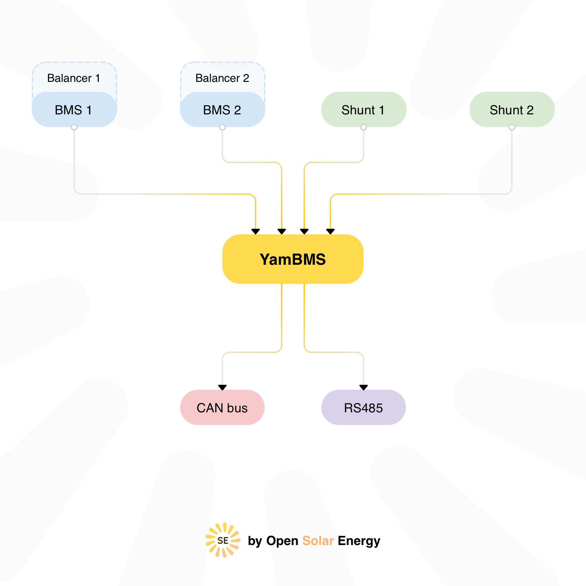
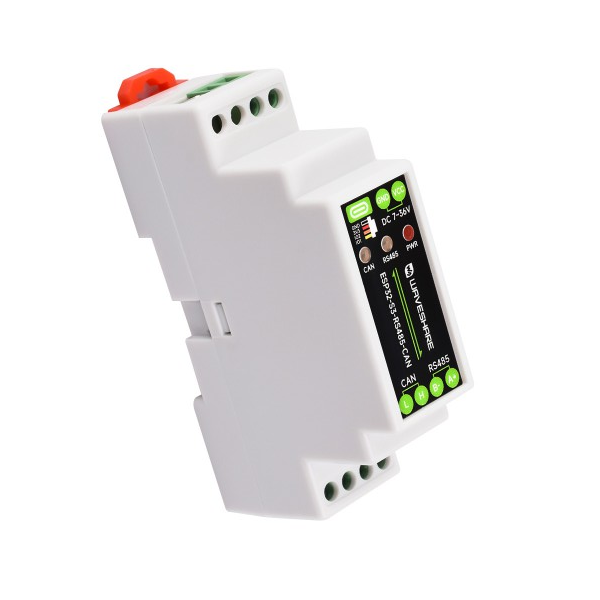
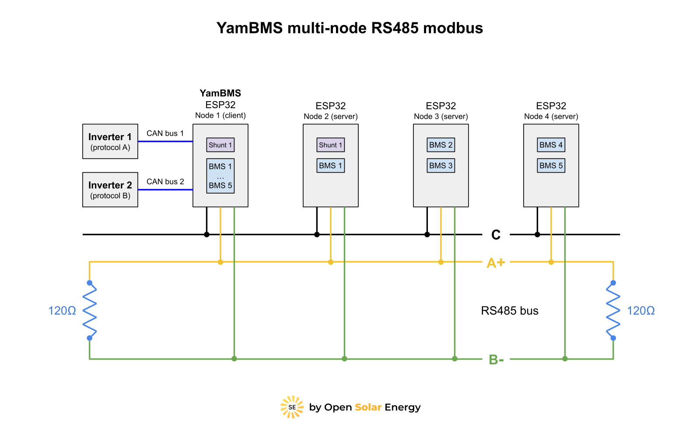

# YamBMS ( Yet another multi-BMS Merging Solution )

[](https://www.gnu.org/licenses/gpl-3.0)
[](https://github.com/Sleeper85/esphome-yambms/releases/latest)


[](https://www.buymeacoffee.com/sleeper85)

> [!WARNING]  
> I'm currently working on releasing **YamBMS 1.6.0**, which will be compatible with **ESPHome >= 2025.11**.
> **ESPHome 2025.11.0** introduces many changes and still contains many bugs.
> For the time being, I advise you to stay with **ESPHome 2025.10.5**.

> [!TIP]
> Not sure which YAML to choose ? ... [YamBMS_Remote_Packages_example.yaml](YamBMS_Remote_Packages_example.yaml)
> is a good basis for creating your custom YAML.
> Examples of `BMS` and `Shunt` packages can be found in the [examples](examples/single-node/) folder.
> You don't have to import a shunt but you must import at least `one BMS`.
> You can mix different `BMS` models, the only condition is that the `bms_id` are numbered in order starting from `1` !

> [!IMPORTANT]  
> The most important thing for proper functioning of YamBMS is that **the voltage of your BMS is well calibrated**.
> YamBMS logic is based on the `min_cell_voltage` and `max_cell_voltage` voltages of your `BMS`.
> If you use `YamBMS`, the internal charging logic of the `JK-PB BMS` will not be used.
> Please read the [documentation](README.md#contents) and the [setup instructions](documents/README/Schematic_and_setup_instructions.md).

| ESPHome application to monitor BMS and communicate with inverters<br>supporting CAN bus protocol compatible with Pylontech, GoodWe, SMA,<br>Victron or Luxpower (EG4). | <a href="https://www.buymeacoffee.com/Sleeper85" target="_blank"></a> |
| :--- | --- |
| **Note: Pylontech uses 15S/48V and many others uses 16S/51.2V !**<br><br>Other battery profiles that utilise the **`PYLON`** protocol with different cell counts<br>may also work, e.g. Alpha Ess Smile, BYD Battery-Box LV Flex Lite.<br>Select the correct battery profile in the inverter to match your battery pack !<br>The **`ESP32`** communicates with the BMS using the **`BLE / UART / RS485`**<br>protocol and then sends the CAN bus frames to the inverter via the<br>[CAN bus transceiver](documents/README/Supported_devices.md#supported-can-bus-transceiver). | <a href="https://www.buymeacoffee.com/Sleeper85" target="_blank"></a> |

**Sends over CAN bus to inverter:**
  - Battery Voltage
  - Battery Current (+charge, -discharge)
  - [State of Charge (SoC)](documents/README/YamBMS_behavior.md#state-of-charge) **`SoC 100% will be sent to your inverter only when the battery is fully charged`**
  - State of Health (SoH)
  - Max cell V. and ID
  - Min cell V. and ID
  - BMS temperature
  - Charging voltage
  - Charging max amps
  - Discharge min voltage
  - Discharge max amps
  - Battery name
  - Alarms: Cell over/under voltage, Charge/discharge over current, High/low Temp, BMS fault
  
**Note:** this code support `multi-BMS` and `multi-shunt` connection per inverter with a `single ESP32` and should work with inverters that support the CAN bus protocol `PYLON`, `SMA`, `Victron` or `LuxPower` (EG4). I'm only testing it with my `Deye SUN-6K-SG03-LP1-EU` inverter.

**This project is still in development and testing...<br>**

[Dedicated topic on DIY Solar Forum](https://diysolarforum.com/threads/yambms-jk-bms-can-with-new-cut-off-charging-logic-open-source.79325/)

## Contents

1) [Supported devices](documents/README/Supported_devices.md)
2) [YamBMS behavior](documents/README/YamBMS_behavior.md)
3) [YamBMS functions](documents/README/YamBMS_functions.md)
4) [Charging logic](documents/README/Charging_logic.md)
5) [CAN bus protocol](documents/README/CANBUS_protocol.md)
6) [Hardware and schematic instructions](documents/README/Hardware_and_schematic_instructions.md)
7) [Installation procedure](documents/README/Installation_procedure.md)
8) [Troubleshooting](documents/README/Troubleshooting.md)

## YamBMS ( Yet another multi-BMS Merging Solution )



## Hardware highlighted

This project works with various `ESP32` variants and also with the `Raspberry Pi Pico (RP2040)`.
Note that merging data from multiple BMS, balancers and shunts is resource-intensive, so I highly recommend a board based on the `ESP32-S3` with `PSRAM`.

| [LilyGo T-Connect](https://github.com/Xinyuan-LilyGO/T-Connect) | [Waveshare ESP32-S3-RS485-CAN](https://www.waveshare.com/esp32-s3-rs485-can.htm) | [M5Stack AtomS3R](https://docs.m5stack.com/en/core/AtomS3R) |
| --- | --- | --- |
| - ESP32-S3<br>- 8MB PSRAM<br>- 3x RS485 port<br>- 1x CAN port<br>- 15x GPIOs | - ESP32-S3<br>- 8MB PSRAM<br>- 1x RS485 port<br>- 1x CAN port<br>- 1x SH1.0 connector<br>- 16x GPIOs | - ESP32-S3<br>- 8MB PSRAM<br>- 1x BASE port (**for adding RS485/CAN base**)<br>- 1x UNIT HY2.0 port (**for adding RS485/CAN unit**)<br>- 6x GPIOs |
|  |  |  |

### Single-node

You install `YamBMS` on a single ESP32 connected to your BMS and your inverter.

* Max 3x BMS BLE
* Max 3x BMS UART
* several RS485 BMS on the same bus

### Multi-node

Each BMS/Shunt turns into a `modbus server` with its own address.

> [!IMPORTANT]
> The max number of `UART` BMS/Shunt per ESP32 is `2` (unless you use a UART expander) because you need to keep the last `UART` for the `RS485` network.
> The max number of `BLE` BMS/Shunt per ESP32 is `2`, ESP32-S3 / AtomS3 can supervise `3` BLE devices.

YamBMS installs on `node1` as a `modbus client` to collect information from all your BMS.
The `node1` is also connected to your inverter via the `CAN bus`.

The BMS/Shunt are connected to other ESP32 nodes connected on a dedicated RS485 bus for YamBMS. Each BMS/Shunt becomes a `modbus server`.

The theoretical limit is `256` modbus server (BMS/Shunt) per `RS485 bus` but in reality this will depend on the capabilities of `node1` (YamBMS) which will have to combine all the BMS/Shunt together.

[You can find more information about creating your YAML in this How To.](documents/README/YamBMS_main_YAML_HowTo.md)

> [!TIP] 
> If you have a lot of `BMS/Shunt` to combine, using an `ESP32-S3` or `AtomS3` for `node1` is recommended.



## Home Assistant


## Try YamBMS with the DEMO firmware

You can simply test the application with a `generic ESP32` without compiling and connecting anything on your ESP32.
The DEMO firmware is composed of `3x BMS` and `1x Shunt` (fake) for a `48V LFP` system.

> [!IMPORTANT] 
> `YamBMS_DEMO_ESP32.factory.bin` is intended for a generic ESP32, does not work with ESP32-S3.
> If you want to test `YamBMS DEMO` with another board you need to compile the firmware with the `YamBMS_RP_DEMO.yaml`.

1) Download [YamBMS_DEMO_ESP32.factory.bin](firmware/YamBMS_DEMO_ESP32.factory.bin)
2) Follow the [procedure explained in this document](https://docs.google.com/document/d/12pOpaG4Iyw3DjC_kB1q0jjBeSKJHK2FvXI1swebL2RI/edit?usp=sharing).

If you want to add a `CAN transceiver` on this `DEMO board` here are the GPIOs to connect it to :
```YAML
tx_pin: 23 # to CAN board CTX
rx_pin: 22 # to CAN board CRX (with 4.7K resistor except for SN65HVD230)
```

## Requirements

* [ESPHome 2025.6.0 or higher](https://github.com/esphome/esphome/releases)
* ESP32 MCU (buying a board with ≥8MB flash is advised if you intend to monitor multiple BMS)
* CAN transceiver (only with TJA1050/TJA1051 => 4.7K resistor for 5V to 3V3 level shifing)
* BMS JK, JBD, Seplos (other BMS brands already integrated with ESPhome can be added easily)
* Inverters supporting CAN PYLON/GoodWe/SMA/Victron Low Voltage protocol
* Optional: 48V to 5V DC-DC converter to power the ESP32 from the JK-BMS VBAT pin (URB4805YMD-10WR3 or VRB4805S-6WR3)
* Optional: JK RS485 adaptor and RS485 to TTL 3V3 adaptor (see schematic section)

## Data collection

> [!NOTE]
> For your information, in June 2025 there were `100` YamBMS users.

If the ESP32 has an internet connection, the following data is sent to [this script](http://script.opentel.be/yambms.post.php)
for statistics collection. Only [@Sleeper85](https://github.com/Sleeper85) have access to this information for the production of statistics, the support and the update service.

- ESP32 MAC address
- YamBMS version
- Board chip
- Board name
- BMS model
- BMS count
- CAN bus name
- CAN bus protocol
- Uptime
- Current date and time

## References

* Thanks to [@syssi](https://github.com/syssi/esphome-jk-bms) for help and making many BMS components (JK, JBD, Seplos, Pace, etc.)
* Thanks to [@txubelaxu](https://github.com/txubelaxu/esphome-jk-bms) for help and making the `JK-PB RS485` component.
* Thanks to [@uksa007](https://www.patreon.com/Uksa007Codedevelopment) for making the original CANBUS code.
