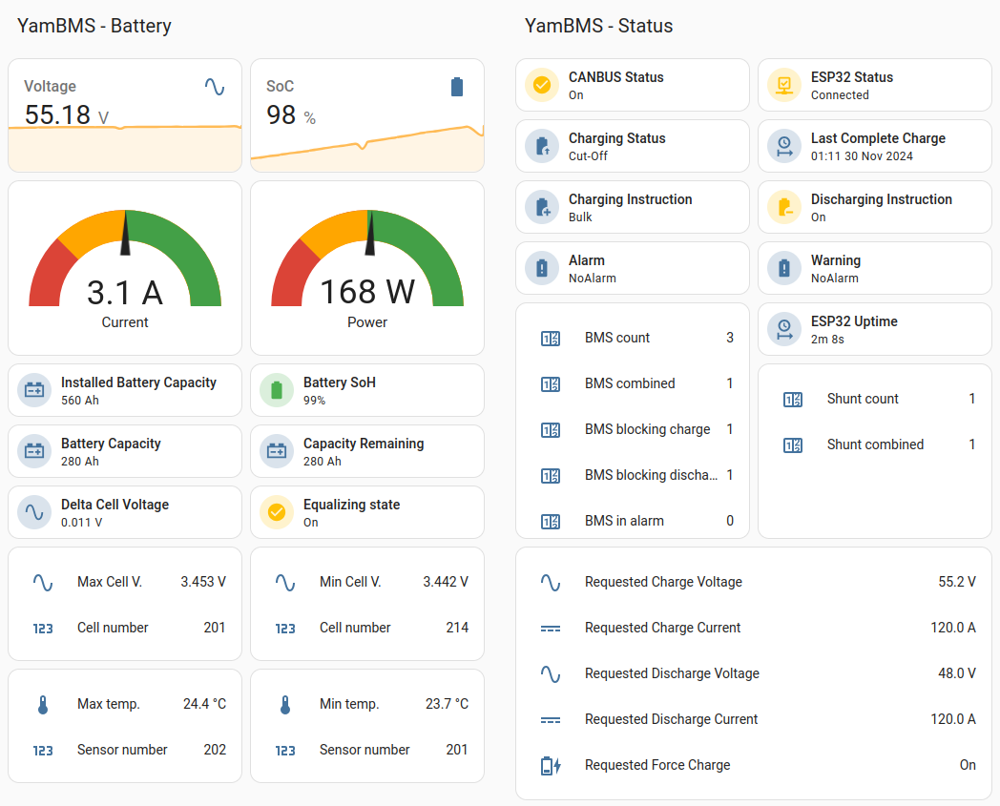

# YamBMS ( Yet another multi-BMS Merging Solution )

[](https://www.gnu.org/licenses/gpl-3.0)
[](https://github.com/Sleeper85/esphome-yambms/releases/latest)


[](https://www.buymeacoffee.com/sleeper85)

> [!TIP]
> If compiling the source code is too difficult for you, I can provide you a `custom firmware` that is easy to install from a web page. You can [contact me privately](https://diysolarforum.com/direct-messages/add?to=Sleeper85) on the DIY solar forum.

| ESPHome application to monitor BMS and communicate with inverters<br>supporting CAN bus protocol compatible with Pylontech, GoodWe, SMA,<br>Victron or Luxpower (EG4). | <a href="https://www.buymeacoffee.com/Sleeper85" target="_blank"></a> |
| :--- | --- |
| **Note: Pylontech uses 15S/48V and many others uses 16S/51.2V !**<br><br>Other battery profiles that utilise the **`PYLON`** protocol with different cell counts<br>may also work, e.g. Alpha Ess Smile, BYD Battery-Box LV Flex Lite.<br>Select the correct battery profile in the inverter to match your battery pack !<br>The **`ESP32`** communicates with the BMS using the **`BLE / UART / RS485`**<br>protocol and then sends the CAN bus frames to the inverter via the<br>[CAN bus transceiver](documents/README/Supported_devices.md#supported-can-bus-transceiver). | <a href="https://www.buymeacoffee.com/Sleeper85" target="_blank"></a> |

**Sends over CAN bus to inverter:**
  - Battery Voltage
  - Battery Current (+charge, -discharge)
  - [State of Charge (SoC)](documents/README/YamBMS_behavior.md#state-of-charge) **`SoC 100% will be sent to your inverter only when the battery is fully charged`**
  - State of Health (SoH)
  - Max cell V. and ID
  - Min cell V. and ID
  - BMS temperature
  - Charging voltage
  - Charging max amps
  - Discharge min voltage
  - Discharge max amps
  - Battery name
  - Alarms: Cell over/under voltage, Charge/discharge over current, High/low Temp, BMS fault
  
**Note:** this code support `multi-BMS` and `multi-shunt` connection per inverter with a `single ESP32` and should work with inverters that support the CAN bus protocol `PYLON`, `SMA`, `Victron` or `LuxPower` (EG4). I'm only testing it with my `Deye SUN-6K-SG03-LP1-EU` inverter.

**This project is still in development and testing...<br>**

[Dedicated topic on DIY Solar Forum](https://diysolarforum.com/threads/yambms-jk-bms-can-with-new-cut-off-charging-logic-open-source.79325/)

## YamBMS


## Home Assistant



## Contents

1) [Supported devices](documents/README/Supported_devices.md)
2) [YamBMS behavior](documents/README/YamBMS_behavior.md)
3) [YamBMS functions](documents/README/YamBMS_functions.md)
4) [Charging logic](documents/README/Charging_logic.md)
5) [CAN bus protocol](documents/README/CANBUS_protocol.md)
6) [Schematic and setup instructions](documents/README/Schematic_and_setup_instructions.md)
7) [How to create your YamBMS YAML](documents/README/YamBMS_main_YAML_HowTo.md)
8) [Installation procedure](documents/README/Installation_procedure.md)
9) [Troubleshooting](documents/README/Troubleshooting.md)

## Try YamBMS with the DEMO firmware

You can simply test the application with a `generic ESP32` without compiling and connecting anything on your ESP32.
The DEMO firmware is composed of `3x BMS` and `1x Shunt` (fake) for a `48V LFP` system.

> [!IMPORTANT] 
> `YamBMS_DEMO_ESP32.factory.bin` is intended for a generic ESP32, does not work with ESP32-S3.
> If you want to test `YamBMS DEMO` with another board you need to compile the firmware with the `multi-bms_DEMO.yaml`.

1) Download [YamBMS_DEMO_ESP32.factory.bin](firmware/YamBMS_DEMO_ESP32.factory.bin)
2) Follow the [procedure explained in this document](https://docs.google.com/document/d/12pOpaG4Iyw3DjC_kB1q0jjBeSKJHK2FvXI1swebL2RI/edit?usp=sharing).

If you want to add a `CAN transceiver` on this `DEMO board` here are the GPIOs to connect it to :
```YAML
tx_pin: 23 # to CAN board CTX
rx_pin: 22 # to CAN board CRX (with 4.7K resistor except for SN65HVD230)
```

## Requirements

* [ESPHome 2024.6.0 or higher](https://github.com/esphome/esphome/releases)
* ESP32 MCU
* CAN Transceiver (only with TJA1050/TJA1051 : 4.7K resistor for 5V to 3V3 level shifing)
* BMS JK-B*, JK-PB* (other BMS brands already integrated with ESPhome can be added easily)
* Inverters supporting CAN PYLON/Goodwe/SMA/Victron Low Voltage protocol
* Optional: 48V to 5V DC-DC converter to power the ESP32 from the JK-BMS VBAT pin (URB4805YMD-10WR3 or VRB4805S-6WR3)
* Optional: JK RS485 adaptor and RS485 to TTL 3V3 adaptor (see schematic section)

## Changelog

* YamBMS 1.5.1 :
  * The conditions for `combining` BMS and the `charging` and `discharging` instructions no longer have any relation with the `errors_bitmask` sensor, the new system relies on the three **binary_sensor** `online status`, `charging allowed` and `discharging allowed` being linked to the status of alarms and switches.
  * The BMS combination procedure has been completely rewritten.
  * Improved structure and ID names of `bms.yaml`.
  * The `yambms.yaml` and `yambms_combine.yaml` global variable names have been changed for better code reading.
  * Improved code regarding the CAN bus `esp_light` status for boards without integrated LED.
  * New `Atom S3R` board and `Smartshunt BLE` shunt.
  * New `JBD`, `Seplos V1 V2`, `JK-B RS485` (display port) and `FAKE` BMS.
  * New `YamBMS DEMO` YAML and firmware offered to test and discover how `YamBMS` works.
  * New management of temperature sensors (no longer limited to two sensors).
  * **@Der_Hannes** fixed the AtomS3 `black screen` issue (with **esphome > 2024.7.3**) and developed new code for display management based on the [ili9xxx](https://esphome.io/components/display/ili9xxx.html) platform.
  * `Auto CCL/DCL` functions have been fixed to work with `JK-PB` and `new JK-B` BMS, [see this issue](https://github.com/Sleeper85/esphome-yambms/issues/11).
  * The `UVPR` and `OVPR` sensors are no longer used and replaced by `UVP` and `OVP` to ensure operation with all BMS.
  * **@txubelaxu** fixed a bug in the `JK-PB RS485` component that could cause a false battery voltage value to be sent, [see this issue](https://github.com/Sleeper85/esphome-yambms/issues/10).
  * Improved documentation, added a `HowTo` to create its main YAML, warning about galvanic isolation.
* CANBUS 2.3.7 : If there is no response from the inverter, the time before a new communication test has been reduced from `120s` to `60s`, added Victron `0x372` nbr. of modules `blocking charge/discharge`.
* YamBMS 1.4.5 : Changed the way to configure WiFi/Ethernet network, added `ESP32-C3 ETH01-EVO` ethernet board, reduction of the number of YAML bms files, UART `rx_buffer_size` is set to `512` by default for JK-B and JK-PB, new JK-BMS BLE sensors (last commits of @syssi) and new BLE `standard` version
* CANBUS 2.3.6 : Sending CAN frames stops immediately if there are no combined BMS
* YamBMS 1.4.4 : Multi-shunt support, Simplified and new YamBMS option `battery chemistry`, slider `min/max` values ​​are automatically configured based on the battery chemistry and cell count, added `YamBMS Fallback Hotspot`, added YamBMS `Update service`, added PVbrain2 and Atom Matrix board, added PSRAM settings YAML (not enabled by default), new MIN/MAX temperature sensor, added DC current icon, fixed dual sensor `Cell UVPR (MAX)` bug, Improved `combine` code, Breaking change : Atom S3 `GPIOs 1 and 2` reversed
* CANBUS 2.3.5 : New MIN/MAX temperature / sensor ID, Improved Victron protocol (online/offline battery modules, installed/available battery capacity)
* CANBUS 2.3.4 : Fixed bug of canbus link validation without inverter connected
* YamBMS 1.4.3 : Added Victron and Junctek KH-F `Shunt` support and `Requested Force Charge` function based on `SoC start/stop`, new `Total Daily Energy` sensors
* CANBUS 2.3.3 : Added `Automatic` BMS name selection and `Requested Force Charge` Bit 3/4/5 (PYLON 0x35C)
* CANBUS 2.3.2 : Added `LuxPower` protocol with updated `can_id` 0x355, 0x356, 0x359 and 0x35C
* CANBUS 2.3.1 : Improved the procedure for sending canbus frames with reduced loop time, rewritten of the canbus link validation code and added `Inverter Heartbeat Monitoring` function
* YamBMS 1.4.2 : Added new `Auto CVL Boost V.` and `Rebulk SoC` functions, new debug.yaml for ESP32 and ESP32-S3, improved code and comments
* YamBMS 1.4.1 : Rewriting of the alarm system, bug fixes and improvement of the charging logic (new status `Cut-Off`), icon allocation for each sensor, UART and CANBUS `!extend ${vars}`, New sensor `YamBMS Delta Cell V.`, Improved `Battery SOC` logic
* YamBMS 1.3.2 : New var `yambms_cell_count`, the BMS charge or discharge switches can be activated separately without causing the decombination of the BMS, new `minimal` version of the BMS YAML in order to reduce the loop time
* YamBMS 1.3.1 : First multi-BMS version named `YamBMS`

## References

* Thanks to [@syssi](https://github.com/syssi/esphome-jk-bms) for help and making many BMS components (JK, JBD, Seplos, Pace, etc.)
* Thanks to [@txubelaxu](https://github.com/txubelaxu/esphome-jk-bms) for help and making the `JK-PB RS485` component.
* Thanks to [@uksa007](https://www.patreon.com/Uksa007Codedevelopment) for making the original CANBUS code.
