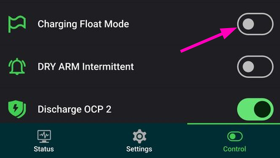
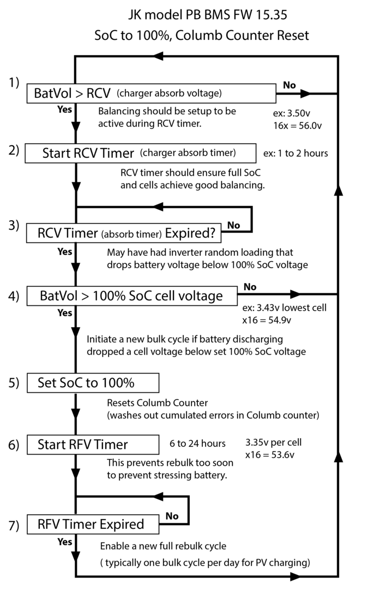

# YamBMS - JK-PB Inverter BMS

[](https://www.gnu.org/licenses/gpl-3.0)
[](https://github.com/Sleeper85/esphome-yambms/releases/latest)


> [!WARNING]
> The behavior described on this page is true up to the **first hardware version V19 shipped with firmware <= V19.10**.
> This behavior changes with **firmware > V19.10**.
> Using **DIP switch addresses 1 to 15** does not reliably guarantee that the **UART2 (RS485-2)** port protocol will be automatically configured to **001 - JK BMS RS485 Modbus V1.0**, which allows **YamBMS** to access BMS information.
> The alternative solution is to use the **UART1 (RS485-1)** port configured with the **001 - JK BMS RS485 Modbus V1.0** protocol from the JK application.
> Downgrading to **V19.10** does not guarantee to correct this problem, [please read this information before downgrading](BMS_JK-PB#downgrading-to-1910).

> [!IMPORTANT]  
> The most important thing for proper functioning of YamBMS is that **the voltage of your BMS is well calibrated**.
> YamBMS logic is based on the `min_cell_voltage` and `max_cell_voltage` voltages of your BMS.
> If you use YamBMS, the internal charging logic of the `JK-PB BMS` will not be used.

## JK-PB BMS overview

||
|-|
||
||

## JK-PB BMS protocol

The datas from this BMS can be retrieved from the `RS485-1 (UART1)` or `RS485-2 (UART2)` network using the component [JK_RS485](https://github.com/Sleeper85/esphome-components/tree/main/components) originally developed by [@txubelaxu](https://github.com/txubelaxu).

The BMS DIP switches must be set from `1` to `15` (server mode) and connected to each other using the `RS485-2` network available on the **two ports at the right ends**. `YamBMS` also connects to one of these two ports.

### **UART2 configuration**

> [!NOTE]
> The protocol of the `UART2` port is not selectable from the JK application.
> It is automatically set based on the address (DIP switch) of the BMS.

In the last software version only two protocols are available on the **RS485-2 (UART2)** ports:

- **001** - JK BMS RS485 Modbus V1.0 **(DIP switch 1 to 15)**
- **015** - UART Protocol 015 **(DIP switch 0)**

### **UART1 configuration**

The following protocols are supported on the **RS485-1 (UART1)** port:

(*italic options ane not settable*)

- **000** - 4G-GPS Remote module Common protocol V4.2
- **001** - **JK BMS RS485 Modbus V1.0**
- **002** - NIU U SERIES
- **003** - China tower shared battery cabinet V1.1
- **004** - PACE_RS485_Modbus_V1.3
- **005** - PYLON_low_voltage_Protocol_RS485_V3.5
- **006** - Growatt_BMS_RS485_Protocol_1xSxxP_ESS_Rev2.01
- **007** - Voltronic_Inverter_and_BMS_485_communication_protocol_20200...
- **008** - China tower shared battery cabinet V2.0
- **009** - WOW_RS485_Modbus_V1.3
- **010** - JK BMS LCD Protocol V2.0
- **011** - *UART1 User customization*
- **012** - *UART2 User customization*
- **013** - (9600)JK BMS RS485 Modbus V1.0
- **014** - (9600)PYLON_low_voltage_Protocol_RS485_V3.5
- **015** - *UART Protocol 015*

### **CAN port configuration**

The following CAN protocols are supported on the CAN port:

(*italic options ane not settable*)

- **000** - JK BMS CAN Protocol (250K) V2.0
- **001** - Deye Low-voltage hybrid inverter CAN communication protocol V1.0
- **002** - PYLON-Low-voltage-V1.2
- **003** - Growatt BMS CAN-Bus-protocol-low-voltage_Rev_05
- **004** - Victron_CANbus_BMS_protocol_20170717
- **005** - MEGAREVO_Hybird_BMSCAN_Protocol_V1.0
- **006** - JK BMS CAN Protocol (500K) V2.0
- **007** - INVT BMS CAN Bus protocol V1.02
- **008** - GoodWe LV BMS Protocol (EX/EM/S-BP/BP)
- **009** - FSS-ConnectingBat-Tl-en-10 | Version 1.0
- **010** - MUST PV1800F-CAN communication Protocol1.04.04
- **011** - LuxpowerTek Battery CAN protocol V01
- **012** - *CAN BUS User customization*
- **013** - *CAN BUS Protocol 013*
- **014** - *CAN BUS Protocol 014*

## YamBMS hardware

> [!TIP]
> This solution only requires an ESP32 with a CAN transceiver and a RS485 transceiver.

You are free to choose the hardware you want, the list below are 3 easy to use examples of **ESP32-S3 with PSRAM** :

- [Waveshare ESP32-S3-RS485-CAN](https://www.waveshare.com/esp32-s3-rs485-can.htm), ESP32-S3 with 1x RS485 and 1x CAN
- [LilyGo T-Connect](https://github.com/Xinyuan-LilyGO/T-Connect), ESP32-S3 with 3x RS485 and 1x CAN
- [M5Stack AtomS3R](https://docs.m5stack.com/en/core/AtomS3R), ESP32-S3 with the isolated [Atomic CAN base](https://docs.m5stack.com/en/atom/Atomic%20CAN%20Base) and [RS485 unit](https://docs.m5stack.com/en/unit/iso485)

See the [documentation about supported hardware](Supported_devices.md).

### M5Stack AtomS3 example (no welding)

The example below uses an `AtomS3` (display) with the `Atomic CAN base` and `RS485 unit`.


## Schematic and setup instructions

> [!CAUTION]
> Galvanic isolation of the `RS485` connection is strongly recommended.
> The diagrams below does not show the galvanic isolation of the `RS485` connection !

> [!IMPORTANT]
> If you are unable to read your BMS from the `RS485` bus, add a `120 Ohm`
> resistor between the `A` and `B` wires connected to your `RS485` board.
> This must be done with the `M5Stack RS485 unit`, some boards have a switch to enable the bus termination resistor.

**Note:** the choice of RS485 board is not related to the chosen ESP32.

### AtomS3 with unisolated RS485 board

```
┌──────────┐                 ┌───────────┐                       ┌──────────┐
│          │                 │   UART    │<-VCC--------------5V--│          │<---5V
│   BMS    │                 │    TO     │                       │   ESP32  │
│  JK-PB   │<-RJ45-P1-----B->│   RS485   │<-DI-----------TX--G1--│  Atom S3 │
│          │<-RJ45-P2-----A->│           │--RO-----------RX--G2->│          │                  ┌────────────┐             ┌────────────┐
│  RS485   │                 │ CONVERTER │<-DE--+                │          │--G5--TX-----CTX->|            |             |            |
│ NETWORK  │                 │           │<-RE--└--TALK PIN--G8--│          │<-G6--RX-----CRX--|   Atomic   |<---CAN H--->|  Inverter  |
│          │                 │           │                       │          │<-------5V------->|  CAN Base  |<---CAN L--->|            |
|          |<-RJ45-P3---GND->|           |<-GND-------------GND->|          |<-------GND------>|            |             |            |
└──────────┘                 └───────────┘                       └──────────┘                  └────────────┘             └────────────┘
```

### ESP32-S3 with isolated RS485 board

```
┌──────────┐                 ┌───────────┐                       ┌──────────┐
│          │                 │   UART    │<-V1--------3V3 or 5V--│          │<---5V
│   BMS    │                 │    TO     │                       │          │
│  JK-PB   │<-RJ45-P1-----B->│   RS485   │<-RX-----------TX--17--│ ESP32-S3 │
│          │<-RJ45-P2 ----A->│           │--TX-----------RX--18->│          │                  ┌────────────┐             ┌────────────┐
│  RS485   │                 │ CONVERTER │                       │          │--38--TX-----CTX->|            |             |            |
│ NETWORK  │                 │           │      No TALK PIN (8)--│          │<-39--RX-----CRX--|    CAN     |<---CAN H--->|  Inverter  |
│          │                 │           │                       │          │<-------3V3------>| SN65HVD230 |<---CAN L--->|            |
|          |<-RJ45-P3----G2->|           |<-G1--------------GND->|          |<-------GND------>|            |             |            |
└──────────┘                 └───────────┘                       └──────────┘                  └────────────┘             └────────────┘
```

- [RJ45 568A pinout](../../images/RJ45-Pinout-T568A.jpg)
- [RJ45 568B pinout](../../images/RJ45-Pinout-T568B.jpg)

## BMS DIP switch config (mode 2)

With `mode 2`, the sniffer (ESP32) will automatically take the address `0x00` and act as master BMS (max 15 BMS).
This is the preferred mode with YamBMS.

- BMS 1 RS485 address : 0x01
- BMS 2 RS485 address : 0x02
- BMS 3 RS485 address : 0x03
- etc.

## MODE 1 vs MODE 2

`MODE 1`. If there is a JK-BMS acting as REAL MASTER (i.e. it has set 0x00 address), the code will be sniffing all the traffic in the network. The problem is that there is some information that is NEVER in the sniffed traffic information (device info frame type 03): device-name, hw version, sw version, password, RCV Time, RFV Time... So, periodically, ESP code will act as a PSEUDO-MASTER to try to get this information. It works for every slave device, but not for master device. At this moment, master device does NOT broadcast by itself the "frame type 03" info. And it does not answer to a "frame type 03" request sent by PSEUDO MASTER.

`MODE 2`. If every JK-BMS are set as SLAVES (all of them), the ESP code will act as MASTER. So, if ESP code does not detect any REAL MASTER in the network, it will act as a MASTER. Remember to adapt DIP switches and the YAML (addresses) as well. Changing the addreses of the devices does not affect to the historic data gathered from that device, because the config is based on the NAME of the device and not on the address of the device. So, change the address, but not the name. In this mode, ESP will gather all the information (cell info, device settings and device info). If anytime, a REAL MASTER arrives to the network, ESP will detect it and will stop acting as MASTER.

## JK-PB RS485 functions

### Broadcasting JK-PB settings to all BMS


When enabled, this function synchronizes the settings of all your BMS connected to the same RS485 network as soon as you make parameter changes.

## JK-PB SoC 100% reset

> [!NOTE]
> During the `Bulk` phase the YamBMS `SoC` cannot be more than `98%`.
> When the battery is fully charged, the average `SoC` of your BMS will be sent.

### Solution 1

The simplest solution is to disable the **Charging Float Mode** switch to disable the new **SoC 100% reset logic** described below in **Solution 2**. Your BMS will simply use the **SOC 100% V.** value, and the SoC will be reset to 100% as soon as a cell reaches this value.



### Solution 2

The new `JK-PB` parameters `RCV` and `RCV timer` are not used by `YamBMS`, but you can adjust them to reach the `100%` faster, a little before `YamBMS` completes charging.

If you are instructing `YamBMS` to Bulk charge at `3.5V/cell`, configure the `JK-PB` parameters like this:

* JK RCV V. : `3.45V/cell`
* JK RCV timer to `0.1` hour
* JK SOC 100% V. : `3.449V`

This will reset the `SoC` to `100%` faster.

The `SoC` at the end of charge is easy to understand, it's the average `SoC` of your BMS, but it won't go higher than `98%` until charging is complete.

Then, when charging is complete before switching to `Float`, `YamBMS` will again send the average `SoC` of your BMS, which is assumed to have reached `100%`. It's up to you to ensure this is the case by configuring your BMS.

On the `YamBMS` side, disabling the `EOC Timer` (which will end charging after max `30min` in the `Cut-Off` phase without waiting for all `cells` to be `equalized`) will prolong charging until all your `cells` are `equalized` and the active balancer is no longer working for `60s`. This can give more time to the `JK-PB` to reset to `100%`.




## Downgrading to 19.10

Downgrading to **19.10** does **not definitely** fix the RS485‑2 issue in every situation, but it is the firmware version that most often restores the old, predictable behaviour on compatible V19 hardware.  

### What 19.10 usually fixes

- On early V19 units that originally ran something like 19.00–19.10, going back to 19.10 generally brings back the classic logic: DIP 0 → master protocol 015 on RS485‑2, DIP 1–15 → slave Modbus V1.0 on RS485‑2.  
- Many users reporting RS485‑2 protocol problems on later 19.x builds have had the issue disappear or become much less erratic after flashing 19.10 on those same, early‑series V19 boards.  
- If your BMS is from that first V19 hardware generation and has already worked correctly on 19.10 in the past, the probability that a downgrade will restore proper RS485‑2 auto‑selection is high, though never mathematically 100 %.  

### Why it cannot be guaranteed

- JK has shipped several hardware revisions under the **V19** label (different comms boards, inverter‑style variants, added 4G, etc.), and not all of them were designed or tested for use with the older 19.10 firmware.  
- On newer V19 hardware that came from the factory with a much later 19.x firmware, flashing 19.10 may or may not fully fix RS485‑2; in some cases it can introduce other quirks, because that firmware doesn’t **know** about all the newer options and mappings.  
- There is no official statement from JK saying **downgrading to 19.10 on any V19 guarantees correct RS485‑2 behaviour**, so any downgrade remains at your own risk: you might regain proper RS485‑2 logic, but you might also revive older bugs or hit incompatibilities.  

### Practical recommendation

- If you have an early V19 that you know worked fine with 19.10 before: downgrading is a reasonable, often effective attempt to get RS485‑2 back to the DIP‑driven behaviour.  
- If your V19 is a later revision that never ran 19.10: do not assume a downgrade will solve everything; the safer path is usually to ignore RS485‑2 for Modbus and use RS485‑1 (UART1) explicitly set to **JK BMS RS485 Modbus V1.0** for all external reading, regardless of firmware.  

So the honest answer is: downgrading to 19.10 often helps on compatible hardware, but it can’t be promised as a guaranteed fix for RS485‑2 on all V19 BMS units.
