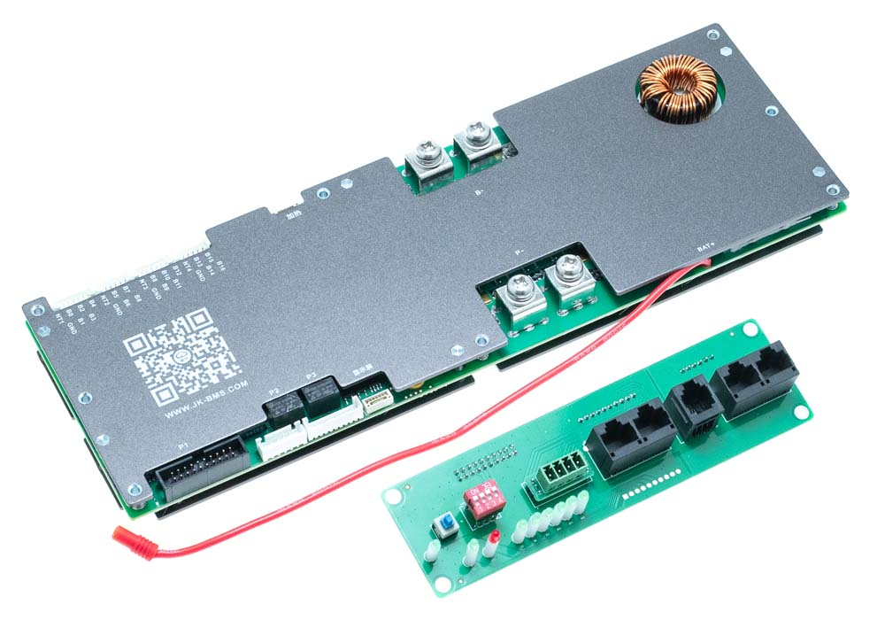
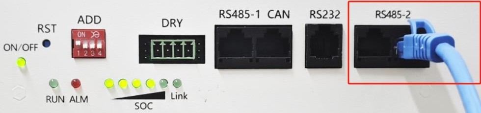
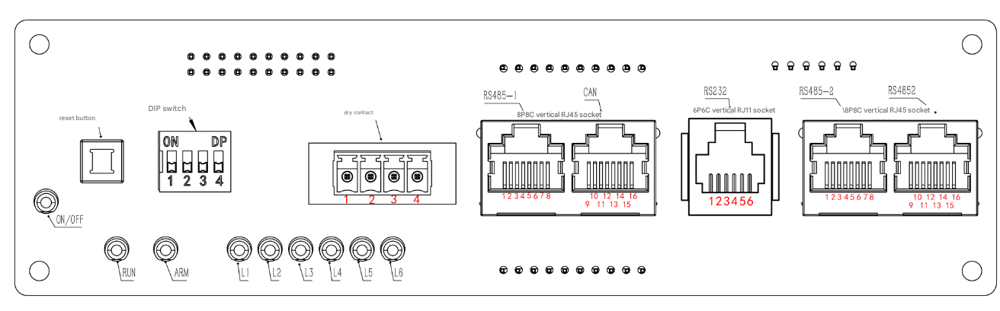

# YamBMS - JK-PB Inverter BMS

[](https://www.gnu.org/licenses/gpl-3.0)
[](https://github.com/Sleeper85/esphome-yambms/releases/latest)


> [!IMPORTANT]  
> The most important thing for proper functioning of YamBMS is that **the voltage of your BMS is well calibrated**.
> YamBMS logic is based on the `min_cell_voltage` and `max_cell_voltage` voltages of your BMS.
> If you use YamBMS, the internal charging logic of the `JK-PB BMS` will not be used.

## JK-PB BMS overview

||
|-|
||
||

## JK-PB BMS protocol

The datas from this BMS can be retrieved from the `RS485-2 (UART2)` network using the component [JK_RS485](https://github.com/txubelaxu/esphome-jk-bms/blob/main/components/jk_rs485_bms/README.md) of [@txubelaxu](https://github.com/txubelaxu).

The BMS DIP switches must be set from `1` to `15` (server mode) and connected to each other using the `RS485-2` network available on the **two ports at the right ends**. `YamBMS` also connects to one of these two ports.

### **UART2 configuration**

> [!NOTE]
> The protocol of the `UART2` port is not selectable from the JK application.
> It is automatically set based on the address (DIP switch) of the BMS.

In the last software version only two protocols are available on the **RS485-2 (UART2)** ports:

- **001** - JK BMS RS485 Modbus V1.0 **(DIP switch 1 to 15)**
- **015** - UART Protocol 015 **(DIP switch 0)**

### **UART1 configuration**

The following protocols are supported on the **RS485-1 (UART1)** port:

(*italic options ane not settable*)

- **000** - 4G-GPS Remote module Common protocol V4.2
- **001** - **JK BMS RS485 Modbus V1.0**
- **002** - NIU U SERIES
- **003** - China tower shared battery cabinet V1.1
- **004** - PACE_RS485_Modbus_V1.3
- **005** - PYLON_low_voltage_Protocol_RS485_V3.5
- **006** - Growatt_BMS_RS485_Protocol_1xSxxP_ESS_Rev2.01
- **007** - Voltronic_Inverter_and_BMS_485_communication_protocol_20200...
- **008** - China tower shared battery cabinet V2.0
- **009** - WOW_RS485_Modbus_V1.3
- **010** - JK BMS LCD Protocol V2.0
- **011** - *UART1 User customization*
- **012** - *UART2 User customization*
- **013** - (9600)JK BMS RS485 Modbus V1.0
- **014** - (9600)PYLON_low_voltage_Protocol_RS485_V3.5
- **015** - *UART Protocol 015*

### **CAN port configuration**

The following CAN protocols are supported on the CAN port:

(*italic options ane not settable*)

- **000** - JK BMS CAN Protocol (250K) V2.0
- **001** - Deye Low-voltage hybrid inverter CAN communication protocol V1.0
- **002** - PYLON-Low-voltage-V1.2
- **003** - Growatt BMS CAN-Bus-protocol-low-voltage_Rev_05
- **004** - Victron_CANbus_BMS_protocol_20170717
- **005** - MEGAREVO_Hybird_BMSCAN_Protocol_V1.0
- **006** - JK BMS CAN Protocol (500K) V2.0
- **007** - INVT BMS CAN Bus protocol V1.02
- **008** - GoodWe LV BMS Protocol (EX/EM/S-BP/BP)
- **009** - FSS-ConnectingBat-Tl-en-10 | Version 1.0
- **010** - MUST PV1800F-CAN communication Protocol1.04.04
- **011** - LuxpowerTek Battery CAN protocol V01
- **012** - *CAN BUS User customization*
- **013** - *CAN BUS Protocol 013*
- **014** - *CAN BUS Protocol 014*

## YamBMS hardware

> [!TIP]
> This solution only requires an ESP32 with a CAN transceiver and a RS485 transceiver.

You are free to choose the hardware you want, the list below are 3 easy to use examples :

- `AtomS3` with the isolated `Atomic CAN base` and `RS485 unit`
- [`LilyGo T-Connect`, ESP32-S3 with 3x RS485 and 1x CAN](https://github.com/Xinyuan-LilyGO/T-Connect)
- [`LilyGo T-CAN485`, ESP32 with 1x RS485 and 1x CAN](https://github.com/Xinyuan-LilyGO/T-CAN485)

See the [documentation about supported hardware](Supported_devices.md).

### M5Stack AtomS3 example (no welding)

The example below uses an `AtomS3` (display) with the `Atomic CAN base` and `RS485 unit`.


## Schematic and setup instructions

> [!CAUTION]
> Galvanic isolation of the `RS485` connection is strongly recommended.
> The diagrams below does not show the galvanic isolation of the `RS485` connection !

**Note:** the choice of RS485 board is not related to the chosen ESP32.

### AtomS3 with unisolated RS485 board

```
┌──────────┐                 ┌───────────┐                       ┌──────────┐
│          │                 │   UART    │<-VCC--------------5V--│          │<---5V
│   BMS    │                 │    TO     │                       │   ESP32  │
│  JK-PB   │<-RJ45-P1-----B->│   RS485   │<-DI-----------TX--G1--│  Atom S3 │
│          │<-RJ45-P2-----A->│           │--RO-----------RX--G2->│          │                  ┌────────────┐             ┌────────────┐
│  RS485   │                 │ CONVERTER │<-DE--+                │          │--G5--TX-----CTX->|            |             |            |
│ NETWORK  │                 │           │<-RE--└--TALK PIN--G8--│          │<-G6--RX-----CRX--|   Atomic   |<---CAN H--->|  Inverter  |
│          │                 │           │                       │          │<-------5V------->|  CAN Base  |<---CAN L--->|            |
|          |<-RJ45-P3---GND->|           |<-GND-------------GND->|          |<-------GND------>|            |             |            |
└──────────┘                 └───────────┘                       └──────────┘                  └────────────┘             └────────────┘
```

### ESP32-S3 with isolated RS485 board

```
┌──────────┐                 ┌───────────┐                       ┌──────────┐
│          │                 │   UART    │<-V1--------3V3 or 5V--│          │<---5V
│   BMS    │                 │    TO     │                       │          │
│  JK-PB   │<-RJ45-P1-----B->│   RS485   │<-RX-----------TX--17--│ ESP32-S3 │
│          │<-RJ45-P2 ----A->│           │--TX-----------RX--18->│          │                  ┌────────────┐             ┌────────────┐
│  RS485   │                 │ CONVERTER │                       │          │--38--TX-----CTX->|            |             |            |
│ NETWORK  │                 │           │      No TALK PIN (8)--│          │<-39--RX-----CRX--|    CAN     |<---CAN H--->|  Inverter  |
│          │                 │           │                       │          │<-------3V3------>| SN65HVD230 |<---CAN L--->|            |
|          |<-RJ45-P3----G2->|           |<-G1--------------GND->|          |<-------GND------>|            |             |            |
└──────────┘                 └───────────┘                       └──────────┘                  └────────────┘             └────────────┘
```

- [RJ45 568A pinout](../../images/RJ45-Pinout-T568A.jpg)
- [RJ45 568B pinout](../../images/RJ45-Pinout-T568B.jpg)

## BMS DIP switch config (mode 2)

With mode 2, the sniffer (ESP32) will automatically take the address 0x00 and act as master BMS (max 15 BMS).

- BMS 1 RS485 address : 0x01
- BMS 2 RS485 address : 0x02
- BMS 3 RS485 address : 0x03
- etc.

## JK-PB RS485 functions

### Broadcasting JK-PB settings to all BMS


When enabled, this function synchronizes the settings of all your BMS connected to the same RS485 network as soon as you make parameter changes.
