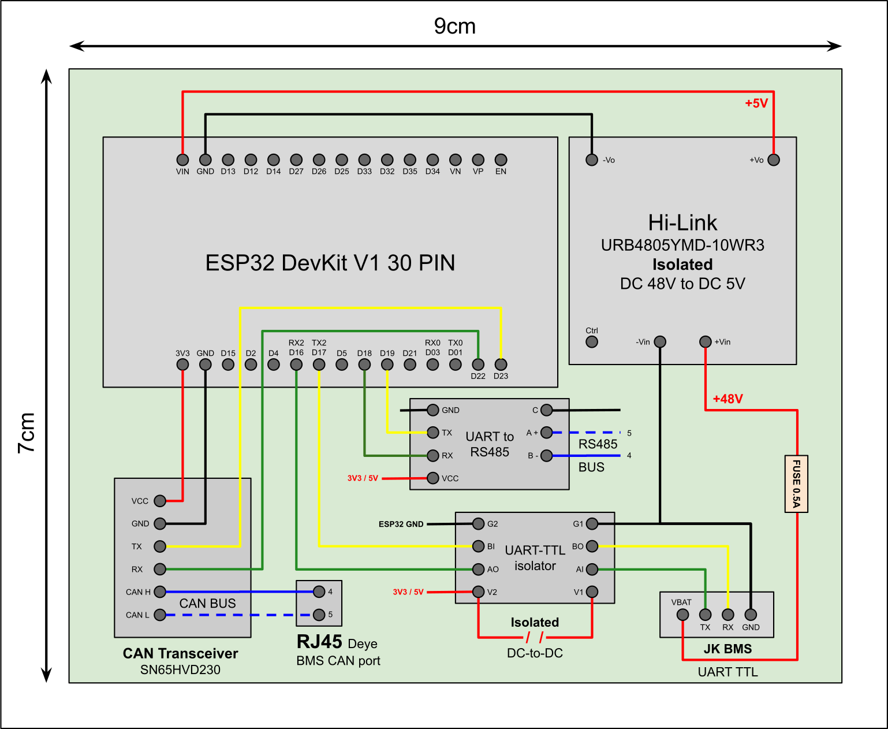
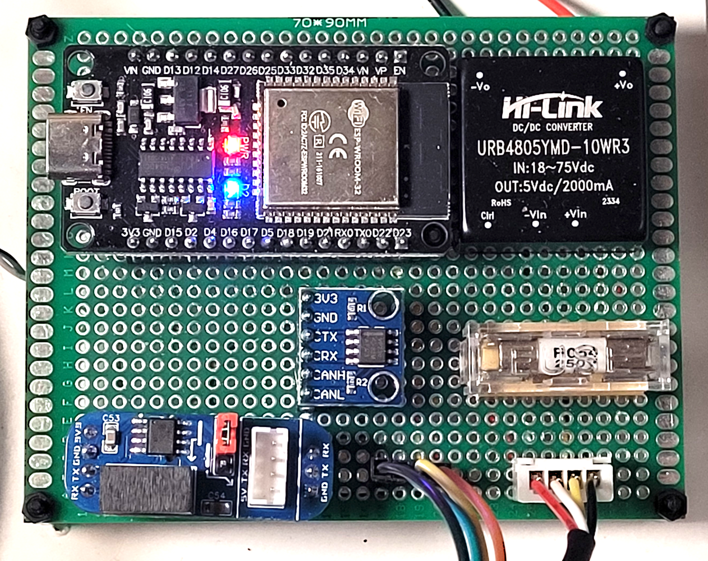

# YamBMS - ESP32 or ESP32-S3

> [!IMPORTANT]
> BMS monitoring with `UART` or `RS485` is recommended.

## BMS Support Capacity

Based on hardware limitations and testing, this board supports:

| Communication Method | Maximum BMS | Notes |
|----------------------|-------------|-------|
| **RS485** | Multiple BMS | Best option for monitoring many BMS units |
| **UART** | 3× BMS | Must be connected to the GPIOs header |
| **Bluetooth (BLE)** | 3× BMS (ESP32-S3) | BLE stack consumes significant RAM, may cause crashes/reboots |

**Note:** These are theoretical limits. Not all combinations have been tested.

## UART/IO Expander

It would be possible to add one or more [WK2168 4x UART expander](https://esphome.io/components/weikai.html) to increase the number of `UART` port.

## Build your own PCB

> [!CAUTION]
> The `GND` of the `JK-B GPS port` is directly connected with the `B-` of your battery. Even if your BMS is in protection or stopped you can measure the `full voltage` between this `GND` and `B+`. This therefore presents a risk of `bypass` of the BMS `P-` and can be dangerous if the GND of your ESP32 is connected to the GND of your inverter or a measurement shunt for example.
> I therefore strongly advise you to achieve [galvanic isolation](BMS_JK-B_UART_solution.md#galvanic-isolation-of-the-uart-ttl-connection) between your ESP32 and the `UART-TTL` of the `JK-B GPS port`.

This is an example of an `ESP32 DevKit V1` 30 pin board powered by the `JK-B` BMS. **This example uses an RS485 board for the `multi-node` solution which is not mandatory.**

