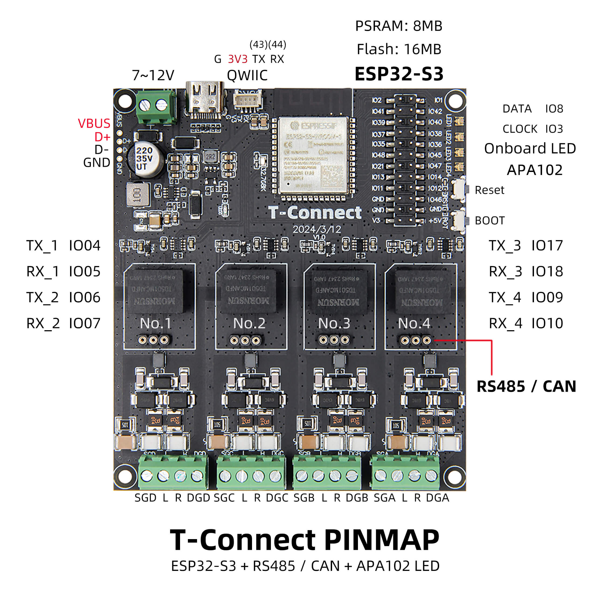
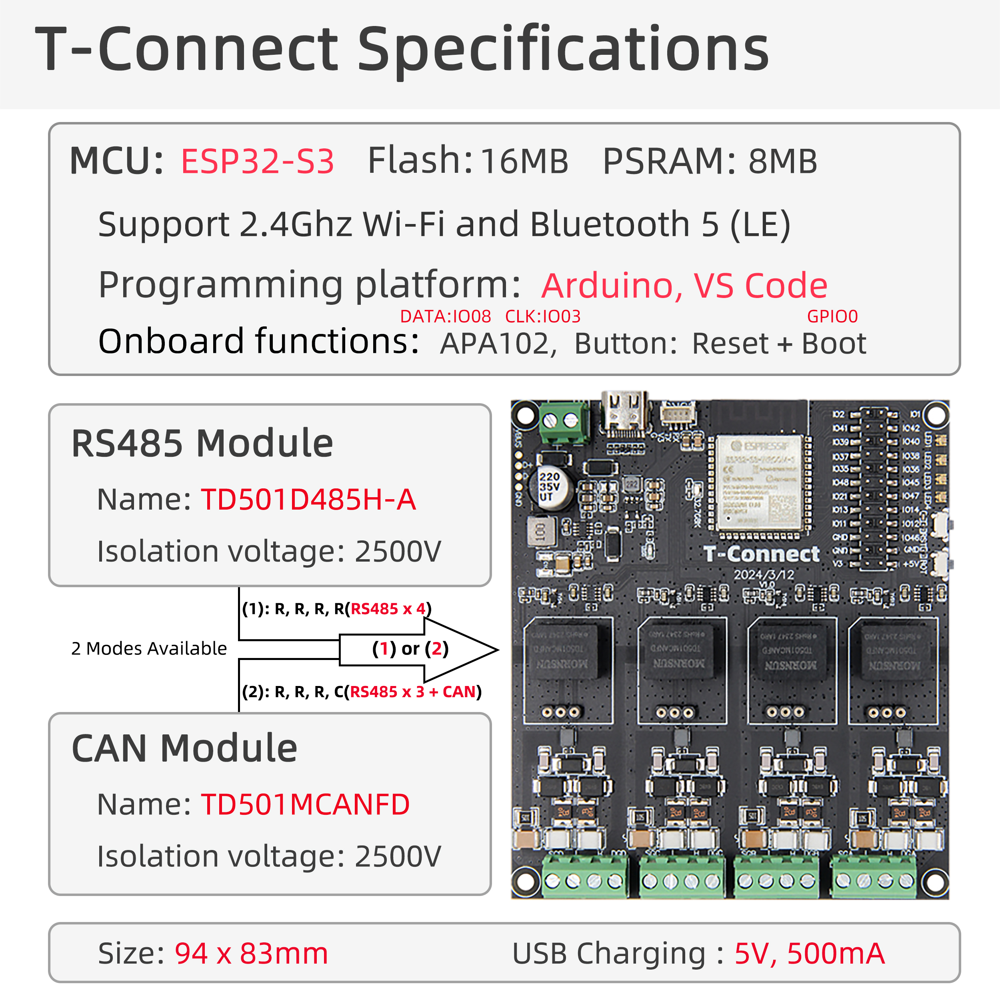

# YamBMS - LilyGo T-Connect

> [!IMPORTANT]  
> Make sure to order the version with **3x RS485** and **1x CAN**.

## Overview

The LilyGo T-Connect is a multi-functional development board based on the ESP32-S3-R8 chip, equipped with 8MB PSRAM and 16MB Flash, supporting Wi-Fi/Bluetooth dual-mode communication and RS485/CAN industrial protocols. This board is particularly well-suited for the YamBMS project thanks to its multiple communication interfaces including up to 3 RS485 ports and 1 CAN bus port.

**Key Features:**
- Multi-protocol Support: Supports up to three sets of RS485 and one set of CAN bus
- Industrial Communication: RS485 (UART protocol) and CAN bus (TWAI protocol)
- Flexible Configuration: Supports switching between CAN and RS485 modules
- Rich Interfaces: Integrated APA102 LED driver, QWIIC expansion interface
- Industrial Design: Wide voltage input (7V-12V DC), 4 positioning holes for easy installation

 

## Board Specifications

The T-Connect is available as a single version with the following specifications:

| Specification | Details |
|---------------|---------|
| Model | T-Connect |
| MCU | ESP32-S3-R8 |
| FLASH | 16MB |
| PSRAM | 8MB (Octal SPI) |
| RS485 | 3× Isolated RS485 interface |
| CAN Bus | 1× Isolated CAN interface |
| LED Driver | APA102 RGB |
| Wireless | Wi-Fi 802.11 b/g/n / Bluetooth 5.0 (BLE) |
| USB | Type-C (5V/500mA) |
| Power Input | 7V-12V DC |
| Expansion | 1× QWIIC Interface |
| Buttons | RESET + BOOT |
| Mounting | 4× 2mm positioning holes |
| Dimensions | 94×83×13mm |

**Note:** The T-Connect supports switching configuration between CAN and RS485 modules through onboard jumpers, allowing maximum flexibility with up to 3 RS485 ports + 1 CAN port simultaneously.

## Interfaces Support Capacity

Based on hardware limitations and testing, this board supports:

| Interface | Maximum | Notes |
|-----------|---------|-------|
| **CAN** | 1x bus | CAN bus to BMS or Inverter |
| **RS485** | 3x bus | Best option for monitoring many BMS of the same brand (**shared with UART**) |
| **UART** | 3× devices¹ | Must be connected to the **GPIOs header** (**shared with RS485**) |
| **Bluetooth (BLE)** | 3× devices¹ | BLE stack consumes significant RAM, may cause crashes/reboots |

¹ BMS / Balancer / Shunt

**Note:** These are theoretical limits. Not all combinations have been tested.

## UART/IO Expander

It would be possible to add one or more [WK2168 4x UART expander](https://esphome.io/components/weikai.html) to increase the number of `UART` port.

## Power Supply

The LilyGo T-Connect board can be powered using two methods:

### Option 1: USB-C Port
- Connect a USB-C cable to the USB-C port on the board
- Provides **5V / 500mA**
- Recommended for programming and testing
- Supports USB OTG functionality

### Option 2: External Power Supply (DC Input)
- Voltage range: **7V to 12V DC**
- Connect to the dedicated DC power terminal (usually labeled VIN/GND or PWR)
- Recommended for permanent installations and industrial environments
- Provides stable power for all communication interfaces
- Internal voltage regulator steps down to 5V and 3.3V for the ESP32-S3

**Important:** Do not power the board simultaneously through USB-C and the external DC terminal to avoid potential damage to the power regulation circuitry.

## Port Identification

### Communication Ports Layout

The T-Connect board features 4 communication ports that share pins through a switching mechanism. The board supports up to **3 RS485 ports + 1 CAN port** simultaneously through proper configuration.

**Pin Assignment :**

| Port | TX Pin | RX Pin | Protocol |
|------|--------|--------|----------|
| Port 1 | IO4 | IO5 | RS485 |
| Port 2 | IO6 | IO7 | RS485 |
| Port 3 | IO17 | IO18 | RS485 |
| Port 4 | IO9 | IO10 | CAN |

### RS485 ports

The RS485 ports are positioned at locations **No.1** to **No.3** (see photo at the beginning of this page).

**RS485 Terminal Pinout:**
- **SG** - Signal Ground (for shield connection and noise immunity)
- **L** - RS485 A (Data+)
- **H** - RS485 B (Data-)
- **DG** - Data Ground (common reference ground)

### CAN port

The CAN bus port is positioned at location **No.4** (see photo at the beginning of this page).

**CAN Terminal Pinout:**
- **SG** - Signal Ground (for shield connection and noise immunity)
- **L** - CAN L (CAN Low)
- **H** - CAN H (CAN High)
- **DG** - Data Ground (common reference ground)

## Wiring Instructions

### Connecting RS485 Devices

To connect an RS485 device to any of the configured RS485 ports:

| RS485 | Terminal Block |
|-------|----------------|
| - | SG : Shield/Signal Ground (optional but recommended) |
| A + | L (RS485 A, Data+ non-inverting) |
| B - | H (RS485 B, Data- inverting) |
| GND | DG : Data/Device Ground (optional but recommended) |

**Wiring Steps:**
1. Ensure the port is configured for RS485 mode using the onboard jumpers
2. Identify the A and B wires from your RS485 device (often labeled as D+/D- or A/B)
3. Connect the **A wire (D+)** to the **L pin** of the RS485 port
4. Connect the **B wire (D-)** to the **H pin** of the RS485 port
5. **Connect the ground wire** to the **DG pin** for common reference (highly recommended)
6. If using **shielded cable**, connect the shield to the **SG pin** (recommended for noisy environments)

**Ground Connection Best Practices:**
- **Always connect DG (Data Ground)** to provide a common reference between devices
- This prevents communication errors caused by ground potential differences
- Over long distances or in industrial environments, ground connection is critical
- RS485 can tolerate -7V to +12V common mode voltage, but proper grounding prevents issues

**Shield Connection (for shielded cables):**
- Connect the cable shield to **SG (Signal Ground)** at one end only to avoid ground loops
- In electrically noisy environments, shield connection significantly improves noise immunity
- The shield should be connected at the end closest to earth ground

**Important Notes:**
- RS485 polarity matters: swapping A and B will prevent communication
- If communication fails, try swapping the A and B connections
- Use twisted pair cable for RS485 connections to reduce noise and interference
- The board supports UART protocol for RS485 communication
- According to official testing: RS485 operates at **115200 baud rate** with a **communication distance up to 35 meters**

### Connecting CAN Bus Devices

To connect a CAN bus device to the CAN port:

| CAN bus | Terminal Block |
|---------|----------------|
| - | SG : Shield/Signal Ground (optional but recommended) |
| CAN L | L (CAN Low) |
| CAN H | H (CAN High) |
| GND | DG : Data/Device Ground (optional but recommended) |

**Wiring Steps:**
1. Ensure the port is configured for CAN mode using the onboard jumpers
2. Identify the CAN H and CAN L wires from your CAN device
3. Connect the **CAN H wire** to the **H pin** of the CAN port
4. Connect the **CAN L wire** to the **L pin** of the CAN port
5. **Connect the ground wire** to the **DG pin** for common reference (optional but recommended)
6. If using **shielded cable**, connect the shield to the **SG pin** (recommended for noisy environments)

**Ground Connection Best Practices:**
- **Always connect DG (Data Ground)** to provide a common reference between devices
- Ground connection is especially important for CAN bus to prevent communication failures
- Helps maintain proper common mode voltage range
- Essential for long cable runs or installations with multiple power sources

**Shield Connection (for shielded cables):**
- Connect the cable shield to **SG (Signal Ground)** at one end only to avoid ground loops
- In electrically noisy industrial environments, shield connection is highly recommended
- Many CAN applications in automotive and industrial settings require shielded cables

**Important Notes:**
- CAN bus requires proper termination at both ends of the bus (see Termination Resistors section)
- Use twisted pair cable specifically designed for CAN bus (recommended impedance: 120Ω)
- The board uses TWAI (Two-Wire Automotive Interface) protocol for CAN communication
- According to official testing: CAN operates at **500 kbps** with a **communication distance up to 35 meters**
- Maximum cable length depends on baud rate (shorter distances for higher speeds)

## Additional Features

### APA102 LED Driver

The T-Connect includes an onboard APA102 LED driver for controlling RGB light strips:

**Pin Assignment:**
- **APA102_DATA**: GPIO8
- **APA102_CLOCK**: GPIO3

This allows direct control of addressable RGB LED strips without additional hardware.

### QWIIC Expansion Interface

The T-Connect features a **QWIIC interface** for easy connection to the QWIIC ecosystem of I2C sensors and modules, enabling simple plug-and-play expansion without soldering.

### Mounting

The board includes **4× 2mm positioning holes** for secure mounting in enclosures or on DIN rails, ideal for permanent industrial installations.

## Bus Termination

Both RS485 and CAN bus networks require termination resistors to prevent signal reflections and ensure reliable communication.

### Important Note About Termination

**The T-Connect board does not appear to have built-in switchable termination resistors** based on the official documentation. Users will need to add external termination resistors when required.

### RS485 Termination Requirements

RS485 networks require **120Ω termination resistors** at both ends of the bus:

**When You Need Termination:**
- At the **first and last devices** on the RS485 bus
- For cable runs longer than a few meters
- In electrically noisy environments

**How to Add External Termination:**
- Connect a 120Ω resistor between the A (L pin) and B (H pin) terminals
- Only install termination at the two endpoints of the bus
- If the T-Connect is in the middle of the network, do not add termination

### CAN Bus Termination Requirements

CAN bus networks require exactly **two 120Ω termination resistors** (one at each end):

**Critical CAN Termination Rules:**
- Exactly **two 120Ω resistors** must be present on the entire CAN bus
- One resistor at each physical end of the bus
- Without proper termination, CAN communication will fail
- With proper termination, you should measure ~60Ω between CAN H and CAN L

**How to Add External Termination:**
- Connect a 120Ω resistor between CAN H (H pin) and CAN L (L pin) terminals
- Only install at the two endpoints of the CAN bus
- Many CAN devices (like inverters) have built-in termination - check your device documentation

**Tip:** For point-to-point connections (e.g., T-Connect ↔ Inverter), you typically need termination at both ends. Check if your inverter has built-in termination before adding external resistors.

## Typical YamBMS Configuration

For a typical YamBMS setup with the LilyGo T-Connect board:

1. **Power Supply:** 
   - For bench testing: Connect USB-C cable (5V/500mA)
   - For permanent installation: Connect 12V DC to the external power terminal (recommended)

2. **BMS Communication:** 
   - Connect your BMS (e.g., JK, JBD, SEPLOS, PACE, BASEN) to RS485 ports (No.1 to No.3)
   - Wire according to: **L=RS485 A**, **H=RS485 B**, **DG=Ground**
   - Connect shield to SG if using shielded cable

3. **Inverter Communication:** 
   - Connect your inverter (e.g., Deye, Sofar, Growatt, Victron) to the CAN port (No.4)
   - Wire according to: **L=CAN L**, **H=CAN H**, **DG=Ground**
   - Connect shield to SG if using shielded cable
   - Typical CAN speed: 500 kbps

4. **Bus Termination:** 
   - **RS485:** Add external 120Ω resistor between L and H pins if the T-Connect is at the end of the RS485 bus
   - **CAN:** Check if your inverter has built-in termination. If not, add external 120Ω resistor between CAN H and CAN L
   - For point-to-point connections, you typically need termination at both devices

## Additional Resources

### Official Documentation
- [LilyGo T-Connect Official Wiki](https://wiki.lilygo.cc/get_started/en/High_speed/T-Connect/T-Connect.html)
- [LilyGo Official Store](https://lilygo.cc/products/t-connect)
- [LilyGo Official GitHub](https://github.com/Xinyuan-LilyGO)
- [T-Connect GitHub Repository](https://github.com/Xinyuan-LilyGO/T-Connect)

### Datasheets & Schematics
- [ESP32-S3 Datasheet](https://www.espressif.com/sites/default/files/documentation/esp32-s3_datasheet_en.pdf)
- [T-Connect V1.0 Schematic (PDF)](https://github.com/Xinyuan-LilyGO/T-Connect/blob/main/project/T-Connect_V1.0.pdf)
- [TD501MCANFD Datasheet](https://github.com/Xinyuan-LilyGO/T-Connect-Pro/blob/main/information/TD501MCANFD_MORNSUN.pdf)
- [TD501D485H-A Datasheet](https://github.com/Xinyuan-LilyGO/T-Connect-Pro/blob/main/information/TD501D485H-A_K-CUT.pdf)

## Troubleshooting

### No Communication on RS485
- Verify the port is configured for RS485 mode (check jumper settings)
- Verify correct A/B wiring (L=A, H=B). Try swapping if communication fails
- Check baud rate matches between devices (tested at 115200 for T-Connect)
- **Add external 120Ω termination resistors** at both ends of the RS485 bus if not already present
- Test cable continuity and check for damaged twisted pair cable
- Maximum tested distance: 35 meters at 115200 baud

### No Communication on CAN Bus
- Verify the port is configured for CAN mode (check jumper settings)
- Verify CAN H and CAN L are correctly connected (H to H pin, L to L pin)
- **Ensure exactly two 120Ω termination resistors are present** on the entire CAN bus (add external resistors if needed)
- Verify CAN bus speed matches all devices (tested at 500 kbps for T-Connect)
- Measure resistance between CAN H and CAN L with multimeter (should be ~60Ω with proper termination)
- Check TWAI protocol configuration in your software
- Maximum tested distance: 35 meters at 500 kbps

### Board Not Powering Up
- Check power supply voltage (7-12V DC for external power, 5V for USB-C)
- Verify polarity of external power connection (check + and - terminals)
- Try powering via USB-C for testing
- Check for short circuits on terminal blocks
- Inspect for damaged components or solder bridges

### Programming/Upload Issues
- Hold down the **BOOT button** while uploading firmware
- Verify USB cable supports data transfer (not charge-only cable)
- Check that correct COM port is selected in Arduino IDE or PlatformIO
- Ensure USB CDC is enabled in Arduino IDE settings
- Try different USB cable or USB port on your computer

### Termination Resistor Tips
- **RS485:** Use 1/4W 120Ω resistors between L and H pins at both bus ends
- **CAN:** Use 1/4W 120Ω resistors between CAN H and CAN L at both bus ends
- Verify termination with multimeter: ~60Ω for CAN, ~60Ω for RS485 (when measured across the entire bus)
- Many devices have built-in termination - check documentation before adding external resistors

## Comparison with Other Boards

### Waveshare ESP32-S3-RS485-CAN vs LilyGo T-Connect

| Feature | Waveshare | LilyGo T-Connect |
|---------|-----------|------------------|
| RS485 Ports | 1 (isolated) | Up to 3 (isolated) |
| CAN Ports | 1 (isolated) | 1 (isolated) |
| Built-in Termination | ✅ Yes (120Ω jumper-selectable) | ❌ No (external resistors required) |
| Power Isolation | ✅ Yes | ❌ No |
| Signal Isolation | ✅ Yes (RS485 & CAN) | ✅ Yes (RS485 & CAN up to 2500V) |
| Enclosure | ✅ DIN rail ABS case included | ❌ No enclosure |
| Power Input | 7-36V DC or USB-C | 7-12V DC or USB-C |
| LED Indicators | PWR, RS485 TX/RX, CAN | PWR, APA102 support |
| Price | Moderate | Moderate |
| Best For | Single RS485 + CAN with isolation | Multiple RS485 + CAN with isolation |

**Summary:** The Waveshare board excels in **industrial-grade protection and built-in termination**, while the LilyGo offers **more RS485 ports and configuration flexibility**. Choose based on your specific needs:
- **Waveshare**: Best for harsh environments, built-in termination, ease of installation
- **LilyGo**: Best for multiple RS485 devices, flexible configuration, compact size

---

**License:** This documentation is part of the YamBMS project and is licensed under GPLv3.

**Disclaimer:** Always verify specifications and wiring with the official LilyGo documentation before deployment. This guide is community-created and may not reflect the latest product revisions.