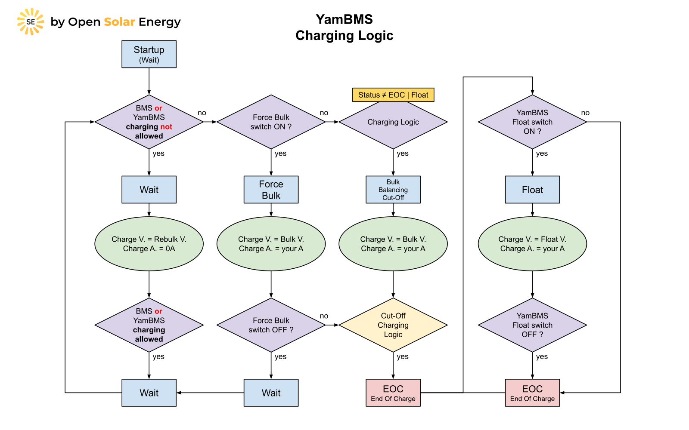
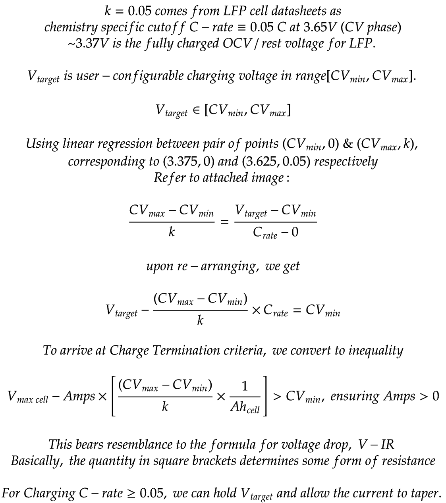
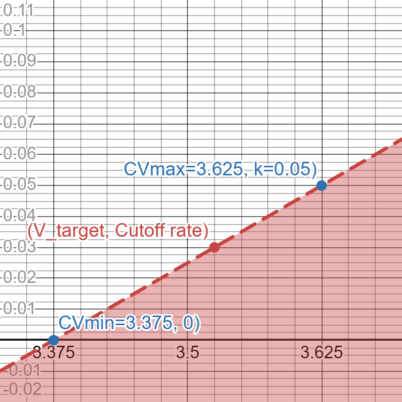
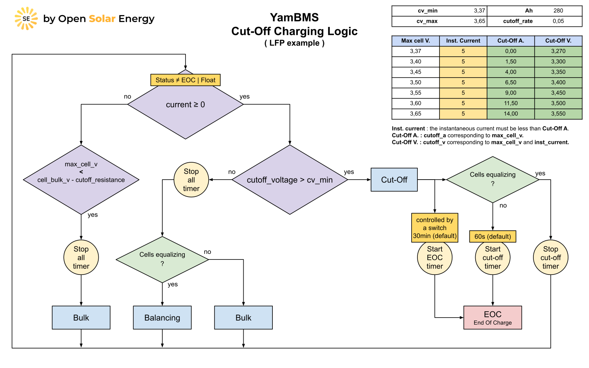
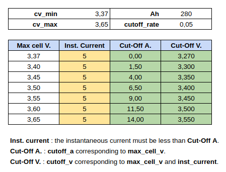
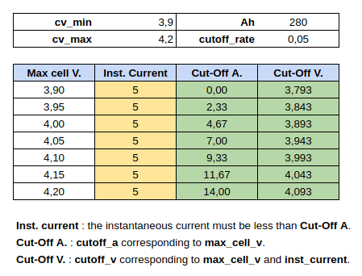
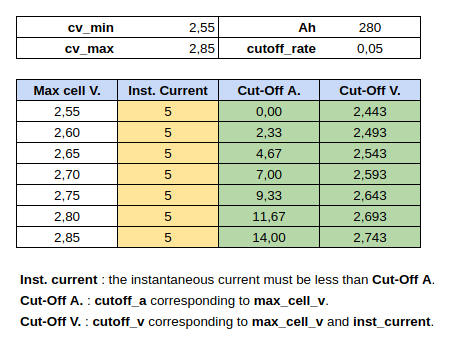

# YamBMS - Charging Logic

[](https://www.gnu.org/licenses/gpl-3.0)
[](https://github.com/Sleeper85/esphome-yambms/releases/latest)


> [!NOTE]
> Please read the documentation regarding the [charging settings](YamBMS_functions.md#charging-settings).

## Charging Logic Diagram

The charging voltage and current correspond to the default values in the YAML script and can be modified.



## Cut-Off Charging Logic Equation

Source: [Charging Marine Lithium Battery Banks](https://nordkyndesign.com/charging-marine-lithium-battery-banks)

Special thanks to [@shvmm](https://github.com/shvmm) for deriving the equations.

Note: The equations below can be adopted for other chemistries like Li-ion and LTO with specific CVmin and CVmax values.





```cpp
// CPP style pseudocode for guiding implementation, assuming we've already fetched params
// cutoff_resistance: (CVmax - CVmin) ÷ (k * cell_Ah)
// CVmax = 3.625, CVmin = 3.375
// Cutoff_Rate_LFP(k) = 0.05C (k can be increased to 0.08C or even 0.1C for extra safety margin)
// cell_Ah = user supplied, 100 Ah for this example

// cutoff_r_LFP = (3.625 - 3.375) ÷ (0.05 * cell_Ah) = 5 / cell_Ah

float cutoff_r_LFP = (3.625-3.375) / cell_Ah / 0.05;
static num_count = 0;

void charging_loop (args... if any) {
    if (max_cell_voltage - cutoff_r_LFP * I_bat) > CVmin && I_bat > 0) {
        // Current can't be negative for calculations.
        num_count++;
        // the criteria check must succeed num_count=4 times (adjustable) in a row to safely terminate,
        //so we don't terminate with random/bogus/erroneous readings from BMS
    } else num_count = 0; // resets n back to 0 otherwise
    
    if (num_count>4) {  
        // charge termination is reached.
        // The highest voltage cell is fully charged, charging must be terminated and we can proceed with balancing.
        // Do something here
     }
}
```

## Cut-Off Charging Logic Diagram (what's happening in the yellow diamond)

Note: The diagram below is valid for other chemistries like Li-ion and LTO but with other CVmin and CVmax values.



## LFP Cut-Off Values

- Nominal : 3.20 V
- CV min : 3.37 V
- CV max : 3.65 V



## Li-ion Cut-Off Values

- Nominal : 3.60 V
- CV min : 3.90 V
- CV max : 4.20 V



## LTO Cut-Off Values

- Nominal : 2.40 V
- CV min : 2.55 V
- CV max : 2.85 V


