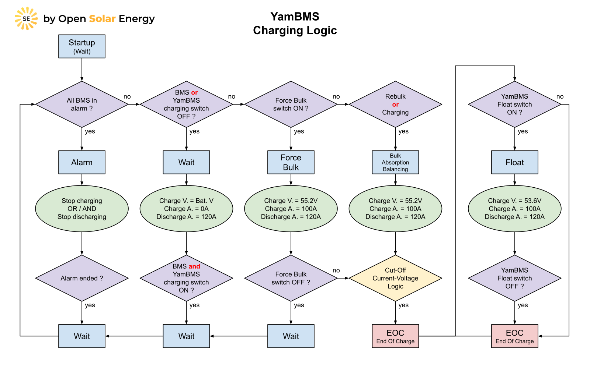
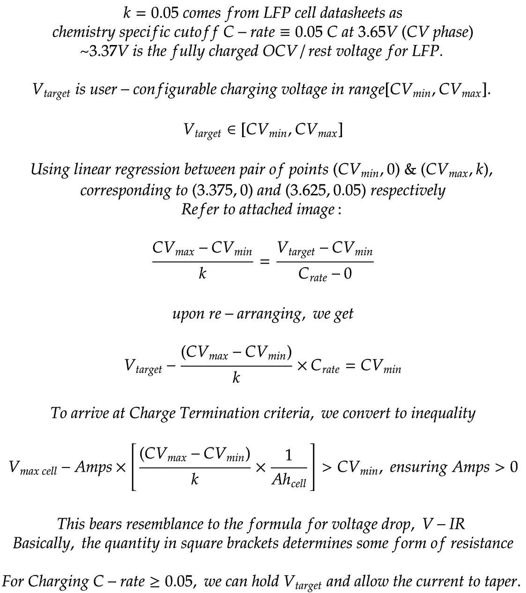
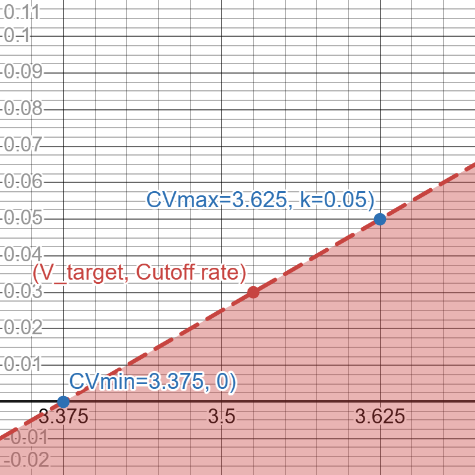
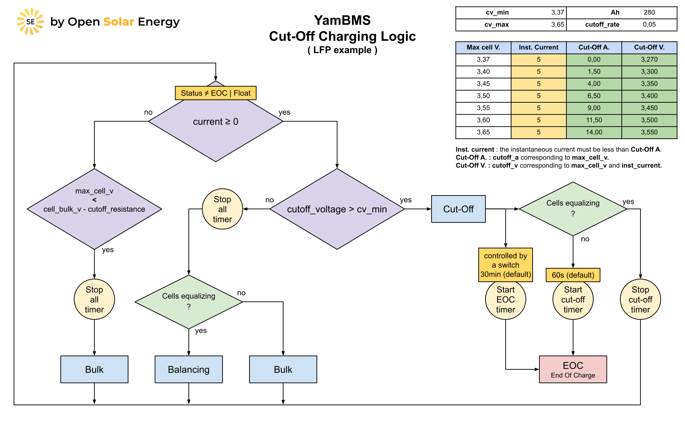
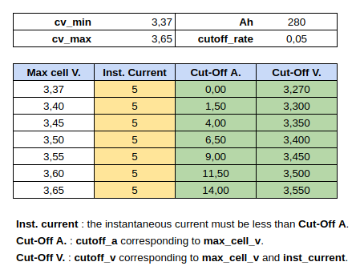
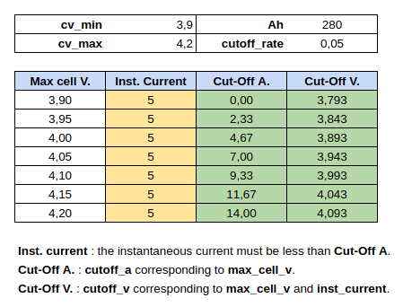
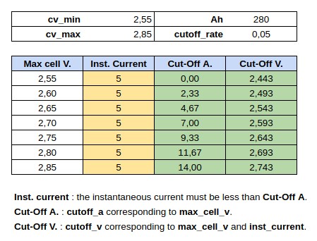

# YamBMS charging logic

> [!NOTE]
> Please read the documentation regarding the [charging settings](YamBMS_functions.md#charging-settings).

> [!NOTE]
> Please read the [YamBMS 1.7.1 Cut-Off charging logic release note](Release_note_YamBMS_1.7.1_Cut-Off_charging_logic.md).

## Charging Logic Diagram

The charging voltage and current correspond to the default values in the YAML script and can be modified.

## Cut-Off Charging Logic Equation

Source: [Charging Marine Lithium Battery Banks](https://nordkyndesign.com/charging-marine-lithium-battery-banks)

Special thanks to [@shvmm](https://github.com/shvmm) for deriving the equations.

Note: The equations below can be adopted for other chemistries like Li-ion and LTO with specific CVmin and CVmax values.

 

The physical anchor of the equation is **CVmin**, the resting voltage of a fully charged cell (~3.37 V for LFP): a cell above `cv_min` at zero current is full, and a cell cannot become full while staying below `cv_min + R·I` under current. The current taper therefore inevitably crosses the criterion when the battery is genuinely full, even if the requested charge voltage is never reached (e.g. low PV production days).

## Cut-Off Cell Voltage source

The `Cut-Off Cell Voltage` select defines which cell voltage feeds the whole Cut-Off logic below (`cell_v` in this document):

- `Max Cell Voltage` (default): `cell_v = max_cell_v`. Conservative, the end of charge depends on the highest cell.
- `Average Cell Voltage`: `cell_v = battery_voltage / cell_count`. The end of charge reflects the state of the whole pack, giving a consistent charge termination voltage from one day to the next. Recommended for packs built from unmatched cells (different internal resistances), packs with a runner cell, or a BMS that does not report its equalizing status.

> [!WARNING]  
> With `Average Cell Voltage`, the highest cell no longer stops the charge. Cell-level protection **must** be ensured by `Auto CVL` and/or `Auto CCL`, the BMS `OVP` remaining the last resort. If your inverter does not respect the requested charge voltage, only the `Auto CCL` is effective.

## Cut-Off Charging Logic Diagram (what's happening in the yellow diamond)

> [!NOTE]
> The diagram below is valid for other chemistries like Li-ion and LTO but with other CVmin and CVmax values.

> [!WARNING]  
> This diagram no longer reflects reality and needs to be updated.

The logic evaluates the battery current first, in three zones:

**1. Current deadband** (`current < 0.005C`, ≈1.4 A on a 280 Ah pack) — the current is within sensor noise or PV starvation, the compensated equation is not meaningful. Three outcomes:

- `cell_v ≥ cv_min` and `SoC ≥ 95 %` → **Cut-Off conditions valid**. This is the *fully charged at rest* signature: `cv_min` is by definition the resting voltage of a full cell, so a battery that stops accepting current with `cell_v` above it has completed its charge — without ever needing to reach the bulk voltage.
- `cell_v < cv_min` → **Bulk conditions valid**: the battery cannot be full, any running timer is stopped.
- otherwise → **grey zone**: no conclusion is drawn, the charge status is left unchanged.

**2. Charging** (`current > deadband`) — the **Cut-Off conditions are valid** when both:

- `cutoff_voltage ≥ cv_min` where `cutoff_voltage = cell_v − cutoff_resistance × current` (the compensated criterion, see the equation above);
- `SoC ≥ 95 %` (`yambms_eoc_min_soc`, configurable, max 98 %) — a safety net against premature Cut-Off caused by a runner cell or a transient voltage reading.

Otherwise the **Bulk conditions are valid**.

**3. Discharging** — the **Bulk conditions are valid** when `cell_v < cell_bulk_v − cell_hysteresis_v` (20 mV/cell by default). Otherwise nothing changes (grey zone).

The Bulk or Cut-Off **conditions must hold continuously for 10s** before the corresponding phase is entered. Transient states (cloud passages, load spikes) that flip the conditions back and forth never change the phase.

Once the **Cut-Off phase** is entered:

- if the BMS reports that cells are **equalizing**, the cut-off timer is stopped: the charge is held so the balancer can work;
- otherwise the **cut-off timer** starts (`180s` default): if the Cut-Off conditions still hold when it expires, the **EOC** (End Of Charge) is declared;
- in parallel, if the `EOC timer` switch is enabled, the **EOC timer** (`30min` default) guarantees that the Cut-Off phase ends at the latest when it expires, even if cells are still equalizing.

Returning to the Bulk phase stops both timers.

## LFP Cut-Off Values

- Nominal : 3.20 V
- CV min : 3.37 V
- CV max : 3.65 V

To enter the **Cut-Off phase** while charging, **cutoff_voltage ≥ cv_min** and **SoC ≥ 95 %** must hold for 10s.

Reading example at 5A: the Cut-Off conditions become valid when `cell_v` reaches **3.47 V** (the row where `Cut-Off A.` equals the instantaneous current). The `Cut-Off V.` column shows the compensated voltage for each `cell_v`, which must exceed `cv_min`.

## Li-ion Cut-Off Values

- Nominal : 3.60 V
- CV min : 3.90 V
- CV max : 4.20 V

To enter the **Cut-Off phase** while charging, **cutoff_voltage ≥ cv_min** and **SoC ≥ 95 %** must hold for 10s.

## LTO Cut-Off Values

- Nominal : 2.40 V
- CV min : 2.55 V
- CV max : 2.85 V

To enter the **Cut-Off phase** while charging, **cutoff_voltage ≥ cv_min** and **SoC ≥ 95 %** must hold for 10s.

