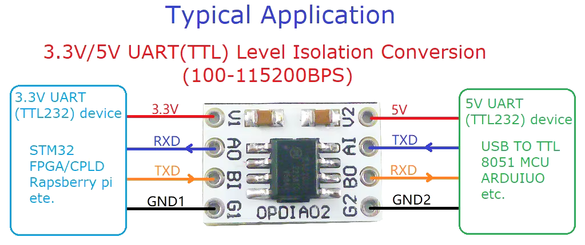
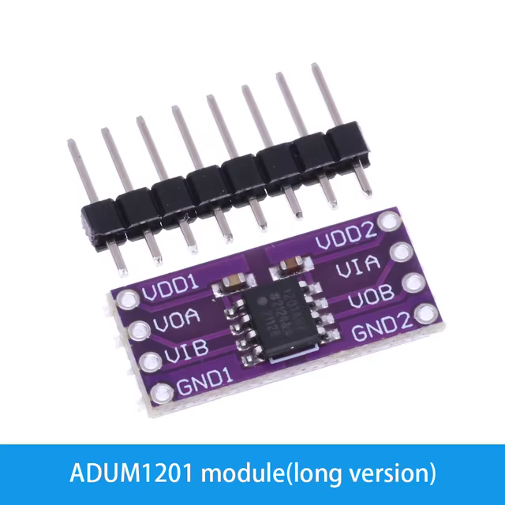
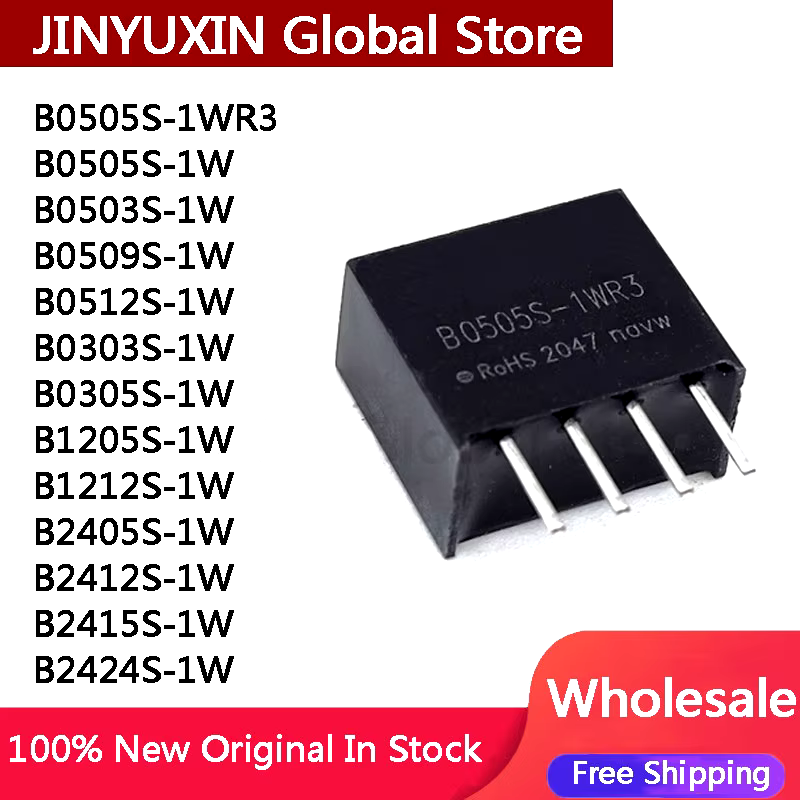

# YamBMS - Galvanic isolation

[](https://www.gnu.org/licenses/gpl-3.0)
[](https://github.com/Sleeper85/esphome-yambms/releases/latest)


## Galvanic isolation of the `UART-TTL` connection

> [!CAUTION]
> `V1` and `V2` (3V3 or 5V) must be isolated and cannot come from the same source. `V1` can be powered by the device or the `3V3` of the ESP32 via a `DC-DC isolator` (**B0303S = 3V3-to-3V3**), `V2` (ESP32 side) is powered directly by the `3V3` of the ESP32.

```
┌─────────────┐             ┌──────────┐             ┌───────────┐
│             |  3V3/5V--V1>│          |<V2---3V3---<|           |
│   DEVICE    │<RX-------AO<│ UART-TTL │<AI-------TX<|   ESP32   |
│ BMS / Shunt │>TX-------AI>│ ISOLATOR │>BO-------RX>|           |
│             │<----GND---->│          │<----GND---->|           |
└─────────────┘             └──────────┘             └───────────┘
```

Here are some components available on the market allowing you to set up galvanic isolation. The `UART-TTL isolator 2` seems a little better isolated with more space below the chip.

* [UART-TTL isolator 1](https://a.aliexpress.com/_EuXszn7)
* [UART-TTL isolator 2](https://a.aliexpress.com/_EItDRvX)
* [DC-DC isolator](https://a.aliexpress.com/_EIsPAoh)



| [UART-TTL isolator](https://a.aliexpress.com/_EItDRvX) | [DC-DC isolator](https://a.aliexpress.com/_EIsPAoh) |
| --- | --- |
|  |  |

### Another solution would be the use of M5Stack's isolated RS485 unit.

| [M5Stack RS485 unit (isolated)](https://docs.m5stack.com/en/unit/iso485) |
| --- |
|  |
