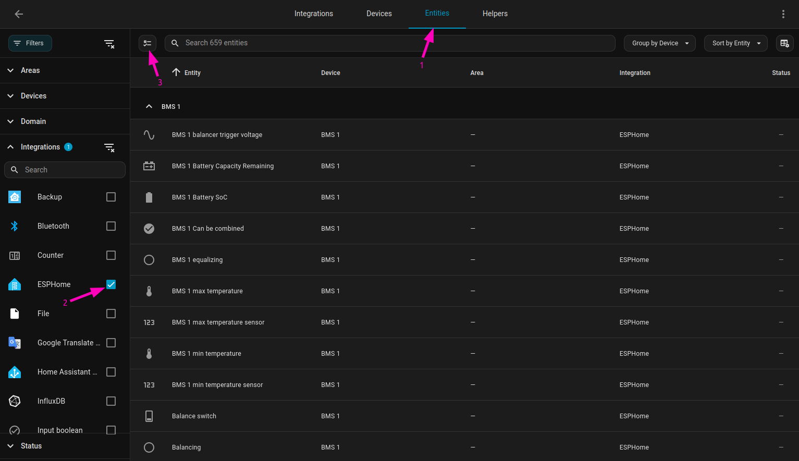
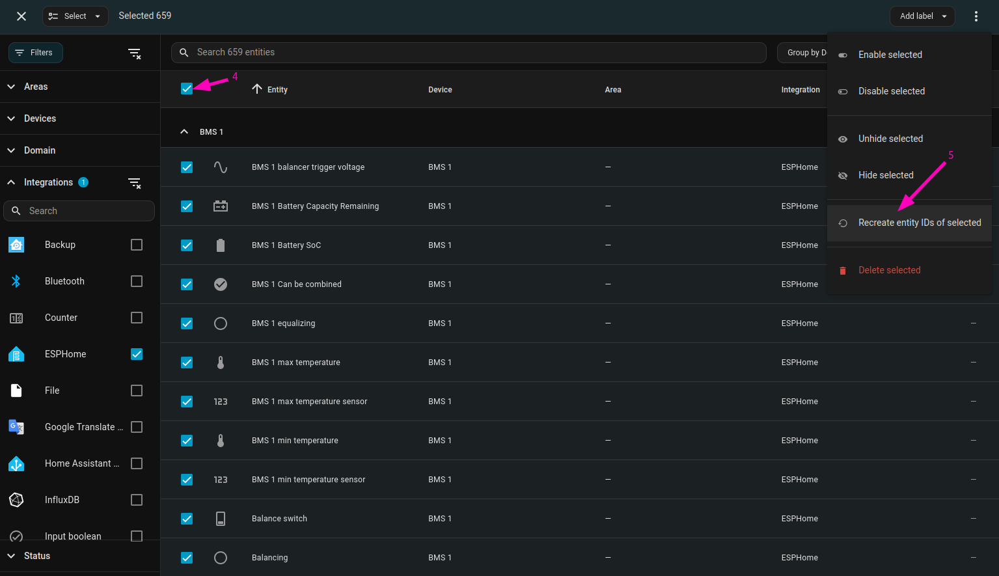
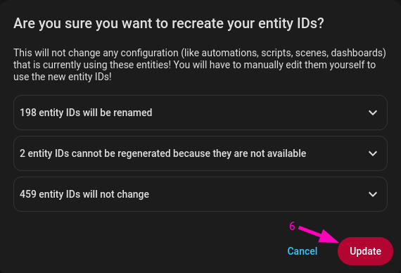
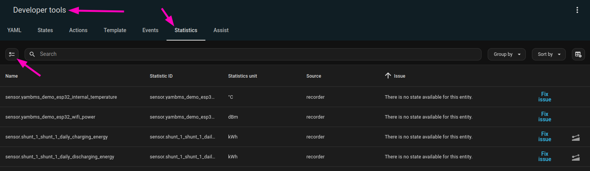
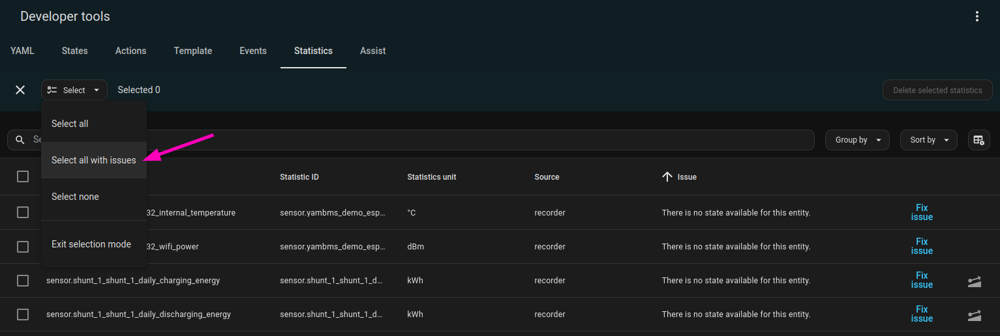
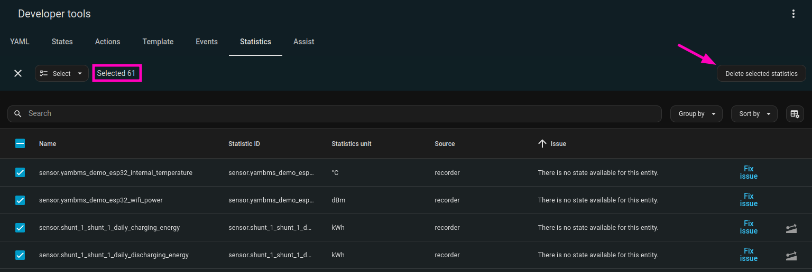
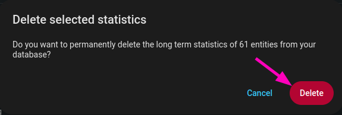

# Cleaning up Home Assistant entities after a YamBMS update

After renaming your ESPHome node, its sub-devices (BMS, Shunt, Balancer…) or individual entities, Home
Assistant does **not** update the existing `entity_id`s. Only the *friendly names* follow — the entity IDs
keep the slug that was generated the very first time the entity was discovered.

The result is a registry that slowly drifts away from the YAML:

- entity IDs still carrying the old node name, e.g. `sensor.yambms_bms_1_battery_soc`
  instead of `sensor.bms_1_battery_soc`;
- duplicated entities suffixed with `_2` when a new entity claims an ID that is already taken;
- long-term statistics left in the recorder database for entity IDs that no longer exist.

This guide covers the two maintenance operations that fix this:

1. [Fix entity names](#1-fix-entity-names) — regenerate the entity IDs so they match the current names.
2. [Remove old entities](#2-remove-old-entities) — delete the orphaned long-term statistics left behind.

Run them **in this order**: renaming first, cleanup second. What remains flagged after step 1 is genuinely
orphaned data.

---

## Before you start

| Requirement | Why |
|---|---|
| **Take a full backup** (*Settings → System → Backups*) | Both operations write to the entity registry and to the recorder database. Neither can be undone from the UI. |
| **Bring the ESPHome node online** | Entities that are unavailable cannot have their ID regenerated, and their statistics will be wrongly reported as orphaned. |
| **Flash the final YAML first** | Do the cleanup *after* all renames are done, not between two iterations. |
| **Recent Home Assistant version** | *Recreate entity IDs* and *Select all with issues* are recent additions to the UI. Update HA if the menu entries described below are missing. |

> [!WARNING]
> Recreating an entity ID **does not** update anything that references it: automations, scripts, scenes,
> dashboards, template sensors, utility meters, the Energy dashboard, or external consumers such as
> InfluxDB, Grafana or Node-RED. Plan to review those afterwards — see
> [After the rename](#after-the-rename).

---

## 1. Fix entity names

This procedure makes Home Assistant recompute every selected `entity_id` from the entity's current name and
its device name.

### Step 1 — Open the entity list and filter it

Go to **Settings → Devices & Services** and open the **Entities** tab `(1)`.

In the left sidebar, expand **Integrations** and tick **ESPHome** `(2)`. This restricts the list to entities
provided by ESPHome, so nothing else in your installation can be touched by mistake.

Then switch the table to selection mode with the button on the left of the search field `(3)`.

> [!IMPORTANT]
> The **ESPHome** filter selects the entities of **all** your ESPHome nodes, not just YamBMS. If you run
> other ESPHome devices whose entity IDs must stay untouched, filter on the **Devices** section instead and
> pick only the YamBMS device and its sub-devices.

### Step 2 — Select the entities and launch the operation

Tick the checkbox in the table header to select everything currently displayed `(4)`, then open the
overflow menu (⋮) in the top-right corner and choose **Recreate entity IDs of selected** `(5)`.

### Step 3 — Review the summary and confirm

Home Assistant shows what it is about to do before applying anything. Each line can be expanded to list the
entities concerned:

| Line | Meaning |
|---|---|
| *N entity IDs will be renamed* | Entities whose current ID no longer matches their name — this is what you want to fix. |
| *N entity IDs cannot be regenerated because they are not available* | Entities with no live state (offline node, entity removed from the YAML). Bring the device online and run the procedure again, or remove them from the registry. |
| *N entity IDs will not change* | Entities already consistent — they are left alone. |

Expand the first line and skim the proposed IDs. If they look right, click **Update** `(6)`.

The change is applied immediately; no restart is required.

### After the rename

Long-term statistics follow the rename automatically — the recorder updates the `statistic_id` along with
the entity ID, so your energy history is preserved.

Everything else must be updated by hand. Search your configuration for the old IDs:

- **Automations, scripts, scenes** — *Settings → Automations & Scenes*, or a text search in
  `automations.yaml` / `scripts.yaml`.
- **Dashboards** — open the raw configuration editor of each dashboard (⋮ → *Edit dashboard* → ⋮ → *Raw
  configuration editor*) and search for the old prefix.
- **Templates, `configuration.yaml`, utility meters, Energy dashboard**.
- **External integrations** — InfluxDB / Grafana queries, Node-RED flows, MQTT bridges, mobile app
  shortcuts.

A broken reference is easy to spot afterwards: the card shows *Entity not available* and the automation
trace fails on the missing entity.

---

## 2. Remove old entities

Renaming and removing entities leaves behind long-term statistics that are still stored in the recorder
database but no longer point to any existing entity. Home Assistant flags them with
*There is no state available for this entity.*

They serve no purpose, they grow the database, and they pollute the entity pickers of the statistics and
energy cards.

### Step 1 — Open the statistics list

Go to **Developer tools → Statistics**, then switch the table to selection mode with the button on the left
of the search field.

Take a moment to look at the **Issue** column: every row listed here has a problem, and the *Statistic ID*
tells you which entity it belonged to.

> [!TIP]
> If a row corresponds to an entity you **renamed** and whose history you want to keep, do not delete it —
> click **Fix issue** on that row instead. Home Assistant then offers to remap the statistics to the new
> entity ID. Handle those cases one by one *before* the bulk deletion below.

### Step 2 — Select all entries with issues

Open the **Select** dropdown and choose **Select all with issues**. Only the problematic rows are selected;
healthy statistics are left untouched.

### Step 3 — Check the count and delete

The header shows how many statistics are selected. Verify that the number is consistent with what you saw
in the list, then click **Delete selected statistics**.

### Step 4 — Confirm

The final dialog states how many entities are affected. Click **Delete**.

> [!CAUTION]
> This deletion is **permanent** and removes the long-term history of the selected statistic IDs from the
> database. On energy or charge counters (`shunt_x_daily_charging_energy`, …) this data cannot be
> reconstructed. Make sure your ESPHome node was online when you built the list, otherwise its live
> entities may have been flagged as having issues and would be deleted along with the real orphans.

---

## Optional — remove stale entities from the registry

Entities that no longer exist in your YamBMS YAML remain registered as *restored* and stay visible as
unavailable. To clear them:

1. Go to **Settings → Devices & Services → Entities**.
2. In the **Status** filter, select *Unavailable* / *Not available* (and enable *Show restored entities* if
   your version exposes that option).
3. Confirm that the ESPHome node is online — otherwise all of its entities will appear here.
4. Select the leftovers and use **Delete selected**.

If the node is online and the entities still cannot be deleted, they are still being published by the
firmware; remove them from the YAML and reflash first.

---

## Troubleshooting

| Symptom | Cause | Fix |
|---|---|---|
| New entities appear with a `_2` suffix | The desired entity ID is still taken by an old registry entry. | Delete the stale entity from the registry, then run [Fix entity names](#1-fix-entity-names). |
| *Recreate entity IDs of selected* is missing from the menu | Home Assistant version too old, or the table is not in selection mode. | Update Home Assistant; make sure you clicked the selection-mode button first. |
| Entities reported as *not available* during the rename | The node is offline, or the entity no longer exists in the firmware. | Bring the node online and retry, or delete the obsolete registry entries. |
| Statistics still flagged after the cleanup | The corresponding device was offline when the list was built. | Bring it online, reload the Statistics page and check the remaining rows individually. |
| Dashboards or automations broken after the rename | References are not updated automatically. | Search and replace the old entity IDs — see [After the rename](#after-the-rename). |
| Energy dashboard lost a source | Its entity ID changed. | Re-select the sensor in *Settings → Dashboards → Energy*. |
