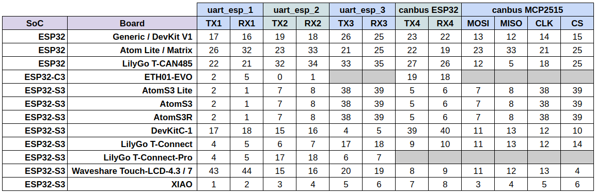

# YamBMS - Hardware and schematic instructions

## Default GPIOs

## BMS

* [JK-B BMS](BMS_JK-B.md)
* [JK-PB BMS](BMS_JK-PB.md)
* [JK RS485 DISPLAY](BMS_JK_RS485_DISPLAY.md)

## Shunts

* [Victron SmartShunt](Shunt_Victron_SmartShunt.md)

## Communication interfaces

* [RS485 bus](Interface_RS485_bus.md)
* [CAN bus](Interface_CAN_bus.md)

## Others

* [Galvanic isolation](Galvanic_isolation.md)