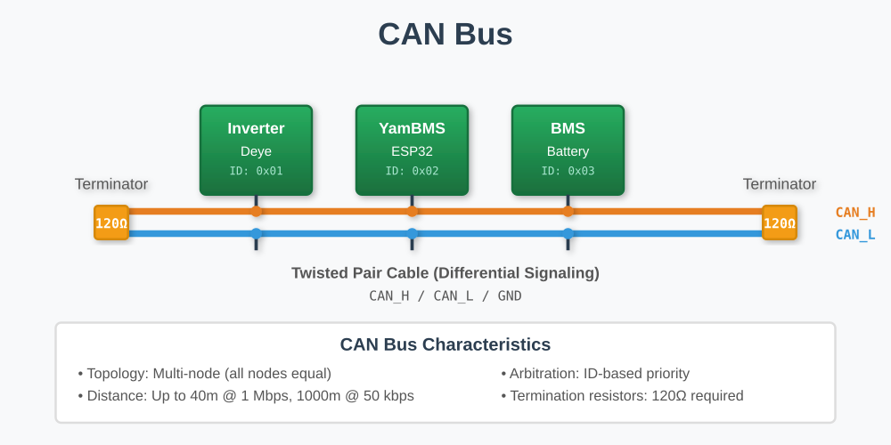
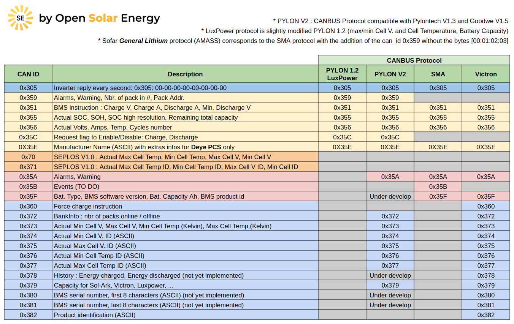

# YamBMS - CAN bus

[](https://www.gnu.org/licenses/gpl-3.0)
[](https://github.com/Sleeper85/esphome-yambms/releases/latest)


## Overview

**CAN (Controller Area Network)** is a robust vehicle bus standard designed for reliable communication in harsh environments. Originally developed for automotive applications, CAN bus is now widely used in industrial automation, energy management systems, and battery management applications.

In the YamBMS ecosystem, CAN bus is primarily used to communicate between the ESP32 controller and the solar inverter, transmitting battery status information to enable proper charge/discharge control.



**Key Features:**
- Multi-master communication protocol
- High immunity to electrical interference
- Built-in error detection and fault confinement
- Data rates up to 1 Mbps
- Supports up to 110 nodes (depending on transceiver)
- Differential signaling for noise immunity

## CAN bus protocol table



Note: the following IDs are not implemented: 0x35B, 0x360, 0x378, 0x380 and 0x381.

## CAN Bus Fundamentals

### What is CAN Bus?

CAN bus uses a **two-wire differential signaling system**:
- **CAN H (CAN High)**: Dominant state high, recessive state ~2.5V
- **CAN L (CAN Low)**: Dominant state low, recessive state ~2.5V

**Differential Signaling:**
```
Differential Signal = CAN H - CAN L

Dominant bit (0): CAN H = ~3.5V, CAN L = ~1.5V → Difference = +2V
Recessive bit (1): CAN H = ~2.5V, CAN L = ~2.5V → Difference = 0V
```

This differential approach provides excellent **common-mode noise rejection**, allowing reliable communication even in electrically noisy environments like solar installations with high-voltage batteries and inverters.

### CAN Bus Speed & Distance

The maximum cable length depends on the communication speed:

| Baud Rate | Maximum Distance | Typical Use Case |
|-----------|------------------|------------------|
| 1 Mbps | 40 meters | Short, high-speed networks |
| 500 kbps | 100 meters | **Typical for solar inverters** |
| 250 kbps | 250 meters | Medium-distance industrial |
| 125 kbps | 500 meters | Long-distance, lower speed |
| 50 kbps | 1000 meters | Very long distance |

**YamBMS Typical Configuration:** Most solar inverters use **500 kbps** for CAN bus communication.

### CAN Bus Topology

**Linear Bus (Daisy Chain) - CORRECT:**
```
[Device 1]───[Device 2]───[Device 3]───[Device 4]
   ↑                                         ↑
120Ω termination                      120Ω termination
```

**Important Rules:**
- ✅ **Linear topology** (daisy chain)
- ✅ **Two termination resistors** (120Ω each at both ends)
- ❌ **NOT star topology** (causes signal reflections)
- ❌ **NOT ring topology** (not supported)
- ❌ **NOT multiple branch points** (stub length < 30cm if unavoidable)

## CAN Bus Wiring

### Standard 3-Wire Configuration

**Recommended wiring for CAN bus:**

```
CAN Bus 3-Wire Configuration
=============================
Device 1              Device 2              Device 3
├─ CAN H ────────────── CAN H ────────────── CAN H
├─ CAN L ────────────── CAN L ────────────── CAN L
└─ GND ──────────────── GND ──────────────── GND
```

### Pin Identification

**Common CAN Terminal Labeling:**
- **CAN H** / **CANH** / **H** / **+** = CAN High
- **CAN L** / **CANL** / **L** / **-** = CAN Low
- **GND** / **GND** / **G** / **Signal Ground** = Ground reference

**Important:** Always verify with your device documentation, as some manufacturers may use different labeling conventions.

### Cable Requirements

**Recommended Cable Specifications:**
- **Type:** Twisted pair cable designed for CAN bus
- **Characteristic Impedance:** 120Ω (this matches the termination resistors)
- **Gauge:** 24 AWG to 20 AWG (depending on distance and current)
- **Shielding:** Shielded cable recommended for electrically noisy environments
- **Quality:** Use cables certified for CAN bus applications

### Ground Connection - CRITICAL INFORMATION

> [!IMPORTANT]
> **Should you connect the GND wire on CAN bus?**

**Answer: YES - STRONGLY RECOMMENDED**

#### Why Ground Connection is Important

While CAN uses differential signaling and can theoretically work without a ground connection, **in practice you should ALWAYS connect the ground wire**. Here's why:

**1. Common Mode Voltage Range**
- CAN transceivers tolerate **-7V to +12V** common mode voltage
- Over long distances or with separate power supplies, ground potential differences can **exceed this range**
- Without GND connection: risk of **transceiver damage** and communication failure

**2. Distance Considerations**
- Even over a few meters, ground potential differences can develop
- Over hundreds of meters, differences of several volts are common
- GND wire equalizes these potential differences

**3. Multiple Power Sources**
- ESP32 and inverter have separate power supplies
- Different power supplies = different ground potentials
- GND connection provides common reference

**4. Electrical Noise Protection**
- High-voltage batteries and inverters generate electrical noise
- Switching power supplies create transients
- GND helps stabilize the common mode voltage

**5. Shielded Cable Grounding**
- If using shielded cable (recommended), the shield should be grounded
- Improves electromagnetic interference (EMI) immunity
- Shield should be grounded at **one end only** to avoid ground loops

#### When GND Can Be Omitted (NOT RECOMMENDED)

**Very limited cases where GND might work without connection:**
- Distance **< 2 meters**
- **Common power supply** (same PSU for all devices)
- Clean electrical environment (bench testing only)

**However:** Even in these cases, it's **better to connect GND** to ensure reliability!

#### Isolated CAN Transceivers

**Question:** If my board has isolated CAN (e.g., Waveshare, M5Stack), do I still need to connect GND?

**Answer:** **YES - Still recommended!**

```
Board with CAN Isolation
=========================

ESP32 Side        Isolation        CAN Bus Side
(non-isolated)    ═══════════      (isolated)
                                   
                                   ├─ CAN H ──→ to Inverter
                                   ├─ CAN L ──→ to Inverter
                                   └─ GND ──→ to Inverter (RECOMMENDED!)

Isolation protects the ESP32, but devices on the isolated side
of the CAN bus still need a common ground reference!
```

**Explanation:**
- **Isolation** protects your ESP32 from voltage spikes and noise on the CAN bus
- Devices on the **isolated side** (inverter, etc.) still benefit from a common GND reference
- Without GND: communication may be unstable despite isolation

### Wiring Best Practices

**DO:**
- ✅ Use twisted pair cable (CAN H and CAN L twisted together)
- ✅ Keep cable runs as short as practical
- ✅ Use proper CAN bus cable (120Ω impedance)
- ✅ Connect GND wire between all devices
- ✅ Add termination resistors at both ends
- ✅ Avoid running CAN cables parallel to power cables
- ✅ Use shielded cable in noisy environments

**DON'T:**
- ❌ Use random cable (cat5, speaker wire, etc.)
- ❌ Create star or ring topologies
- ❌ Exceed maximum cable length for your baud rate
- ❌ Add more than two 120Ω termination resistors
- ❌ Omit GND connection
- ❌ Create long stubs (branches) from the main bus

## Termination Resistors

### Why Termination is Necessary

**Signal Reflections:**
- When an electrical signal travels down a cable and reaches the end, it reflects back
- These reflections cause signal distortion and communication errors
- **Termination resistors** absorb the signal energy, preventing reflections

**The 120Ω Standard:**
- CAN bus cable has a characteristic impedance of 120Ω
- Termination resistors match this impedance
- Result: clean signal transmission without reflections

### Proper Termination Configuration

**Correct: Exactly TWO 120Ω resistors at both ends**

```
CORRECT Termination
===================
120Ω                                          120Ω
 ║                                             ║
[Device 1]───[Device 2]───[Device 3]───[Device 4]
└─── Start of bus                    End of bus ───┘
```

**How to verify termination:**
1. Disconnect all devices from the CAN bus
2. Measure resistance between CAN H and CAN L with a multimeter
3. **Expected result: ~60Ω** (two 120Ω resistors in parallel = 60Ω)

```
Termination Math:
=================
Two 120Ω resistors in parallel:
R_total = (R1 × R2) / (R1 + R2)
R_total = (120 × 120) / (120 + 120)
R_total = 14400 / 240 = 60Ω
```

### Common Termination Mistakes

**❌ WRONG: No termination**
```
[Device 1]───[Device 2]───[Device 3]
```
**Result:** Signal reflections, communication errors, unreliable operation

**❌ WRONG: Only one termination resistor**
```
120Ω
 ║
[Device 1]───[Device 2]───[Device 3]
```
**Result:** Partial reflections, reduced noise immunity

**❌ WRONG: Termination in the middle**
```
        120Ω
         ║
[Device 1]───[Device 2]───[Device 3]
```
**Result:** Both ends are unterminated, causing reflections from both directions

**❌ WRONG: More than two termination resistors**
```
120Ω            120Ω            120Ω
 ║               ║               ║
[Device 1]───[Device 2]───[Device 3]
```
**Result:** Total impedance too low (~40Ω), excessive current draw, poor signal quality

### Built-in vs External Termination

**Boards with Built-in Termination (Jumper-Selectable):**

Some boards have onboard 120Ω resistors that can be enabled via jumpers:
- **Waveshare ESP32-S3-RS485-CAN**: Jumper for CAN termination (120R/NC)
- Many industrial CAN interfaces
- Some inverters have built-in switchable termination

**Boards without Built-in Termination:**

Some boards require external termination resistors:
- **LilyGo T-Connect**: No built-in CAN termination
- **M5Stack Atomic CAN Base**: No built-in switchable termination
- External 120Ω resistor must be connected between CAN H and CAN L

**How to add external termination:**
```
Physical Connection:
====================
        120Ω Resistor
           ┌─────┐
CAN H ─────┤     ├───── CAN L
           └─────┘
```

**Where to buy termination resistors:**
- 1/4W or 1/2W 120Ω resistors from any electronics supplier
- Pre-made CAN termination plugs (with VH or screw terminals)
- DeviceNet/CANopen termination resistors

### Determining Termination Configuration

**For a typical YamBMS setup (ESP32 ↔ Inverter):**

```
Point-to-point CAN connection:
===============================

      120Ω (if available)              120Ω (check inverter)
         ║                                      ║
    [ESP32 Board]───────────────────────[Solar Inverter]
    └─ Start                                End ─┘
```

**Steps:**
1. **Check your ESP32 board:**
   - Does it have built-in termination? (check docs/jumpers)
   - If yes: enable it (move jumper to 120R position)
   - If no: add external 120Ω resistor between CAN H and CAN L

2. **Check your inverter:**
   - Most inverters have built-in termination (check manual)
   - Some have a termination switch or jumper
   - If no built-in termination: add external 120Ω resistor

3. **Verify with multimeter:**
   - Power off all devices
   - Measure between CAN H and CAN L
   - Should read ~60Ω

## Common CAN Bus Issues & Troubleshooting

### No Communication on CAN Bus

**Symptoms:**
- No data received from inverter
- ESP32 cannot send data
- CAN bus appears "dead"

**Troubleshooting Steps:**

1. **Check Wiring**
   - ✓ CAN H to CAN H, CAN L to CAN L (not swapped)
   - ✓ GND connected between devices
   - ✓ No loose connections
   - ✓ Cable integrity (no breaks)

2. **Verify Termination**
   - Power off all devices
   - Measure resistance between CAN H and CAN L
   - Should be ~60Ω (two 120Ω resistors in parallel)
   - If not 60Ω: check termination resistor configuration

3. **Check Baud Rate**
   - ESP32 and inverter must use same baud rate
   - Common rates: 500 kbps (most common), 250 kbps, 125 kbps
   - Check inverter manual for supported baud rate
   - Verify ESP32 code configuration

4. **Verify Power**
   - Both devices powered on
   - Correct voltage levels (5V for ESP32, as per inverter specs)
   - Check power supply stability

5. **Check Cable Length**
   - Is cable length within limits for your baud rate?
   - 500 kbps → max 100 meters
   - 1 Mbps → max 40 meters

### Intermittent Communication Errors

**Symptoms:**
- Communication works sometimes, fails other times
- Occasional corrupted messages
- Random disconnections

**Possible Causes & Solutions:**

1. **Poor Termination**
   - Measure resistance: should be exactly ~60Ω
   - Check termination resistors are securely connected
   - Verify only two 120Ω resistors present

2. **Ground Potential Differences**
   - **Solution:** Ensure GND wire is connected between all devices
   - Check GND continuity with multimeter
   - Verify no high resistance in GND path

3. **Electrical Noise**
   - Use shielded cable
   - Route CAN cable away from power cables
   - Connect shield to earth ground at one end only
   - Check for nearby sources of EMI (switching PSUs, motors, etc.)

4. **Cable Quality Issues**
   - Replace with proper CAN bus cable (120Ω impedance)
   - Avoid using random cables (cat5, speaker wire, etc.)
   - Check for damaged or kinked cables

5. **Too Many Nodes**
   - CAN transceiver limited to 110 nodes (CA-IS3050G)
   - In practice, fewer is better for reliability
   - Typical YamBMS: 2-3 devices only

### CAN Bus Completely Non-Functional

**Symptoms:**
- No communication at all
- Multimeter shows unexpected voltages
- CAN transceiver very hot

**Critical Checks:**

1. **Correct Polarity**
   - CAN H to CAN H, CAN L to CAN L
   - **Not swapped!**
   - Some transceivers are damaged by reverse polarity

2. **Over-Termination**
   - Too many termination resistors (>2) causes excessive current
   - Measure total resistance: should be ~60Ω, not ~40Ω or less
   - Remove extra termination resistors

3. **Short Circuit**
   - Check for shorts between CAN H and CAN L
   - Check for shorts to GND or power rails
   - Inspect terminal blocks for debris or solder bridges

4. **Damaged Transceiver**
   - If voltage spikes occurred (no isolation), transceiver may be damaged
   - Replace board or transceiver IC
   - Consider using isolated CAN transceiver for future protection

### Measuring CAN Bus with Multimeter

**Idle Bus (Recessive State):**
```
CAN H: ~2.5V
CAN L: ~2.5V
Differential: ~0V
```

**Active Bus (Mixed Dominant/Recessive):**
```
CAN H: fluctuating between ~2.5V and ~3.5V
CAN L: fluctuating between ~2.5V and ~1.5V
Differential: varies
```

**If you see:**
- CAN H = 0V or 5V continuously → Problem with transceiver or power
- CAN L = 0V or 5V continuously → Problem with transceiver or power
- No voltage fluctuation → No activity on bus (check if devices are transmitting)

## YamBMS-Specific CAN Configuration

### Typical YamBMS CAN Setup

**Hardware:**
- ESP32-S3 board with CAN transceiver (LilyGo, Waveshare, M5Stack)
- Solar inverter with CAN bus interface (Deye, Sofar, Growatt, Victron, etc.)
- Twisted pair CAN cable (120Ω impedance)
- Two 120Ω termination resistors (may be built-in)

**Software:**
- YamBMS firmware configured for CAN output
- CAN baud rate: typically 500 kbps (check inverter manual)
- CAN protocol: Pylontech, SMA, Victron, or custom

**Wiring Example:**
```
YamBMS ESP32-S3                     Solar Inverter
(with CAN transceiver)              (with CAN interface)
┌─────────────────┐                ┌──────────────────┐
│ CAN H ──────────┼────────────────┤ CAN H            │
│ CAN L ──────────┼────────────────┤ CAN L            │
│ GND ────────────┼────────────────┤ GND              │
└─────────────────┘                └──────────────────┘
     120Ω ↑                                 ↑ 120Ω
   (if at endpoint)                  (check inverter)
```

### Inverter-Specific Notes

**Most Common CAN Speeds:**
- **Deye/Sunsynk**: 500 kbps (Pylontech protocol)
- **Growatt**: 500 kbps (Pylontech protocol)
- **Sofar**: 500 kbps (Pylontech protocol)
- **Victron**: 500 kbps (Victron VE.Can protocol)
- **SMA**: 500 kbps (SMA CAN protocol)

**Always verify in your inverter's manual!**

### Common CAN Protocols for Battery Communication

- **Pylontech**: Most common, supported by many inverters
- **SMA**: Used by SMA inverters
- **Victron**: VE.Can protocol for Victron systems
- **LG Resu**: Protocol used by LG battery systems
- **BYD**: BYD battery protocol

YamBMS can typically emulate Pylontech or other protocols depending on your inverter.

## Advanced Topics

### CAN Bus Isolation

**What is CAN Isolation?**
- Galvanic isolation between the ESP32 and the CAN bus
- Protects the ESP32 from voltage spikes, ground loops, and noise
- Uses opto-isolators or isolated DC-DC converters

**Benefits:**
- Protects expensive ESP32 boards from damage
- Improves noise immunity
- Allows operation with ground potential differences
- Reduces risk of ground loops

**Boards with Isolated CAN:**
- ✅ Waveshare ESP32-S3-RS485-CAN (isolated)
- ✅ M5Stack Atomic CAN Base (isolated, CA-IS3050G)
- ❌ Some cheaper CAN modules (not isolated)

**Recommendation:** Always prefer isolated CAN transceivers for battery/inverter applications!

### CAN Bus Sniffing & Debugging

**Tools for CAN Bus Analysis:**
- **CAN USB Adapter**: PCAN-USB, CANable, SLCAN
- **Logic Analyzer**: Saleae, DSLogic with CAN protocol decoder
- **Oscilloscope**: For low-level signal analysis

**Software Tools:**
- **can-utils** (Linux): Command-line CAN tools
- **SavvyCAN**: GUI-based CAN analyzer
- **Wireshark**: With SocketCAN plugin for Linux

**Basic CAN Sniffing (Linux example):**
```bash
# View CAN traffic
candump can0

# Send a CAN frame
cansend can0 123#DEADBEEF

# Log CAN traffic to file
candump -l can0
```

### CAN FD (Flexible Data-Rate)

**What is CAN FD?**
- Enhanced version of CAN bus
- Higher data rates (up to 5 Mbps for data phase)
- Larger payload (up to 64 bytes vs 8 bytes for classical CAN)

**YamBMS Note:**
- Most solar inverters use **Classical CAN** (not CAN FD)
- ESP32-S3 TWAI controller supports Classical CAN
- CAN FD support requires specific transceivers and software
- Not commonly needed for battery/inverter communication

## Safety & Best Practices

### Electrical Safety

⚠️ **WARNING:**
- CAN bus in battery systems operates near **high-voltage DC batteries**
- Always disconnect battery before working on CAN wiring
- Use properly insulated tools
- Verify no voltage on CAN bus before connecting/disconnecting

### Installation Best Practices

**DO:**
- ✅ Plan your wiring layout before installation
- ✅ Use proper crimping tools for terminal connections
- ✅ Label wires clearly (CAN H, CAN L, GND)
- ✅ Secure cables with cable ties to prevent movement
- ✅ Protect cables from sharp edges and abrasion
- ✅ Document your wiring configuration
- ✅ Test with multimeter before powering on

**DON'T:**
- ❌ Work on live circuits
- ❌ Use damaged or frayed cables
- ❌ Mix CAN cables with high-voltage power cables in same conduit
- ❌ Exceed voltage/current ratings of your components
- ❌ Modify inverter wiring without consulting manual

## Sources

- [CAN Bus Wikipedia](https://en.wikipedia.org/wiki/CAN_bus)
- [ISO 11898 Standard (CAN Specification)](https://www.iso.org/standard/63648.html)
- [Microchip CAN Bus Basics](https://www.microchip.com/design-centers/can)
- [Texas Instruments: Introduction to CAN](https://www.ti.com/lit/an/sloa101b/sloa101b.pdf)


---

**License:** This documentation is part of the YamBMS project and follows the same GPLv3 license.

**Disclaimer:** Always consult your device manuals and follow electrical safety procedures. This guide is for educational purposes.
