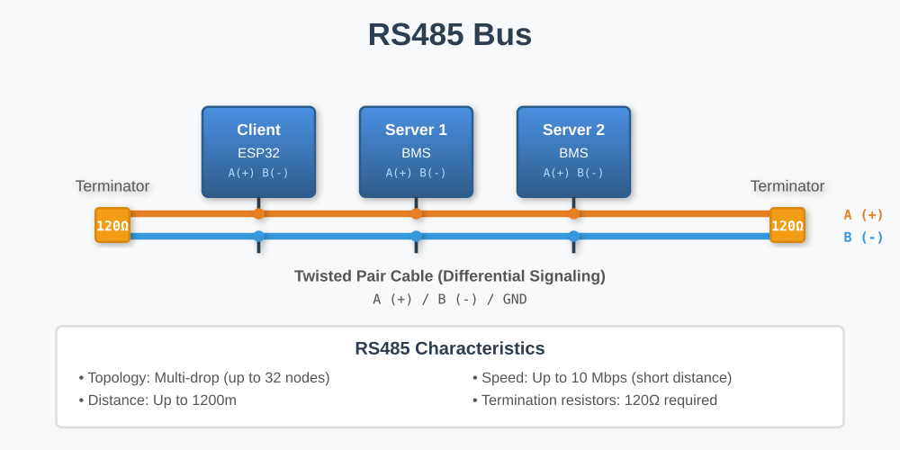

# YamBMS - RS485 bus

[](https://www.gnu.org/licenses/gpl-3.0)
[](https://github.com/Sleeper85/esphome-yambms/releases/latest)


## Overview

**RS485** (also known as TIA/EIA-485) is a robust serial communication standard designed for long-distance, multi-point industrial communication in electrically noisy environments. It is one of the most widely used communication protocols in industrial automation, building automation, and battery management systems.

In the YamBMS ecosystem, RS485 is primarily used to communicate with **JK-PB BMS units** (inverter BMS) and other industrial sensors over long distances with excellent noise immunity.



**Key Features:**
- Multi-point communication (up to 32-256 nodes depending on transceiver)
- Long distance capability (up to 1200 meters)
- High noise immunity via differential signaling
- Data rates up to 10 Mbps (typically 9600-115200 baud for BMS)
- Half-duplex communication (one direction at a time)
- Simple 2-wire or 3-wire configuration

## RS485 Fundamentals

### What is RS485?

RS485 uses a **two-wire differential signaling system**:
- **A (Data+)**: Also called D+, non-inverting line
- **B (Data-)**: Also called D-, inverting line

**Differential Signaling:**
```
Differential Signal = A - B

Logic '0' (space): A > B by at least +200mV
Logic '1' (mark):  A < B by at least -200mV

Typical levels:
Logic '0': A = +3V, B = -1V → Difference = +4V
Logic '1': A = -1V, B = +3V → Difference = -4V
```

This differential approach provides excellent **common-mode noise rejection**, meaning that electrical noise affecting both wires equally is ignored, making RS485 extremely reliable in industrial environments.

### RS485 Speed & Distance

The maximum cable length depends on the communication speed:

| Baud Rate | Maximum Distance | Typical Use Case |
|-----------|------------------|------------------|
| 10 Mbps | 12 meters | Short, very high speed |
| 1 Mbps | 50 meters | High speed local networks |
| 115200 bps | ~500 meters | **Common for JK-B BMS** |
| 9600 bps | ~1200 meters | **Common for JK-PB BMS**, long distance |
| 2400 bps | ~1200 meters | Very long distance, slower speed |

**YamBMS Typical Configurations:**
- **JK-B BMS (UART)**: 115200 baud
- **JK-PB BMS (RS485)**: 9600 baud
- **Modbus devices**: 9600, 19200, or 38400 baud

### RS485 vs RS232

| Feature | RS232 | RS485 |
|---------|-------|-------|
| **Distance** | ~15 meters | Up to 1200 meters |
| **Speed** | Up to 115200 bps | Up to 10 Mbps |
| **Topology** | Point-to-point only | Multi-drop (up to 256 nodes) |
| **Signal** | Single-ended | Differential |
| **Noise Immunity** | Poor | Excellent |
| **Use Case** | PC serial ports, short connections | Industrial, long distance |

**Why RS485 for YamBMS?**
- Long-distance BMS connections
- Noisy electrical environment (batteries, inverters)
- Multiple BMS units on one bus (multi-drop)
- Superior reliability

### RS485 Topology

**Linear Bus (Multi-Drop) - CORRECT:**
```
[Master/ESP32]───[BMS 1]───[BMS 2]───[BMS 3]───[BMS 4]
      ↑                                            ↑
  120Ω term                                   120Ω term
```

**Important Rules:**
- ✅ **Linear topology** (daisy chain, not star)
- ✅ **Two termination resistors** (120Ω each at both ends)
- ✅ **Short stubs** (branches < 30cm if unavoidable)
- ❌ **NOT star topology** (causes signal reflections)
- ❌ **NOT ring topology** (not supported)

## RS485 Wiring

### Standard 3-Wire Configuration

**MANDATORY wiring for RS485 bus:**

```
RS485 Bus 3-Wire Configuration (REQUIRED!)
===========================================
Device 1              Device 2              Device 3
├─ A (Data+) ────────── A (Data+) ────────── A (Data+)
├─ B (Data-) ────────── B (Data-) ────────── B (Data-)
└─ GND ──────────────── GND ──────────────── GND  ← MANDATORY!
```

> [!CRITICAL]
> **The GND connection is MANDATORY for RS485!**
> 
> Unlike CAN bus where GND is "strongly recommended," RS485 **REQUIRES** a ground reference wire for reliable operation. This is not optional!

### Pin Identification

**Common RS485 Terminal Labeling:**

Different manufacturers use different naming conventions. Here are the most common:

| Standard | Pin 1 (Data+) | Pin 2 (Data-) | Pin 3 |
|----------|---------------|---------------|-------|
| **Most Common** | **A** | **B** | **GND** |
| Alternative 1 | D+ | D- | GND |
| Alternative 2 | T/R+ | T/R- | GND |
| Alternative 3 | + | - | GND |
| Alternative 4 | H (High) | L (Low) | GND |

**⚠️ WARNING: A/B Confusion!**

Some manufacturers label pins **opposite** to the standard:
- **Standard (Most Common)**: A = Data+, B = Data-
- **Reversed (Some devices)**: A = Data-, B = Data+

**If communication doesn't work, try swapping A and B!**

**Waveshare boards:**
- L pin = A (Data+)
- H pin = B (Data-)

**Always verify with your device documentation!**

### Cable Requirements

**Recommended Cable Specifications:**
- **Type:** Twisted pair cable (A and B wires twisted together)
- **Characteristic Impedance:** 120Ω (matches termination resistors)
- **Gauge:** 24 AWG to 22 AWG for most applications
- **Shielding:** Shielded cable (STP) **highly recommended** for noisy environments
- **Quality:** Industrial-grade RS485 cable recommended

**Acceptable Alternative (short distances only):**
- CAT5/CAT6 ethernet cable (use one twisted pair for A/B, another for GND)
- **Only for distances < 100 meters and low noise environments!**

### Ground Connection - ABSOLUTELY CRITICAL

> [!CRITICAL]
> **MUST YOU connect the GND wire on RS485 bus?**

**Answer: YES - ABSOLUTELY MANDATORY!**

This is **NOT optional**. RS485 **REQUIRES** a ground reference wire between all devices. Let me explain why this is even more critical than for CAN bus.

#### Why Ground Connection is MANDATORY for RS485

**1. Common Mode Voltage Range (Stricter than CAN)**
- RS485 transceivers tolerate **-7V to +12V** common mode voltage (similar to CAN)
- **BUT:** RS485 is significantly **more sensitive** to ground potential differences than CAN
- Without GND: communication **WILL FAIL** or be extremely unreliable

**2. Long Distance Communications**
- RS485 is designed for distances up to **1200 meters**
- Over these distances, ground potential differences of **several volts** are guaranteed
- Without GND connection: **catastrophic communication failure** or **transceiver damage**

**3. Official RS485/TIA-485 Standard**
- The standard **explicitly requires** a signal ground reference
- Industry best practices **always include ground wire**

**Quote from industrial RS485 documentation:**
> *"While a differential signal does not require a signal ground to communicate, the ground wire serves an important purpose. Over a distance of hundreds or thousands of feet there can be very significant differences in the voltage level of 'ground.' RS-485 networks can typically maintain correct data with a difference of -7 to +12 Volts. If the grounds differ more than that amount, **data will be lost and often the port itself will be damaged**."*

**4. Multiple Power Supplies**
- ESP32 and BMS units have separate power supplies
- Different power supplies = different ground potentials
- Can easily exceed the ±7V to +12V common mode range
- **Result without GND: Transceiver damage and communication failure**

**5. Protection Against Ground Loops**
- Proper grounding prevents destructive ground loop currents
- In long cable runs, ground potential differences create currents in signal wires
- GND wire carries these currents, protecting signal integrity

#### Consequences of Omitting GND on RS485

**What WILL happen without GND connection:**

```
❌ WITHOUT GND - Guaranteed Problems:
✗ Frequent communication errors
✗ Complete communication failure over distance
✗ Intermittent data corruption
✗ Data packets lost or garbled
✗ BMS readings incorrect or missing
✗ RISK: Transceiver damage (voltage > ±12V)
✗ RISK: Complete port failure requiring replacement
```

**Real-world failure modes observed:**
- BMS readings work for 5 minutes, then fail
- Communication works in the morning, fails in the afternoon (temperature-dependent ground shifts)
- Works on the bench (short cables), fails in installation (long cables)
- Random disconnections during high battery current (ground bounce)

#### When GND Can Be Omitted (EXTREMELY RARE - NOT RECOMMENDED)

**Only in these VERY limited cases (still not recommended):**
- Distance **< 1 meter**
- **Identical power supply** (same PSU, same ground reference)
- Clean bench testing environment only
- **Duration:** Temporary testing only

**Even in these cases, you SHOULD connect GND for these reasons:**
- Establishes good habits
- What works on the bench may fail in installation
- Ground connection costs nothing but saves hours of troubleshooting

#### Isolated RS485 Transceivers

**Question:** If my board has isolated RS485 (e.g., Waveshare, M5Stack RS485-ISO), do I still need to connect GND?

**Answer:** **YES - ABSOLUTELY!**

```
Board with RS485 Isolation
===========================

ESP32 Side        Isolation        RS485 Bus Side
(non-isolated)    ═══════════      (isolated)
                                   
                                   ├─ A ──→ to BMS
                                   ├─ B ──→ to BMS
                                   └─ GND ──→ to BMS (MANDATORY!)

Isolation protects the ESP32 from voltage spikes, but devices
on the isolated side STILL REQUIRE a common ground reference!
```

**Explanation:**
- **Isolation** protects your ESP32 from damage
- Devices on the **isolated side** (BMS units, sensors) **MUST** share a common ground
- Without GND: communication between BMS units will be unreliable despite isolation
- The isolated DC-DC converter provides power isolation, not signal ground

### Wiring Best Practices

**DO:**
- ✅ **ALWAYS connect GND wire between ALL devices** (mandatory!)
- ✅ Use twisted pair cable (A and B twisted together)
- ✅ Use proper RS485 cable (120Ω impedance)
- ✅ Keep cable runs as short as practical
- ✅ Add termination resistors at both ends (120Ω)
- ✅ Use shielded cable in electrically noisy environments
- ✅ Connect shield to earth ground at **one end only** (prevents ground loops)
- ✅ Avoid running RS485 cables parallel to AC power cables
- ✅ Use separate conduits for RS485 and high-voltage power

**DON'T:**
- ❌ **NEVER omit the GND wire** (causes guaranteed problems!)
- ❌ Use random cable (speaker wire, telephone cable, etc.)
- ❌ Create star or ring topologies
- ❌ Exceed maximum cable length for your baud rate
- ❌ Add more than two 120Ω termination resistors
- ❌ Connect shield to ground at both ends (causes ground loops)
- ❌ Swap A and B randomly (check device documentation first)

## Termination Resistors

### Why Termination is Necessary

**Signal Reflections:**
- When an electrical signal reaches the end of a cable, it reflects back
- These reflections cause signal distortion, ringing, and communication errors
- **Termination resistors** absorb the signal energy, preventing reflections
- Critical for high-speed communication or long cable runs

**The 120Ω Standard:**
- RS485 cable has a characteristic impedance of 120Ω
- Termination resistors match this impedance
- Result: clean signal transmission without reflections

### Proper Termination Configuration

**Correct: Exactly TWO 120Ω resistors at both ends**

```
CORRECT Termination
===================
120Ω                                                120Ω
 ║                                                   ║
[ESP32]───[BMS 1]───[BMS 2]───[BMS 3]───[BMS 4]
└─ Start of bus                         End of bus ─┘
```

**How to verify termination:**
1. **Power off all devices** (important!)
2. **Disconnect** one end of the RS485 bus
3. Measure resistance between A and B with a multimeter
4. **Expected result: ~60Ω** (two 120Ω resistors in parallel = 60Ω)

```
Termination Math:
=================
Two 120Ω resistors in parallel:
R_total = (R1 × R2) / (R1 + R2)
R_total = (120 × 120) / (120 + 120)
R_total = 14400 / 240 = 60Ω
```

### Built-in vs External Termination

**Boards with Built-in Termination:**

Some boards have onboard 120Ω resistors that can be enabled:
- **Waveshare ESP32-S3-RS485-CAN**: Jumper for RS485 termination (120R/NC)
- **M5Stack RS485-ISO Unit (U094)**: Includes separate 120Ω resistor to connect
- Many industrial RS485 devices have switchable termination

**Boards without Built-in Termination:**

Some boards require external termination resistors:
- **LilyGo T-Connect**: No built-in RS485 termination
- External 120Ω resistor must be connected between A and B at bus endpoints

**How to add external termination:**
```
Physical Connection:
====================
        120Ω Resistor (1/4W or 1/2W)
           ┌─────┐
  A ───────┤     ├─────── B
           └─────┘
     (at bus endpoint)
```

**Where to buy termination resistors:**
- 1/4W or 1/2W 120Ω resistors from any electronics supplier
- Pre-made RS485 termination plugs (with screw terminals)
- Modbus/Profibus termination resistors

### Common Termination Mistakes

**❌ WRONG: No termination**
```
[ESP32]───[BMS 1]───[BMS 2]
```
**Result:** Signal reflections, communication errors, unreliable operation

**❌ WRONG: Only one termination resistor**
```
120Ω
 ║
[ESP32]───[BMS 1]───[BMS 2]
```
**Result:** One end unterminated, partial reflections

**❌ WRONG: Termination in the middle**
```
                120Ω
                 ║
[ESP32]───[BMS 1]───[BMS 2]───[BMS 3]
```
**Result:** Both ends unterminated, reflections from both directions

**❌ WRONG: More than two termination resistors**
```
120Ω          120Ω          120Ω
 ║             ║             ║
[ESP32]───[BMS 1]───[BMS 2]───[BMS 3]
```
**Result:** Total impedance too low (~40Ω), excessive current, signal distortion

### Determining Termination Configuration

**For a typical YamBMS setup (ESP32 ↔ Multiple BMS):**

```
Multi-drop RS485 connection:
============================

   120Ω (if available)                         120Ω (add if needed)
      ║                                                ║
  [ESP32]───[BMS 1]───[BMS 2]───[BMS 3]───[BMS 4]
  └─ Start                                   End ─┘
```

**Steps:**
1. **Check your ESP32 board:**
   - Does it have built-in termination? (check docs/jumpers)
   - If yes: enable it (move jumper to 120R position)
   - If no: add external 120Ω resistor between A and B

2. **Check the last BMS on the bus:**
   - Most BMS units do NOT have built-in termination
   - Add external 120Ω resistor between A and B at the last BMS

3. **Verify with multimeter:**
   - Power off all devices
   - Disconnect one end
   - Measure between A and B
   - Should read ~60Ω

### When is Termination Optional?

**Short, Low-Speed Connections:**
- Cable length < 10 meters
- Baud rate ≤ 9600 bps
- Few communication errors tolerable (not recommended for YamBMS!)

**However:** For reliability, **always add termination** regardless of distance or speed. It costs almost nothing and prevents hours of troubleshooting!

## Common RS485 Issues & Troubleshooting

### No Communication on RS485

**Symptoms:**
- No data received from BMS
- ESP32 cannot communicate with devices
- RS485 bus appears "dead"

**Troubleshooting Steps:**

1. **Check Wiring (MOST COMMON ISSUE)**
   - ✓ A to A, B to B (not swapped)
   - ✓ **GND connected between ALL devices** (mandatory!)
   - ✓ No loose connections
   - ✓ Cable integrity (no breaks)
   - ✓ Try swapping A and B if still not working (labeling may be reversed)

2. **Verify Ground Connection**
   - **Critical:** Measure continuity between all GND pins
   - GND must have low resistance (< 1Ω) between all devices
   - Without GND: guaranteed communication failure

3. **Check Termination**
   - Power off all devices
   - Disconnect one end of bus
   - Measure resistance between A and B
   - Should be ~60Ω (two 120Ω resistors in parallel)

4. **Verify Baud Rate**
   - ESP32 and BMS must use same baud rate
   - JK-B BMS (UART): 115200 baud
   - JK-PB BMS (RS485): 9600 baud
   - Check BMS documentation

5. **Check Power**
   - All devices powered on
   - Correct voltage levels
   - Stable power supplies

6. **Verify Polarity**
   - Some devices label A/B opposite to standard
   - **Try swapping A and B connections**
   - This is a very common issue!

### Intermittent Communication Errors

**Symptoms:**
- Communication works sometimes, fails other times
- Occasional corrupted data
- Random BMS disconnections
- Works for minutes/hours, then fails

**Possible Causes & Solutions:**

1. **Missing or Poor Ground Connection (MOST COMMON)**
   - **Solution:** Ensure GND wire is connected between ALL devices
   - Check GND continuity with multimeter (should be < 1Ω)
   - Verify no high resistance in GND path
   - **This is the #1 cause of intermittent RS485 problems!**

2. **Ground Potential Differences**
   - Without GND: different ground potentials cause voltage shifts
   - Exceeds common mode range (-7V to +12V)
   - **Solution:** Connect GND wire securely

3. **Poor Termination**
   - Measure resistance: should be exactly ~60Ω
   - Check termination resistors securely connected
   - Verify only two 120Ω resistors present

4. **Electrical Noise Interference**
   - Use shielded cable (STP)
   - Route RS485 cable away from AC power cables
   - Connect shield to earth ground at one end only
   - Check for nearby sources of EMI (motors, switching PSUs, inverters)

5. **Cable Quality Issues**
   - Replace with proper RS485 cable (120Ω impedance)
   - Avoid using random cables (cat5 for long distances, speaker wire, etc.)
   - Check for damaged or kinked cables

6. **Temperature-Related Issues**
   - Ground potential differences change with temperature
   - Connections expand/contract
   - **Solution:** Ensure solid, reliable connections with GND wire

### Very Slow or Corrupted Data

**Symptoms:**
- Data arrives but is very slow
- Frequent CRC errors
- Garbled messages

**Possible Causes:**

1. **Incorrect Baud Rate**
   - ESP32 and BMS must match exactly
   - Common rates: 9600, 19200, 38400, 115200
   - Even small mismatches cause problems

2. **Cable Too Long for Baud Rate**
   - 115200 baud: max ~500 meters
   - 9600 baud: max ~1200 meters
   - Higher speeds require shorter cables

3. **Missing Ground Reference**
   - Without GND: signal levels shift
   - Receiver interprets signals incorrectly
   - **Solution:** Connect GND wire!

4. **Over-Termination**
   - Too many termination resistors (>2)
   - Measure resistance: should be ~60Ω, not ~40Ω
   - Remove extra terminators

### RS485 Transceiver Damage

**Symptoms:**
- Complete communication failure
- Hot transceiver chip
- Burnt smell
- No voltage on A or B lines

**Causes:**
- Voltage spike exceeded ±12V common mode range
- Ground potential difference too large without GND connection
- Reverse polarity connection
- Short circuit between A, B, or GND

**Prevention:**
- **Always connect GND wire!**
- Use isolated RS485 transceivers (Waveshare, M5Stack RS485-ISO)
- Check connections before applying power
- Use proper termination

**Solution if damaged:**
- Replace board or transceiver IC
- Investigate root cause before reconnecting
- Consider upgrading to isolated transceiver

### Measuring RS485 with Multimeter

**Idle Bus (Mark State):**
```
With termination (power ON):
A (Data+): ~2.5V to 3.3V
B (Data-): ~1.5V to 2.5V
Differential: A > B (mark state)
```

**Active Bus (Mixed States):**
```
A: Fluctuating between ~1.5V and ~3.5V
B: Fluctuating opposite to A
Differential: Varies with data
```

**If you see:**
- A = 0V or 5V continuously → Problem with transceiver or power
- B = 0V or 5V continuously → Problem with transceiver or power
- A = B (same voltage) → No differential signal, check driver/termination
- No voltage fluctuation → No activity (check if devices are transmitting)

## YamBMS-Specific RS485 Configuration

### JK-PB BMS via RS485 (Recommended Configuration)

**Hardware:**
- ESP32-S3 board with RS485 transceiver (Waveshare ESP32-S3-RS485-CAN, M5Stack AtomS3 + RS485-ISO Unit)
- Multiple JK-PB BMS units (inverter BMS)
- Twisted pair RS485 cable (120Ω impedance)
- Two 120Ω termination resistors

**Communication Parameters:**
- **Protocol:** RS485 (Modbus RTU)
- **Baud Rate:** 9600 bps (typical for JK-PB)
- **Data Bits:** 8
- **Parity:** None (N)
- **Stop Bits:** 1
- **Format:** 8N1

**Wiring Example:**
```
YamBMS ESP32-S3                JK-PB BMS (Multiple Units)
(with RS485)
┌──────────────┐              ┌───────┐  ┌───────┐  ┌───────┐
│  A ──────────┼──────────────┤ A     ├──┤ A     ├──┤ A     │
│  B ──────────┼──────────────┤ B     ├──┤ B     ├──┤ B     │
│ GND ─────────┼──────────────┤ GND   ├──┤ GND   ├──┤ GND   │
└──────────────┘              └───────┘  └───────┘  └───────┘
    120Ω ↑                       BMS 1      BMS 2      BMS 3
  (if at endpoint)                              ↑ 120Ω (add)
```

**Important Notes:**
- Each JK-PB BMS must have a **unique address** (ID 1, 2, 3, etc.)
- ESP32 polls each BMS sequentially by address
- All BMS units share the same RS485 bus (multi-drop)
- **GND must be connected between all devices!**

### JK-B BMS via UART (Direct Serial Connection)

**Hardware:**
- ESP32 board with UART pins
- JK-B BMS with UART interface (not RS485)
- 3-wire connection (TX, RX, GND)

**Communication Parameters:**
- **Protocol:** UART (Serial)
- **Baud Rate:** 115200 bps
- **Data Bits:** 8
- **Parity:** None (N)
- **Stop Bits:** 1
- **Format:** 8N1

**Wiring (Point-to-Point):**
```
ESP32 UART              JK-B BMS UART
┌──────────┐           ┌──────────┐
│ TX ──────┼───────────┤ RX       │
│ RX ──────┼───────────┤ TX       │
│ GND ─────┼───────────┤ GND      │
└──────────┘           └──────────┘
```

**Notes:**
- This is **NOT RS485** - it's direct UART/serial
- No RS485 transceiver needed
- No termination resistors needed
- Limited to short distances (~2 meters recommended)
- Only one BMS per UART (point-to-point)
- **For multiple JK-B BMS, use multiple UART ports or switch to JK-PB via RS485!**

### Comparison: JK-B (UART) vs JK-PB (RS485)

| Feature | JK-B (UART) | JK-PB (RS485) |
|---------|-------------|---------------|
| **Interface** | Direct UART | RS485 differential |
| **Distance** | < 5 meters | Up to 1200 meters |
| **Multiple BMS** | Need multiple UARTs | Single RS485 bus (multi-drop) |
| **Transceiver** | None (direct) | RS485 transceiver required |
| **Baud Rate** | 115200 bps | 9600 bps (typical) |
| **Termination** | Not needed | 120Ω at both ends |
| **Noise Immunity** | Poor | Excellent |
| **Recommended For** | 1-2 BMS, short distance | Multiple BMS, long distance |

**YamBMS Recommendation:** 
- **JK-PB BMS + RS485** is the better choice for installations with multiple BMS units or longer distances.

## Advanced Topics

### RS485 Isolation

**What is RS485 Isolation?**
- Galvanic isolation between the ESP32 and the RS485 bus
- Protects the ESP32 from voltage spikes, ground loops, and electrical noise
- Uses opto-isolators and isolated DC-DC converters

**Benefits:**
- Protects expensive ESP32 boards from damage
- Allows operation with large ground potential differences
- Prevents ground loops
- Improves noise immunity in harsh electrical environments

**Boards with Isolated RS485:**
- ✅ Waveshare ESP32-S3-RS485-CAN (isolated, CA-IS3082W chip)
- ✅ M5Stack RS485-ISO Unit (U094) (isolated, CA-IS3082W chip, 1000V isolation)
- ❌ Some cheaper RS485 modules (not isolated)

**Isolation Voltage Ratings:**
- Waveshare: Isolated DC-DC + optocoupler isolation
- M5Stack RS485-ISO Unit: **1000V RMS isolation**

**Recommendation:** Always prefer isolated RS485 transceivers for battery/BMS applications!

### Fail-Safe Protection

**What is Fail-Safe?**
- Feature of some RS485 transceivers
- If A and B inputs are open or shorted, receiver outputs a known state (high)
- Prevents random data output when bus is disconnected

**Boards with Fail-Safe:**
- M5Stack RS485-ISO Unit (CA-IS3082W has fail-safe)

**Benefit for YamBMS:**
- If a BMS is disconnected or cable breaks, ESP32 detects clean "no data" state
- Prevents false readings from floating inputs

### Half-Duplex vs Full-Duplex

**Half-Duplex (Most Common for RS485):**
- Uses 2 wires (A and B) plus GND
- Communication in one direction at a time
- Transmitter enable (DE/RE) control required
- **This is what JK-PB BMS uses**

**Full-Duplex:**
- Uses 4 wires (TX+, TX-, RX+, RX-) plus GND
- Simultaneous bidirectional communication
- More expensive and complex
- Rarely needed for BMS applications

**YamBMS:** Typically uses half-duplex RS485.

### RS485 Repeaters

**What is an RS485 Repeater?**
- Device that extends the RS485 bus beyond normal distance/node limits
- Regenerates the signal for another 1200 meters
- Isolates one segment from another

**When to Use:**
- Very long distances (> 1200 meters)
- Very high number of nodes (> 32 without repeater)
- Need to isolate bus segments

**YamBMS:** Rarely needed for typical installations.

### Modbus Protocol

**What is Modbus?**
- Application layer protocol that runs over RS485 (physical layer)
- Standard for industrial device communication
- Two variants: Modbus RTU (binary) and Modbus ASCII

**JK-PB BMS:**
- Uses Modbus RTU protocol over RS485
- Standard function codes for reading registers
- CRC error checking

**YamBMS Implementation:**
- ESPHome Modbus component
- Configured for Modbus RTU at 9600 baud
- Reads voltage, current, SOC, temperature, etc.

## Safety & Best Practices

### Electrical Safety

⚠️ **WARNING:**
- RS485 in battery systems operates near **high-voltage DC batteries**
- Always disconnect battery before working on RS485 wiring
- Use properly insulated tools and materials
- Verify no voltage on RS485 bus before connecting/disconnecting
- **Never work on live circuits!**

### Installation Best Practices

**DO:**
- ✅ **ALWAYS connect GND wire between ALL devices** (mandatory!)
- ✅ Plan your wiring layout before installation
- ✅ Use proper crimping tools for terminal connections
- ✅ Label wires clearly (A, B, GND)
- ✅ Secure cables with cable ties to prevent movement
- ✅ Protect cables from sharp edges, abrasion, and UV exposure
- ✅ Use cable glands for outdoor installations
- ✅ Document your wiring configuration (take photos!)
- ✅ Test with multimeter before powering on

**DON'T:**
- ❌ **NEVER omit the GND wire** (guaranteed problems!)
- ❌ Work on live circuits
- ❌ Use damaged or frayed cables
- ❌ Mix RS485 cables with high-voltage AC power cables in same conduit
- ❌ Exceed voltage/current ratings of components
- ❌ Modify BMS wiring without consulting manual
- ❌ Use star or ring topology (linear bus only!)

### Preventive Maintenance

**Regular Checks:**
- Inspect cable condition (wear, damage, UV degradation)
- Verify termination resistors still in place
- Check GND continuity between all devices
- Tighten terminal block screws (can loosen over time)
- Monitor communication error rates in YamBMS logs

**Annual Maintenance:**
- Replace cables showing signs of UV damage (outdoor)
- Clean terminal blocks (dust, corrosion)
- Verify GND resistance still low (< 1Ω between all devices)

## Sources

- [TIA/EIA-485 Standard (RS485 Specification)](https://en.wikipedia.org/wiki/RS-485)
- [Modbus Protocol Specification](https://modbus.org/docs/Modbus_Application_Protocol_V1_1b3.pdf)
- [Schneider Electric RS485 Wiring Guide](https://www.se.com/ca/en/faqs/FA221785/)
- [Analog Devices RS485 Design Guide](https://www.analog.com/en/technical-articles/rs485-design-guide.html)

---

**License:** This documentation is part of the YamBMS project and follows the same GPLv3 license.

**Disclaimer:** Always consult your device manuals and follow electrical safety procedures. This guide is for educational purposes. Work with high-voltage batteries requires proper training and certification.
