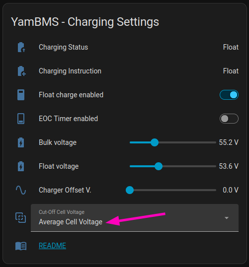

# YamBMS - Release note about new YamBMS 1.7.1 Cut-Off charging logic

[](https://www.gnu.org/licenses/gpl-3.0)
[](https://github.com/Sleeper85/esphome-yambms/releases/latest)


## Fix: false End-Of-Charge (EOC) detection on low PV production days

### The problem

The Cut-Off detection uses a current-compensated voltage criterion (`cell_v ≥ cv_min + R·I`). This criterion is physically sound in steady state: at low charge current a cell voltage above `cv_min` (3.37 V/cell on LFP, the resting voltage of a full cell) genuinely indicates a full battery, and a cell cannot get full while avoiding this threshold. Its weakness lies in **transient readings**:

- **Post-burst cell relaxation.** On grey days, a short sun burst pushes cell voltages up, then a cloud passage drops the current to 1–2 A while polarization keeps the cell voltage elevated for 30–120 s. The 10 s validation plus the 60 s cut-off timer (~70 s total) fit inside that relaxation window — the transient voltage was treated as a resting voltage.
- **Runner cell.** On an imbalanced pack, a single high cell can satisfy the criterion while the pack SoC is only 85–92 %.

The result was a false EOC: the battery was parked in Float/EOC (charging effectively stopped), the `rebulk_days` counter was wrongly reset, and recovery only occurred once SoC dropped back below the rebulk threshold — often losing the rest of the charging day.

### What changed

The compensated voltage criterion itself is **unchanged** — it needed guarding against transients, not replacing.

**1. Minimum SoC gate** Cut-Off/EOC now additionally requires `SoC ≥ 95 %` (configurable). This blocks any false EOC at mid SoC, whether caused by a runner cell or by a transient voltage reading.

**2. Longer cut-off timer** The default `yambms_cutoff_timer` is raised from 60 s to 180 s. The decision window now exceeds the post-burst relaxation time: a transient voltage falls back below the compensated threshold before the timer expires, and the timer is stopped when the Bulk conditions return. The value remains a substitution and can be tuned.

**3. Current deadband around 0 A** Previously, `current >= 0` treated exactly 0 A and sensor noise as "charging". Currents with `I` below 0.005C (configurable, ≈1.4 A on a 280 Ah pack) are no longer fed into the compensated formula. Within the deadband, three outcomes:

- `cell_v ≥ cv_min` and the SoC gate is satisfied → **Cut-Off conditions valid**. This is the "fully charged at rest" signature: a battery that becomes full at very low charge current (poor solar conditions) and stops accepting current still completes its charge cycle, without ever needing to reach the bulk voltage.
- `cell_v < cv_min` → **Bulk conditions valid**: the battery cannot be full, any running timers are stopped (same behavior as the original logic at ~0 A).
- Otherwise → **grey zone**: no conclusion is drawn, the charge status is left unchanged.

**4. Discharge cell hysteresis voltage** The discharge branch now uses an explicit `cell_hysteresis_v` independent of the capacity (20 mV/cell by default, corresponding to the previous behavior of a 280 Ah pack).

**5. Selectable Cut-Off Cell Voltage source** A new **"Cut-Off Cell Voltage"** select allows choosing which cell voltage feeds the whole Cut-Off logic (compensated criterion, "fully charged at rest" signature and discharge hysteresis):



- **Max Cell Voltage** (default) — conservative, unchanged behavior: the EOC depends on the highest cell. It protects imbalanced packs, but the charge termination voltage varies with the imbalance of the day.
- **Average Cell Voltage** — the EOC reflects the state of the whole pack (`total_voltage / cell_count`), giving a **consistent charge termination voltage** from one day to the next. This is the recommended option for packs built from unmatched cells (different internal resistances), packs with a runner cell, and BMS that do not report their equalizing status — in that last case YamBMS cannot hold the Cut-Off open during balancing, and with `Max Cell Voltage` the runner would end the charge prematurely, depriving the balancer of its working window. In `Average Cell Voltage` mode the highest cell stays longer in the upper voltage region where the balancer is active. Note: the inconsistency only shows when the charge ends by current taper below the CVL (PV-limited days, or an inverter that does not respect the CVL); when the charger holds the pack at the CVL, the pack voltage at EOC equals the CVL regardless of the selected source.

⚠️ In **Average Cell Voltage** mode, the runner cell no longer stops the charge: cell-level protection **must** be ensured by **Auto CVL and/or Auto CCL** (in order to avoid triggering an OVP alarm), with the BMS OVP as last resort. Note that if your inverter does not respect the CVL — the very situation where `Average Cell Voltage` mode is most useful — Auto CVL has no effect and **Auto CCL is the effective protection**. This setting only affects the Cut-Off logic — all other YamBMS mechanisms (Auto CVL, Auto CCL, rebulk) keep using the max cell voltage.

### New substitutions

| Substitution | Default | Purpose |
|---|---|---|
| `yambms_eoc_min_soc` | `95` | Minimum SoC (Max 98%) required to allow Cut-Off/EOC |
| `yambms_current_deadband_crate` | `0.005` | C-Rate below which the current is treated as noise / PV starvation |
| `yambms_cell_hysteresis_v` | `0.020` | Discharge hysteresis margin (V/cell) |

Changed default: `yambms_cutoff_timer` 60 s → 180 s.

### New entities

| Entity | Type | Default | Purpose |
|---|---|---|---|
| `Cut-Off cell voltage` | select | `Max Cell Voltage` | Cell voltage source used by the Cut-Off logic (`Max Cell Voltage` / `Average Cell Voltage`) |

### Expected behavior after the fix

- Grey day, transient voltages after sun bursts → the SoC gate and the 180 s window reject them. No false EOC.
- Normal sunny end of charge → unchanged behavior: pack reaches CVL, current tapers, Cut-Off → EOC as before.
- Full charge at very low current (battery full without ever reaching the bulk voltage) → handled by the compensated criterion above the deadband, and by the "fully charged at rest" signature below it. The charge cycle always completes.
- Inconsistent charge termination voltage on imbalanced packs (e.g. 54.7 V one day, 55.2 V the next) → select **Average Cell Voltage** for a reproducible pack voltage at EOC, e.g. for a reliable SoC resync point.
- Extended balancing of an imbalanced pack → unchanged: the EOC timer switch can still be disabled to hold the battery in charge while the BMS is equalizing.

### Note for advanced users

#### Variables that can be modified

```YAML
      - path: 'packages/yambms/yambms.yaml'
        vars:
          yambms_cutoff_crate: '0.05'             # (C-Rate) matches the standard charge termination of most LFP, Li-ion and LTO datasheets and is the right value for the vast majority of installations. Check your cell datasheet before changing it.
          yambms_eoc_min_soc: '95'                # (%) minimum SoC (Max 98%) required to allow Cut-Off/EOC
          yambms_current_deadband_crate: '0.005'  # (C-Rate) `current` below this = grey zone (sensor noise / PV starvation)
          yambms_cell_hysteresis_v: '0.020'       # (V/cell) discharge hysteresis margin
```

#### The `cv_min` setting

The `cv_min` anchor (3.37 V/cell on LFP) is a conservative lower bound of the fully-charged resting voltage documented in the literature (3.37–3.43 V band, OCV hysteresis included). It is intentionally **not** exposed as a setting: raising it would distort the physical meaning of the compensated criterion. Experienced users can still override the `yambms${yambms_id}_var_cell_min_charge_v` global from their own YAML using an `on_boot` block with a priority **below 600** (the YamBMS chemistry block runs at 600) — see the documentation example.

```YAML
# Example : override the chemistry "fully charged at rest" voltage
# For experienced users only — this shifts the anchor of the whole
# Cut-Off compensated criterion. Values outside the documented
# 3.37-3.43V band (LFP) will distort the charge termination logic.
esphome:
  on_boot:
    - priority: 550  # MUST be < 600 : runs after the YamBMS chemistry block
      then:
        - lambda: |-
            // Override cv_min (example : 3.40V instead of 3.37V)
            id(yambms${yambms_id}_var_cell_min_charge_v) = 3.40;
```
