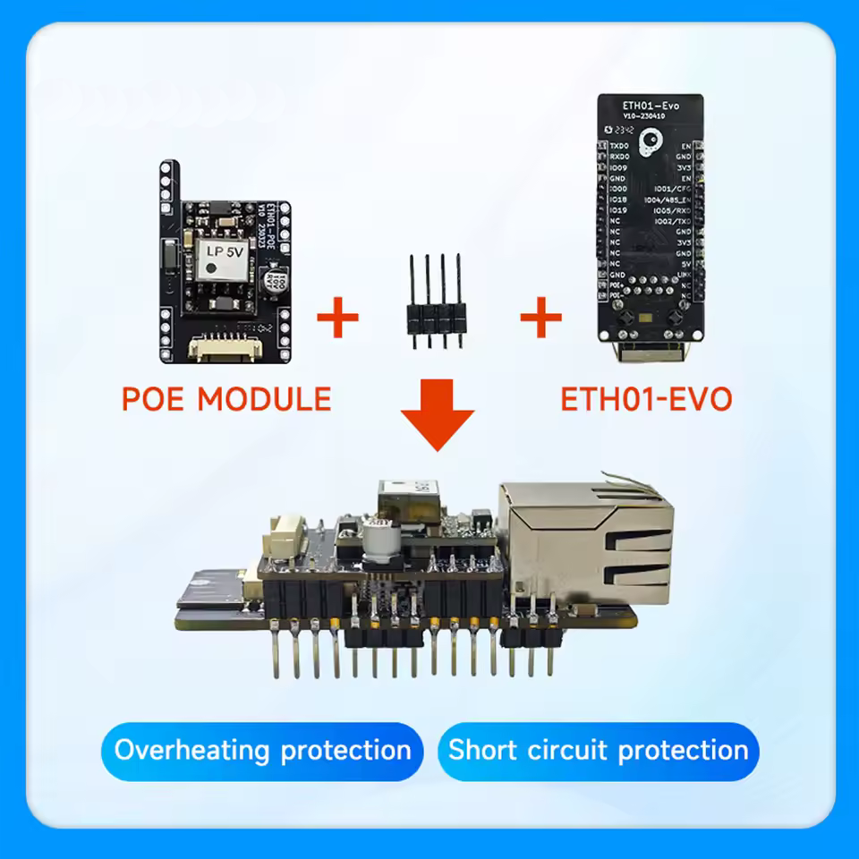
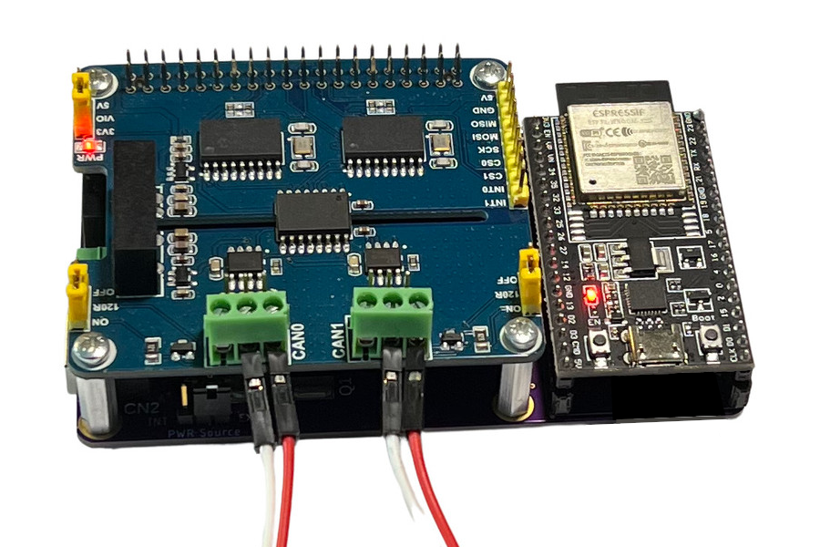
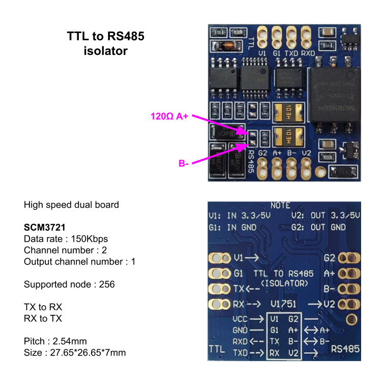

# YamBMS - Supported devices

## Supported BMS

* All `JK-B` BMS models with software version `>=6.0`, see [esphome-jk-bms](https://github.com/syssi/esphome-jk-bms)
* `JK-PB` BMS, see [esphome-jk-bms](https://github.com/txubelaxu/esphome-jk-bms/)
* `JBD` BMS, see [esphome-jbd-bms](https://github.com/syssi/esphome-jbd-bms)
* `Seplos V1 V2` BMS, see [esphome-seplos-bms](https://github.com/syssi/esphome-seplos-bms)

**Note: other BMS brands already integrated with ESPhome can be added easily.**

## Supported shunt

* `Victron Smartshunt` (UART)
* `Victron Smartshunt` (BLE)
* `Junctek KH-F` (UART/RS485)

**Note: other Shunt brands already integrated with ESPhome can be added easily.**

## Supported ESP32

**Recommended: AtomS3 or ESP32-S3**

* [M5Stack AtomS3 dedicated documentation](Supported_devices_M5Stack_AtomS3.md)
* [PVbrain2 with ESP32-S3](https://github.com/SeByDocKy/pvbrain2) (up to 11 BMS monitored with `UART`)
* [Build your own PCB with ESP32 or ESP32-S3](Supported_devices_Build_your_own_PCB.md)

| [AtomS3 Lite](https://docs.m5stack.com/en/core/AtomS3%20Lite) | [AtomS3](https://docs.m5stack.com/en/core/AtomS3) | [AtomS3R (8MB PSRAM)](https://docs.m5stack.com/en/core/AtomS3R) |
| --- | --- | --- |
|  |  |  |

| [ESP32 DevKit-V1](https://a.aliexpress.com/_EG12CJ2) | [ESP32-S3 DevKitC-1](https://a.aliexpress.com/_EzFdrw3) | [ESP32-C3 ETH01-EVO](https://a.aliexpress.com/_Ey29fog) |
| --- | --- | --- |
|  |  |  |

| [espBerry + Waveshare 2-CH CAN HAT](https://copperhilltech.com/esp32-development-board-with-dual-isolated-can-bus-hat/) | [LilyGo T-CAN485 (ESP32)](https://github.com/Xinyuan-LilyGO/T-CAN485) | [LilyGo T-Connect (ESP32-S3)](https://github.com/Xinyuan-LilyGO/T-Connect) |
| --- | --- | --- |
|  |  |  |

## Supported CAN bus transceiver

**Note: some inverters only accept a CAN bus at 3.3V in this case please choose the SN65HVD230 chip.**

| TJA1050 (5V) | [TJA1051T (5V)](https://a.aliexpress.com/_EIdl3b5) | [SN65HVD230 (3V3)](https://a.aliexpress.com/_Evq9Ra7) |
| --- | --- | --- |
|  |  |  |

| [M5Stack Atomic CAN Base (isolated)](https://docs.m5stack.com/en/atom/Atomic%20CAN%20Base) | [M5Stack CAN Unit (isolated)](https://docs.m5stack.com/en/unit/can) | [MCP2515 (5V)](https://a.aliexpress.com/_EGPcjhZ) |
| --- | --- | --- |
|  |  |  |

## Supported RS485 transceiver

| [M5Stack RS485 Unit (isolated)](https://docs.m5stack.com/en/unit/iso485) | [RS485 isolated board (high speed dual)](https://a.aliexpress.com/_EueIZT5) | [RS485 Two-way Converter](https://electronics.stackexchange.com/questions/244425/how-is-this-rs485-module-working) |
| --- | --- | --- |
|  |  |  |

## Supported inverter

Inverters supporting CAN PYLON/Goodwe/SMA/Victron Low Voltage protocol should work, check your inverter manual to confirm.

The following are confirmed and known to work:

| Brand | Model | Satus | Reported by | Inverter bat. mode | BMS | BMS protocol | ESP32 board | CAN name | CAN protocol | CAN transceiver | RS485 board | Multi-BMS | Remarks |
| --- | --- | --- | --- | --- | --- | --- | --- | --- | --- | --- | --- | --- | --- |
| Deye | SUN-3.6K-SG03LP1-EU | Working | [@Der_Hannes](https://diysolarforum.com/members/der_hannes.16949/) | Lithium 00 | JK-B | UART | ESP32 DevKit V1 | PYLON | PYLON 1.2 | SN65HVD230 **3.3V** | --- | no | --- |
| Deye | SUN-5K-SG03LP1-EU | Working | [@vdiex](https://github.com/vdiex) | Lithium 00 | JK-B | UART | ESP32 DevKit V1 | PYLON | PYLON 1.2 | --- | no | --- |
| Deye | SUN-5K-SG03LP1-EU | Working | [@arzaman](https://github.com/arzaman) | Lithium 00 | JK-B | BLE | Atom S3 | PYLON | PYLON 1.2 | [Atomic CAN base (SKU:A103)](https://docs.m5stack.com/en/atom/Atomic%20CAN%20Base) | --- | no | --- |
| Deye | SUN-5K-SG03LP1-EU (3) | Working | [@widget4145](https://diysolarforum.com/members/widget4145.110784/) | Lithium 00 | JK-PB (7) | RS485 | Atom S3 Lite | PYLON | PYLON 1.2 | [Atomic CAN base (SKU:A103)](https://docs.m5stack.com/en/atom/Atomic%20CAN%20Base) | RS485 (talk pin) | yes | --- |
| Deye | SUN-6K-SG03LP1-EU | Working | [@Sleeper85](https://github.com/Sleeper85) | Lithium 00 | JK-B | UART | ESP32 DevKit V1 | PYLON | PYLON 1.2 | TJA1051T | --- | no | --- |
| Deye | SUN-6K-SG03LP1-EU | Working | [@Imanol82](https://diysolarforum.com/members/imanol82.122457/) | Lithium 00 | JK-PB (2) | RS485 | ETH01-EVO POE | PYLON | PYLON 1.2 | SN65HVD230 | [Isolated RS485 (high speed dual)](https://a.aliexpress.com/_EueIZT5) | yes | ESP32 wired without WiFi, all ok. |
| Deye | SUN-12K-SG04LP3-EU | Working | [@lucize](https://github.com/lucize) | Lithium 00 | JK-B | UART | ESP32 DevKit V1 | PYLON | PYLON 1.2 | --- | --- | no | --- |
| Deye | SUN-12K-SG04LP3-EU | Working | [@luckylinux](https://github.com/luckylinux) | Lithium 00 | JK-B | BLE | Atom S3 Lite | PYLON | PYLON 1.2 | [CANBus Unit (CA-IS3050G)](https://docs.m5stack.com/en/unit/can) | --- | no | --- |
| Deye | SUN-12K-SG04LP3-EU | Working | [@virus100b](https://github.com/virus100b) | Lithium 00 | JK-PB (2) | RS485 | ESP32 DevKit V1 | PYLON | PYLON 1.2 | TJA1050 | --- | yes | --- |
| Deye | SUN-12K-SG04LP3-EU | Working | [@b1ggi](https://diysolarforum.com/members/b1ggi.120910/) | Lithium 00 | JK-PB (2) | BLE | Atom S3 Lite | PYLON | PYLON 1.2 | [Atomic CAN base (SKU:A103)](https://docs.m5stack.com/en/atom/Atomic%20CAN%20Base) | --- | yes | Used for Inverter Offset Setting 0.5v because of Deye bug |
| Goodwe | 3648-ES (GW5048-ES) | Working | [@jirdol](https://github.com/jirdol) | --- | JK-B | UART | ESP32 DevKit V1 | GOODWE | PYLON + | --- | --- | no | --- |
| Goodwe | GW5000S-BP | Working | [@Uksa007](https://github.com/Uksa007) | Goodwe LX U5.4-L | JK-B | UART | ESP32 DevKit V1 | GOODWE | PYLON + | --- | --- | no | --- |
| Goodwe | GW5000S-BP & GW3600S-BP | Working | [@OselDusan7](https://github.com/OselDusan7) | --- | JK-B | UART | ESP32 DevKit V1 | GOODWE | PYLON + | --- | --- | no | --- |
| Sofar | ME 3000-SP | Working | [@starman](https://diysolarforum.com/members/starman.65151/) | --- | JK-B | UART | ESP32 DevKit V1 | --- | --- | --- | --- | no | --- |
| Sofar | HYD 5000-ES | Working | [@Paulfrench35](https://diysolarforum.com/members/paulfrench35.78523/) | --- | JK-B | UART | ESP32 DevKit V1 | --- | --- | --- | --- | no | --- |
| Sofar | HYD 5000-EP | Working | [@tonystrullu](https://diysolarforum.com/members/tonystrullu.91283/) | --- | JK-B | UART | ESP32 DevKit V1 | --- | --- | --- | --- | no | --- |
| Sofar | HYD 3600-ES | Working | [@chaosnature](https://diysolarforum.com/members/chaosnature.64395/) | Automatic | JK-PB (2) | BLE | Atom S3 (display) | PYLON | PYLON 1.2 | [Atomic CAN base (SKU:A103)](https://docs.m5stack.com/en/atom/Atomic%20CAN%20Base) | --- | yes | DIY Li-ion Growatt GBLI5001 converted. A 120 Ohm resistor had to be added on the Sofar side. Prefared over original BMS Manufacture's Management System. |
| Growatt | SPF 5000ES | Working | [@Paulfrench35](https://diysolarforum.com/members/paulfrench35.78523/) | CAN L52 | JK-B | UART | ESP32 DevKit V1 | PYLON | PYLON 1.2 | --- | --- | no | --- |
| Growatt | SPF 5000ES | Working | [@cjdell](https://github.com/cjdell) | CAN L52 | JK-B | UART | ESP32 DevKit V1 | PYLON | PYLON 1.2 | --- | no | --- |
| Growatt | SPF 5000ES | Working | [@cinusik](https://diysolarforum.com/members/cinusik.109738/) | CAN L52 | JK-PB (2) | BLE | Atom S3 (display) | PYLON | PYLON 1.2 | [Isolated CAN Unit (SKU:U085)](https://docs.m5stack.com/en/unit/can) | [Atomic RS485 Base (SKU:A131)](https://docs.m5stack.com/en/atom/Atomic%20RS485%20Base) | yes | Best solution for the incomplete/wrong protocols implementation on JK Inverter BMSes and some inverters. |
| Solis | RHI-3.6K-48ES-5G | Working | [@cjdell](https://github.com/cjdell) | Pylon LV | JK-B | UART | ESP32 DevKit V1 | PYLON | PYLON + | SN65HVD230 **3.3V** | --- | no | --- |
| Solis | S5-EH1P4.6K-L | Working | [@Baker0052](https://github.com/Baker0052) | Pylon LV | JK-B | UART | ESP32 DevKit V1 | PYLON | PYLON + | SN65HVD230 **3.3V** | --- | no | --- |
| Solis | S5-EH1P6K-L | Working | [@MrPabloUK](https://github.com/MrPabloUK) | AoBo | JK-B | UART | ESP32 DevKit V1 | SMA | SMA | [Adafruit CAN Pal](https://learn.adafruit.com/adafruit-can-pal/overview) | --- | no | --- |
| Solis | RHI-3.6K-48ES-5G | Working | [@MrPabloUK](https://github.com/MrPabloUK) | AoBo | JK-B | UART | ESP32 DevKit V1 | SMA | SMA | [Adafruit CAN Pal](https://learn.adafruit.com/adafruit-can-pal/overview) | --- | no | --- |
| Solis | RHI-3K-48ES | Working | [@chaosnature](https://diysolarforum.com/members/chaosnature.64395/) | AoBo | JK-B (2) | BLE | Atom S3 Lite | SMA | SMA | [Atomic CAN base (SKU:A103)](https://docs.m5stack.com/en/atom/Atomic%20CAN%20Base) | --- | yes | DIY Li-ion Growatt GBLI5001 converted. |
| LuxPower | LXP SNA 5K | Working | [@shvmm](https://github.com/shvmm) | Lithium 6 | JK-B | UART | ESP32 DevKit V1 | Automatic | LuxPower| SN65HVD230 / TJA1050 | --- | no | --- |
| LuxPower | LXP SNA 5K | Working | [@yur43](https://diysolarforum.com/members/yur43.121157/) | Lithium 6 | JK-PB (1) | RS485 | ESP32 DevKit V1 | Automatic | LuxPower | SN65HVD230 | [Isolated RS485 (high speed dual)](https://a.aliexpress.com/_EueIZT5) | no | --- |
| LuxPower | LXP-LB-US 10K | Working | [@Henny101](https://diysolarforum.com/members/henny101.67026/) | Lithium 6 | JK-PB (2) | RS485 | ESP32-S3 DevKitC-1 | Automatic | LuxPower | SN65HVD230 | [Isolated RS485 (high speed dual)](https://a.aliexpress.com/_EueIZT5) | yes | --- |
| EG4 | 6000XP | Working | [@ChrisG](https://diysolarforum.com/members/chrisg.483/) |  Lithium 2  | JK-B (2) | BLE | ESP32 DevKit V1 / ESP32-S3 DevKitC-1 | PYLON | PYLON 1.2 |  MCP2515 | --- | yes | --- |
| EG4 | 6000XP (2) | Working | [@SGB](https://diysolarforum.com/members/scrotpusgobblebottom.100804/) |  Lithium 6  | JK-B (1) JK-PB (1) | BLE | Atom S3 (display) | Automatic | LuxPower | [Atomic CAN base (SKU:A103)](https://docs.m5stack.com/en/atom/Atomic%20CAN%20Base) | --- | yes | --- |
| EG4 | 18kPV | Working | [@Maintman](https://diysolarforum.com/members/maintman.19007/) |  Lithium 6  | JK-B | BLE | ESP32 DevKit V1 | Automatic | LuxPower |  MCP2515 | --- | yes | Connected via Bluetooth to Victron SmartShunt. |
| Victron | MultiPlus-II 48/10000/140 | Working | [@cali-clim](https://diysolarforum.com/members/cali-clim.54284/) | CAN-bus BMS LV (500 kbit/s) | JK-PB (2) | RS485 | Atom S3 (display) | Automatic | Victron | [Atomic CAN base (SKU:A103)](https://docs.m5stack.com/en/atom/Atomic%20CAN%20Base) | [Isolated RS485 Unit (SKU:U094)](https://docs.m5stack.com/en/unit/iso485) | yes | --- |
| Victron | Multiplus 24/1200/25-16  | Working | [@dmsims](https://diysolarforum.com/members/dmsims.23417/) | CAN-bus BMS LV (500 kbit/s) | JK-B (1) | BLE | Atom S3 Lite | Automatic | Victron | [Atomic CAN base (SKU:A103)](https://docs.m5stack.com/en/atom/Atomic%20CAN%20Base) | --- | no | Plugged into Cerbo Can port (must use supplied Victron terminator in the other port) |
| MidNite Solar | MN15-12KW-AIO  | Working | [@goldserve](https://diysolarforum.com/members/goldserve.52541/) | PYLON | JK-B | BLE | ESP32-S3 | Automatic | PYLON 1.2 | MCP2515 | --- | no | Stable with Victron Smartshunt, MQTT, BLE, Neopixel LED, Display also working. |
| MidNite Solar | MN15-12KW-AIO  | Working | [@jahyde](https://diysolarforum.com/members/jahyde.7475/) | PYLON | JK-PB | BLE | ESP32-S3 | Automatic | PYLON 1.2 | MCP2515 | --- | yes | --- |
| SMA | Sunny Island  | --- | --- | --- | --- | --- | --- | --- | --- | --- | --- | --- | --- |
