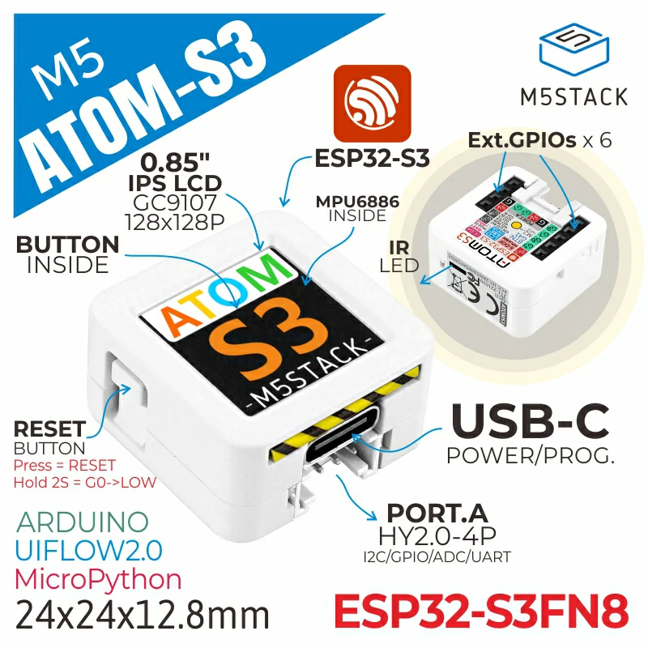
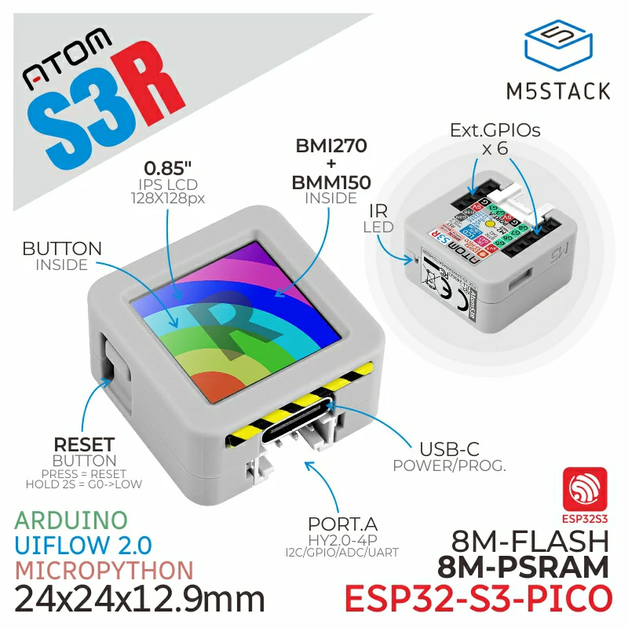
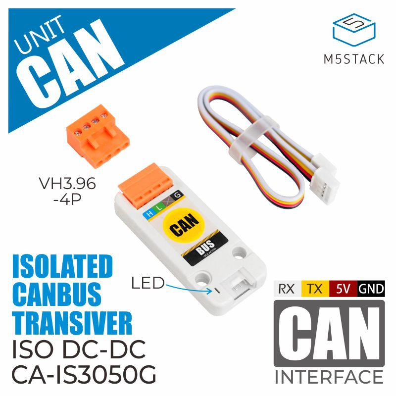

# YamBMS - M5Stack AtomS3, the Plug & Play solution (no welding)

> [!IMPORTANT]
> AtomS3 provides very few GPIOs.
> This solution is not the best for supervising a large number of `JK-B BMS` via `UART` but it works very well for supervising a large number of `JK-PB BMS` via `RS485`.

> [!TIP]
> If you have `JK-PB BMS` (inverter BMS) and want to monitor them via `RS485`, please read the [BMS JK-PB RS485](BMS_JK-PB_RS485_solution.md) dedicated topic.

## Number of BMS supported

* 3x BMS with `Bluetooth` (BLE stack consumes significant amount of RAM on device and can cause crash and reboot)
* 2x `JK-B` BMS with `UART/RS485` (the second UART must be soldered on the Atomic CAN base on GPIOs G7 and G8)
* several `JK-PB` BMS with `RS485` (already tested with 7 BMS)

Note: these are theoretical limits, not all combinations have been tested.

## List of M5Stack components that can be used depending on needs

> [!TIP]
> Choose an `AtomS3` to clip onto the `Atomic CAN Base`.
> Feel free to ask your question on the [DIY solar forum](https://diysolarforum.com/threads/yambms-jk-bms-can-with-new-cut-off-charging-logic-open-source.79325/) if you don't know what to choose.

- [AtomS3 Lite - SKU:C124](https://docs.m5stack.com/en/core/AtomS3%20Lite)
- [AtomS3 - SKU:C123](https://docs.m5stack.com/en/core/AtomS3)
- [AtomS3R - SKU:C126 (8MB PSRAM)](https://docs.m5stack.com/en/core/AtomS3R)
- [Atomic CAN Base - SKU:A103 (recommended)](https://docs.m5stack.com/en/atom/Atomic%20CAN%20Base)
- [CAN Unit - SKU:U085](https://docs.m5stack.com/en/unit/can)
- [RS485 Unit - SKU:U094](https://docs.m5stack.com/en/unit/iso485)

| [AtomS3 Lite](https://docs.m5stack.com/en/core/AtomS3%20Lite) | [AtomS3](https://docs.m5stack.com/en/core/AtomS3) | [AtomS3R (8MB PSRAM)](https://docs.m5stack.com/en/core/AtomS3R) |
| --- | --- | --- |
|  |  |  |

| [Atomic CAN Base (isolated)](https://docs.m5stack.com/en/atom/Atomic%20CAN%20Base) | [CAN Unit (isolated)](https://docs.m5stack.com/en/unit/can) | [RS485 Unit (isolated)](https://docs.m5stack.com/en/unit/iso485) |
| --- | --- | --- |
|  |  |  |

## Note regarding the sensors managing the display backlight (ili9xxx platform)

* **Backlight control** : manual brightness control
* **Backlight max level** : limit the max brightness in general
* **Backlight Autodim level** : the desired brightness when dimmed down (set to 0 to switch off screen completely instead of dimming down)
* **Backlight Autodim time in min** :  time in minutes, after the screen will dim down (set to 0 to disable Auto dimming) 

Device will restore last screen brightness after boot, but the timer script does not get start automatically.
The auto dim timer gets initially started by pressing the screen button (which bumps up the brightness to 100% until the timer dims down then).

That seems to be the easiest and lightweight solution.
But i guess some user could be confused and expect from the device to react immediately after changing some parameters.
