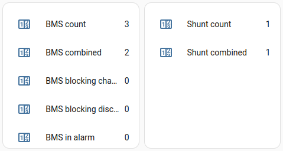

# YamBMS behavior

[](https://www.gnu.org/licenses/gpl-3.0)
[](https://github.com/Sleeper85/esphome-yambms/releases/latest)


## Shunt and BMS combination


### Combine status



**Combine Availability** : This status indicates whether the BMS or Shunt meets the conditions to be combined.

**Can be combined** : This status indicates whether the BMS or Shunt is currently combined.

## Shunt

Combine condition :
1) the `Combine` switch is enabled
2) the `Voltage` supplied by the shunt `is > 0V`

If one of these two conditions is not respected, the shunt is automatically decombined.

As soon as you import a `shunt` and it can be combined (see condition) the values ​​(Voltage, Current, Power and SoC) of the shunt(s) will take precedence over the BMS values.

## BMS

Combine condition :
1) the `Combine` switch is enabled
2) BMS `Charging` or `Discharging` switch is enabled
3) BMS is not in `alarm`

If one of these three conditions is not met, the BMS is automatically decombined.

## State of Charge

The `SoC` is slightly manipulated before reaching `0%` or `100%`.
SoC `100%` will be sent to your inverter only when the battery is `fully charged` (useful for some inverters stopping charging when the SoC reaches 100%).

SoC behavior:
1) If `min_cell_v <= cell_uvpr` SoC 0% is sent
2) Else if `SOC < 1%` SoC 2% is sent (false 0% sending 2%)
3) Else if `SOC < 99%` real SoC is sent
4) Else if `the battery is fully charged` real SoC is sent
5) Else SoC `98%` is sent

## CAN bus link

For the CAN bus link to be established with your inverter, the two conditions below must be met:
1) At least one BMS is in service (the number of combined BMS must be `> 0`)
2) Your inverter sends an `ACK 0x305` every `1s` (the link will be faulty if no ACK is received for 5s)

If these conditions are not met, the application waits `120s` before trying to connect again.

### Extra infos

Sending CAN frames continues without an inverter connected is problematic and will lead to ESP32 crash.

During boot the CAN bus links are activated directly if at least one BMS is combined and the inverter responds to the sending of CAN frames within a `5s` delay.
This `5s` delay represents the time during which the link is valid, this timer is reset each time an `ACK 0x305` is received from the inverter.
This `5s` delay can be modified in the configuration when importing the canbus package.

```YAML
  canbus1: !include
    file: packages/yambms/yambms_canbus.yaml
    vars:
      # YamBMS ID
      yambms_id: 'yambms1'
      # CANBUS vars
      canbus_id: 'canbus1'
      canbus_name: 'CANBUS 1'
      canbus_node_id: 'canbus_node1'
      canbus_light_id: 'esp_light'
      # The CANBUS link will be considered down if no response from the inverter (ID 0x305) for 5s
      canbus_link_timer: '5'
```

If the inverter does not respond with an `ACK 0x305` within this `5s` delay the sending of CAN frames is paused for `120s` this delay cannot be modified when importing the canbus package but you can modify it in the code if you need to.

## BMS alarms

> [!IMPORTANT]  
> This is the current behavior, it may not be perfect, feel free to communicate your ideas to improve it.


The `errors_bitmask` values ​​are merged and then analyzed continuously **even if the BMS is uncombined**.

As long as at least one BMS is working normally the system will continue to work.
YamBMS will display BMS alarms as `Warning`.

If all BMS are in alarm, they are all uncombined and in this case the sending of instructions on the `CAN bus` is also stopped.
YamBMS will display BMS alarms as `Alarm`.