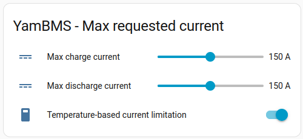
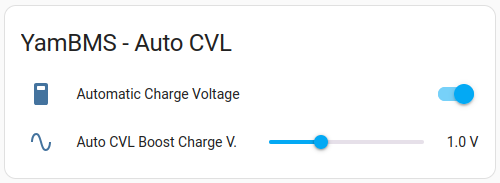
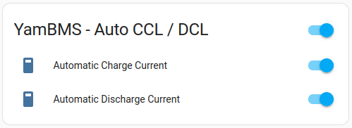
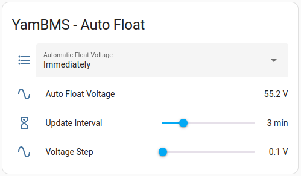
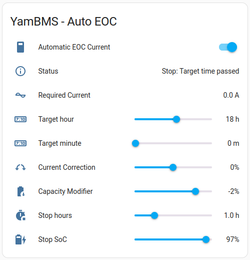
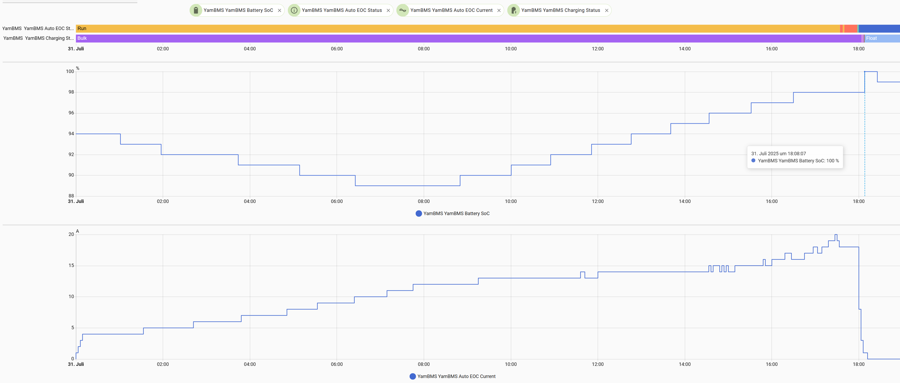

# YamBMS functions

## CAN protocol

> [!IMPORTANT]
> You need to check if your inverter model is on the list of [supported inverters](Supported_devices.md#supported-inverter). In any case it must support one of the following `CAN` bus protocols.

Choose the CAN protocol that will be sent to your inverter and don't forget to configure your inverter for the protocol you choose.

The table below helps you choose the best protocol depending on your inverter brand.
Other configurations are possible, don't hesitate to communicate what works well for you.

| Inverter | Battery mode | CAN protocol |
| --- | --- | --- |
| Deye | Lithium 00 | PYLON 1.2 |
| GoodWe | LX U5.4-L | PYLON V2 |
| Sofar | Automatic | PYLON 1.2 |
| Growatt | CAN L52 | PYLON 1.2 |
| Solis | AoBo | SMA |
| LuxPower | Lithium 6 | LuxPower |
| EG4 | Lithium 6 | LuxPower |
| Victron | CAN-bus BMS LV (500 kbit/s) | Victron |
| MidNite Solar | PYLON | PYLON 1.2 |
| SMA | - | SMA |

## Charging settings

The `Charging status` represents the current charging phase, see the [Charging logic](Charging_logic.md).

The `Charging instruction` is defined based on the `Charging status` and allows the correct `Requested Charge Values` ​​to be sent.

The `Float charge enabled` switch allows the battery to be kept fully charged at the end of the `Bulk` charge. The voltage used will be that of the `Float voltage` slider.

The `EOC timer enabled` switch ensures that the `Cut-Off` phase lasts maximum `30 min` (default value) even if your cells are still being equalized. If your cells are equalized, the `Cut-Off` phase will end at the earliest after `60s` (default value). This prevents the risk of staying in the `Cut-Off` phase for many hours if you have several batteries and they are poorly equalized.

> [!IMPORTANT]
> If you have **totally unbalanced batteries** and want to fix this problem, you can disable the `EOC timer` and let `YamBMS` balance your batteries, **this can take hours**. A well balanced battery does not need this timer enabled as the equalization phase will finish in less than 30 minutes.

The `Bulk voltage` slider allows you to set the voltage used during the `Bulk`, `Balancing` and `Cut-Off` phases.

The `Float voltage` slider allows you to set the voltage used after charging is complete if the `Float charge enabled` switch is enabled.

The `Inverter Offset V.` slider allows you to correct the inverter charge voltage, either because it does not respect the requested value or because your inverter is far from your batteries and there is a voltage drop. This allows you to reach the target `Bulk` or `Float` charge voltage by adding an offset.

### Max Requested Current

The required `charge/discharge current` is calculated as follows :

1. You define a **maximum current** that can never be exceeded
2. YamBMS calculates the **maximum current** accepted by your BMS (total of OCP values ​​* 0.9)
3. The temperature-based current limiting function calculates the **maximum current** `based` on the **temperature**, the **battery capacity** and the **charging_rate_table** / **discharging_rate_table**

The **current requested** by YamBMS will be **the lowest** of these three values.

## Requested Values

These 4 sensors allow you to see what is being requested of your inverter.

In the example below, we are in the `Float` phase at a voltage of `53.6V` and an `Inverter Offset V.` of `0.1V`. The `Requested Charge Voltage` is therefore `53.7V`.

The `Requested Discharge Voltage` is the `UVP + 0.2` value of your BMS multiplied by the number of cells, in this example (3V * 16).

### ReBulk

There are two parameters to start a new `Bulk` phase. You can set a `Rebulk SoC` or a `Rebulk V.` value, only one of these conditions must be met.

If needed you can also force a `Bulk` charge with the `Force Bulk (top bal)` switch. The switch will automatically deactivate when your cells enter the `Balancing` phase.

### Request Force Charge

This function allows you to force a charge from `GRID` :
- when `SoC <= Start SoC` the forced charge start
- when `SoC >= Stop SoC` the forced charge stop

Works only with `PYLON`, `LuxPower` and `Victron` protocols.

## Auto functions

Thanks to [@MrPabloUK](https://github.com/MrPabloUK) for developing `Auto CVL`, `Auto CCL` and `Auto DCL` functions.

A [reference spreadsheet](https://docs.google.com/spreadsheets/d/1UwZ94Qca-DBP5gppzKmAjbMJYZGjR4lMwZtwwQR9wWY/edit?usp=sharing) has been created that shows how the `Auto CVL, CCL & DCL` works.

Thanks to [@GHswitt](https://github.com/GHswitt) for developing `Auto Float` function.

## Auto CVL

> [!IMPORTANT]
> The `Auto CVL` function uses the `Balance Trig. Volt.` value of your BMS. `e.g. for LFP` : BTG=0.010V

When enabled, the `Automatic Charge Voltage Limit` feature will automatically reduce the `Requested Charge Voltage (CVL)` sent to the inverter when a cell starts to exceed the bulk target.
That way, the runner cell should be maintained at or near bulk (for example, 3.45v) and the balancer can start to bring up the lagging cells.
Controlling the CVL is the preferred option according to Victron and others, but it depends on how well your inverter behaves.
My Solis inverter is not great at CVL control, so it doesn't work well for me.

You can compare `Auto CVL` to cruise control in a car.

`Boost Charge V.` allows you to increase the charging voltage to charge your battery faster, the `Auto CVL` function will itself reduce the charging voltage at the end of charging so that it does not exceed the target voltage `Bulk Voltage`.

## Auto CCL & DCL

> [!IMPORTANT]
> The `Auto CCL` function uses the `OVP` value of your BMS.
> The `Auto DCL` function uses the `UVP` value of your BMS.

Regarding the new `Auto Charge/Discharge Current Limit`, this features has been introduced to hopefully prevent `OVP` and `UVP` alarms.

When enabled, the `Automatic Charge Current Limit` feature will automatically reduce the `Requested Charge Current (CCL)` sent to the inverter when a cell starts to exceed the bulk target.
This should prevent the runner cell from exceeding the max voltage cutoff, but doesn't maintain it at bulk voltage - instead it should keep it just below max cell voltage.

You can compare `Auto CCL` to a max speed limiter in a car.

`Auto DCL` works the same way when a cell approaching `UVP + 0.2`.

Current control should work with any inverter that uses `CAN` control.

## Auto Float Voltage

When switching from `Bulk` to `Float`, therefore lowering the `Requested Charge Voltage (CVL)`, some inverters (e.g. Deye SUN-12K) will start to discharge the battery (into the grid) with up to max. discharge current until the
`Requested Charge Voltage (CVL)` is reached. The reason behind this is that the inverter sees this as battery overvoltage and wants to counter it. 
As workaround, by enabling `Automatic Float Voltage`, it will lower the `Requested Charge Voltage (CVL)` gradually in small steps until the float voltage is reached, allowing the battery more time to settle down.
There are two modes available: `Follow` and `Immediately`.

- `Follow`: Waits until the battery voltage itself is below the current `Requested Charge Voltage (CVL)` before lowering `Requested Charge Voltage (CVL)` further. It follows the battery voltage until the target float voltage is reached.
- `Immediately`: Immediately start lowering the `Requested Charge Voltage (CVL)`, independent of the current battery voltage. That means it can go below the current battery voltage.

This feature might not work with all inverters as good or is not required if these do not discharge the battery.

The voltage steps can be configured (default `0.1V`) with `Auto Float Voltage Step`. The update interval can be configured (default `3 minutes`) with `Auto Float Update Interval`.

## Auto EOC

When to use: Your battery would be full early in the day and then be idle for the rest of the day. You want to charge it slowly and have it full at a specified time, for example in the evening.

This function allows to set a target time when `Bulk` charging. It limits the `Requested Charge Current (CCL)` so the battery should reach full charge at the specified time. As the algorithm is quite simple there are some requirements for it to work correctly:

- The time of the ESPHome device must be correct and available.
- The `Battery Capacity` must be correct.
- The charger/inverter can deliver the `Requested Charge Current (CCL)` over the time frame -> the sun must be shining.

There are some configuration options to adjust the behaviour:

- `Automatic EOC Current`: This switch enables or disables the function. When disabled, it will not limit the `Requested Charge Current (CCL)`.
- `Auto EOC Target Hour`: This selects the hour of the desired target time.
- `Auto EOC Target Minute`: This selects the minute of the desired target time.
- `Auto EOC Correction`: This increases or decreases the `Requested Charge Current (CCL)` and allows for correcting charger/inverter differences, for example if the inverter delivers less current than requested.
- `Auto EOC Capacity Modifier`: This allows to lower the target capacity for the calculation. If your battery `Capacity Remaining` does not reach `Battery Capacity` when 100% full, you can adjust the value here.
- `Auto EOC Increase Stop Hours`: When nearing the target time but the charge current can not be reached, the `Requested Charge Current (CCL)` will increase until it reaches the max. charge current. To avoid this, a time frame bevor the target time can be chosen in which the current will not be increased. E.g. if this option is set to 1 hour, the `Requested Charge Current (CCL)` is 40A and the time is between `Target Hour - 1 hour` and `Target Hour`, it will stay at 40A.
- `Auto EOC Increase Stop SoC`: Similar to `Auto EOC Increase Stop Hours`, this stops increasing the `Requested Charge Current (CCL)` when the `SoC` is equal or above the specified `SoC`.

The text sensor `Auto EOC Status` will show the current status of the function:
- `Stop: Disabled`: Function is disabled or capacity not available.
- `Stop: Float`: YamBMS currently in `Float` mode, not `Bulk`.
- `Stop: Time not valid`: The ESPHome device time is not valid.
- `Stop: Target time passed`: The current time is after the selected target time.
- `Stop: Current above limit`: The required charge current is above the current charge limit.
- `Run: Current increase stopped`: Running, but no current increase because of `Auto EOC Increase Stop Hours` or `Auto EOC Increase Stop SoC`.
- `Run`: Working normally.

The sensor `Auto EOC Current` will show the calculated charging current. Note that it is filtered by an EWMA filter with a default 3 minute delay.
That means that changes to the options or parameters are not immediately visible. This avoids that the `Requested Charge Current (CCL)` will fluctuate too much. It will show 0A when the function is disabled/stopped or there is no solution.

The function used to calculate the required charging current is very basic. The missing battery capacity (difference between `Battery Capacity` and `Capacity Remaining`) divided by the remaining hours. It will be updated every minute, but afterwards filtered before it is used for `Requested Charge Current (CCL)`. That means it will adapt, but not take into account any special circumstances. For example if `Auto CCL` is enabled and required, the charge current may further be limited by `Auto CCL`. The target time may then not be reached exactly. To account for this, the parameter `Auto EOC Correction` can be used to increase the overall current a little to compensate for the lower end current.

Here is an example when the target time is set to 18:00. Starting at 00:00, the required current increases as the battery is discharged. When the battery starts charging as the sun is up, the required current stabilizes around 14A.
The current is increased at the end as it does not exactly hit its required charge, but at 17:30, the required current is stable because the parameter `Auto EOC Increase Stop Hours` was set to 0.5 hours, so it will not be increased anymore.
At about 18:08 the battery is 100% after a short balancing period.

## Inverter Heartbeat Monitoring

This feature allows you to monitor the heartbeat of your inverter (time between two ACK 0x305). This is useful for troubleshooting purposes and should not remain enabled continuously.

This heartbeat must be regular and depends on the selected `CAN protocol` and the behavior of the inverter. If the heartbeat is not regular this can show a problem on the inverter side or an overloaded ESP32.

The `Deye` inverter sends an ACK `0x305` in response to the reception of a CAN frame `0x356`. Knowing that CAN frames are sent every `100ms` and that the CAN protocol `PYLON 1.2` has 6 CAN frames, the heartbeat of the `Deye` inverter is `600ms`.

> [!IMPORTANT]  
> Every `2h` Deye takes more than `3s` to respond and more than `5s` at midnight.
> This is what the `CANBUS Status` looks like when the `canbus_link_timer` is set to `3s`.

## Diagnostic

Useful information for troubleshooting.

## YamBMS version

This function lets you know if a new version of YamBMS is available, the check is done every 6 hours.

